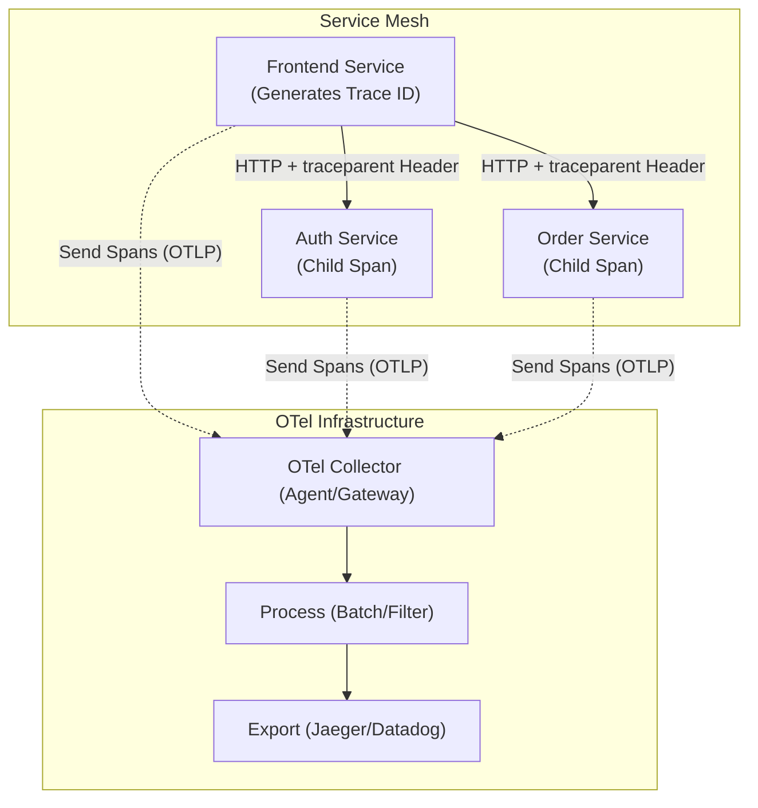

# OpenTelemetry & Distributed Tracing

## Core Concepts

OpenTelemetry (OTel) is an open standard for generating, collecting, and exporting telemetry data (Metrics, Logs, and Traces).

### 1. Distributed Tracing
In a microservices architecture, a single user request might hit 10 different services. Tracing visualizes this entire journey.
- **Trace ID:** A unique identifier for the entire transaction.
- **Span ID:** Represents a single unit of work (e.g., a DB query, an HTTP call) within the trace.
- **Context Propagation:** Services must extract the Trace ID from incoming HTTP Headers (e.g., `traceparent` W3C standard) and inject it into outgoing requests.

### 2. OTel Collector
Instead of services sending data directly to vendors (Datadog/Jaeger), they send it to the OTel Collector. The Collector acts as a vendor-agnostic pipeline (Receive -> Process -> Export).

### Distributed Tracing Map

