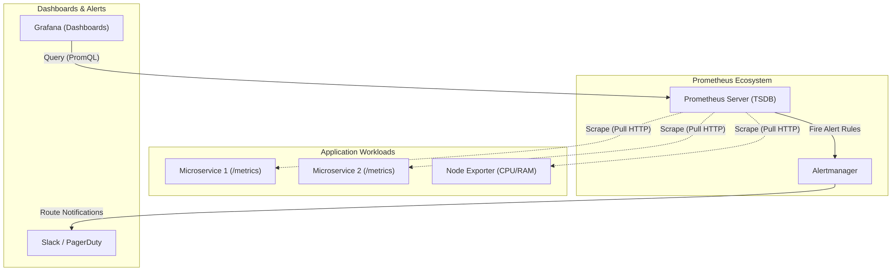

# Prometheus & Grafana Monitoring

## Core Concepts

Prometheus is the industry standard for cloud-native metrics monitoring and alerting.

### 1. The Pull Model
Prometheus actively "scrapes" (pulls) metrics from target services via HTTP endpoints (typically `/metrics`). This is the opposite of systems like StatsD which expect services to push data to them.
- Services must expose metrics in the Prometheus plaintext format using a client library.
- PromQL: A powerful functional query language used to extract time-series data.

### 2. Alertmanager & Grafana
- **Alertmanager:** Handles alerts generated by Prometheus. It deduplicates, groups, and routes them to receivers like Slack, PagerDuty, or Email.
- **Grafana:** The visualization layer. It queries Prometheus via PromQL and displays the data in rich, customizable dashboards.

### Monitoring Architecture Map

