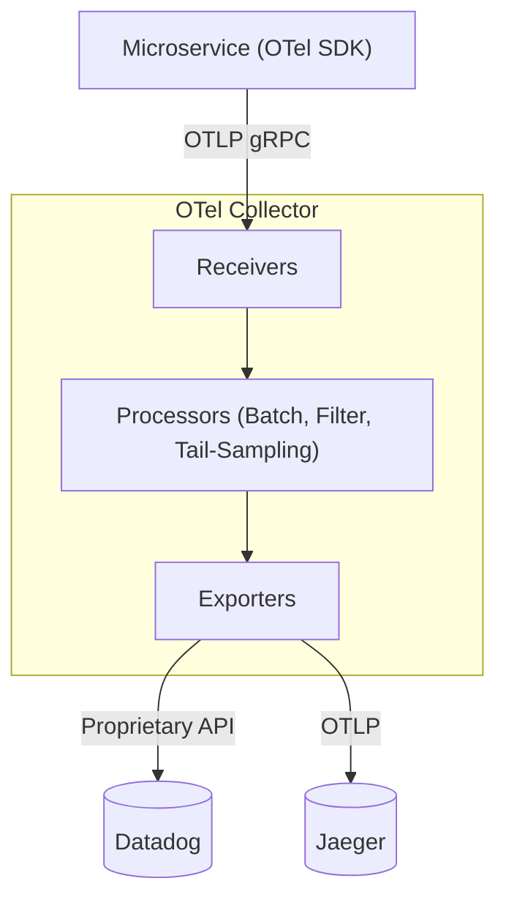

# OpenTelemetry: Distributed Tracing & Context Propagation

## 1. The Distributed Tracing Problem
In a monolithic application, tracing a user request is easy: every function call shares the same Thread ID, and logs can simply be grouped by that Thread ID.

In a microservices architecture, a single user request might traverse an API Gateway, an Auth Service, an Inventory Service, and a Payment Service. Normal logging cannot correlate these requests. Distributed Tracing solves this.

## 2. W3C Trace Context Propagation
To link spans (individual units of work) across different services, the **Trace Context** must be passed along over the network (e.g., via HTTP headers).

The industry standard is the W3C `traceparent` header.
- **Format**: `00-{trace-id}-{span-id}-{trace-flags}`
- **Example**: `traceparent: 00-0af7651916cd43dd8448eb211c80319c-b7ad6b7169203331-01`
  - `trace-id`: A globally unique 16-byte array representing the entire request journey.
  - `span-id`: An 8-byte array representing the parent's specific operation.
  - `trace-flags`: Specifies options like whether the trace is sampled (`01`).

Whenever Service A makes an HTTP request to Service B, it must inject this header. Service B extracts it, creates a new child span, and sends it to the tracing backend.

## 3. The OpenTelemetry Collector Architecture
Instead of every microservice sending traces directly to a vendor (like Datadog, Jaeger, or New Relic), OpenTelemetry (OTel) introduces a vendor-agnostic middleman: **The OTel Collector**.

### Collector Components
1. **Receivers**: How data gets into the collector. Typically accepts OTLP (OpenTelemetry Protocol) via gRPC/HTTP, but can also accept legacy formats like Zipkin or Jaeger.
2. **Processors**: How data is mutated.
   - **Batch Processor**: Groups spans together to compress payloads and save network bandwidth.
   - **Tail-Sampling Processor**: Instead of sampling 10% of *all* requests at the gateway (Head Sampling), it waits until the trace completes and only keeps traces that resulted in errors or high latency.
3. **Exporters**: Translates the internal OTel format into the proprietary format required by your observability vendor.
