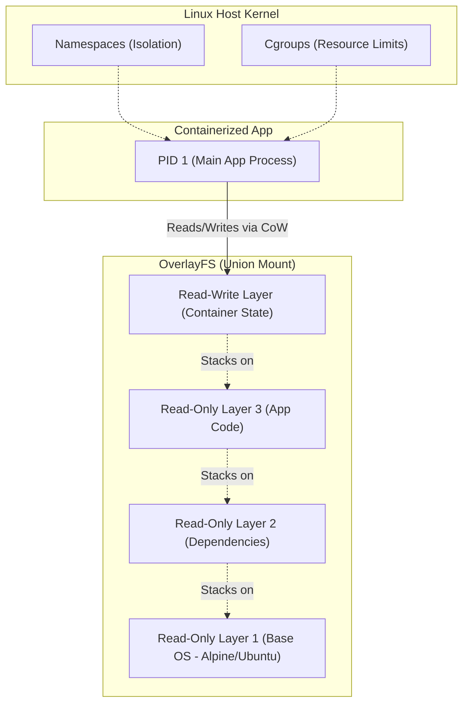

# Docker Internals & Architecture

## Core Concepts

Containers are not VMs; they are isolated processes running on the host OS kernel.

### 1. Namespaces & Cgroups
- **Namespaces:** Provide isolation (PID, NET, MNT, IPC, UTS). A process in a container thinks it has its own isolated OS, filesystem, and network stack.
- **Cgroups (Control Groups):** Provide resource limitation. They restrict how much CPU, Memory, and I/O the container processes can consume.

### 2. OverlayFS (Union File System)
Docker images are built in Read-Only layers. When a container runs, Docker adds a thin Read-Write layer on top. Modifying an existing file triggers a "Copy-on-Write" (CoW) operation.

### Docker Layer Architecture Map

