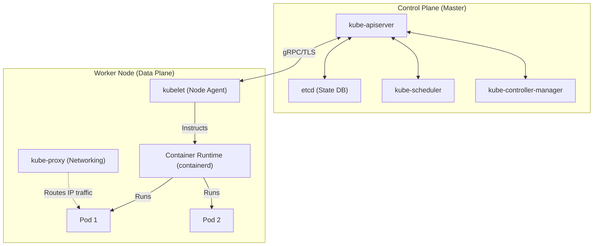

# Kubernetes (K8s) Architecture & Deployments

## Core Concepts

Kubernetes is a distributed system for managing container workloads. It consists of a Control Plane (brain) and Data Plane (worker nodes).

### 1. Control Plane vs Worker Nodes
- **Control Plane:** `kube-apiserver` (Entrypoint), `etcd` (Key-Value Store, the absolute source of truth), `kube-scheduler` (Assigns Pods to Nodes), `kube-controller-manager`.
- **Worker Node:** `kubelet` (Agent that ensures containers are running), `kube-proxy` (Network routing/iptables), Container Runtime (containerd).

### 2. Deployment Strategies
- **Rolling Update:** Replaces pods incrementally. Zero downtime.
- **Blue/Green:** Spins up a full duplicate environment (Green), switches traffic instantly at the Load Balancer level.
- **Canary:** Routes a small percentage (e.g., 5%) of traffic to the new version to monitor metrics before full rollout.

### Architecture Map

