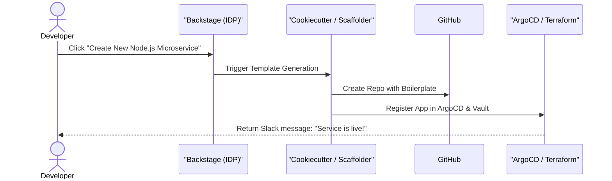

# Platform Engineering: Golden Paths

## 1. The Cognitive Load Problem
In modern cloud-native environments, developers are overwhelmed. To deploy a simple "Hello World" API, a developer must learn Docker, Kubernetes, Terraform, Helm, GitHub Actions, Prometheus, and Datadog. This massive cognitive load destroys developer productivity and leads to copy-pasted, insecure configurations.

**Platform Engineering** solves this by building an Internal Developer Platform (IDP) that abstracts the infrastructure away.

## 2. What is a Golden Path?
A **Golden Path** (or "Paved Road") is an opinionated, highly automated, and officially supported way to build and deploy software within a company.
- If a team chooses the Golden Path, they get CI/CD, monitoring, logging, and security out-of-the-box with zero configuration.
- Teams are allowed to deviate from the Golden Path (e.g., writing their own custom CI/CD), but they must maintain it themselves without Platform Team support.

## 3. The Internal Developer Platform (IDP)
Tools like **Spotify Backstage** serve as the frontend for the IDP. 

### The Developer Workflow

### Components of a Golden Path Boilerplate
When the Scaffolder creates the repository, it includes:
1. **Source Code**: A basic HTTP server with standardized structured logging (JSON) and health check endpoints (`/health/liveness`, `/health/readiness`).
2. **Dockerfile**: A multi-stage, rootless Dockerfile optimized for security.
3. **CI/CD**: A GitHub Actions workflow that runs linting, unit tests, and builds the container image.
4. **Infra-as-Code**: Helm charts pointing to the company's internal library, pre-configured with the correct Datadog/Prometheus annotations.

## 4. Measuring Platform Success
The goal of the IDP is developer velocity. The platform team treats developers as their primary customers.
Key metrics include:
- **Lead Time to Production**: How long it takes to go from a Git commit to code running in production.
- **Time to First "Hello World"**: How long it takes a newly hired engineer to deploy a brand-new microservice to the staging cluster (should be < 1 hour).
- **Golden Path Adoption Rate**: The percentage of teams voluntarily using the IDP vs rolling their own infrastructure.
