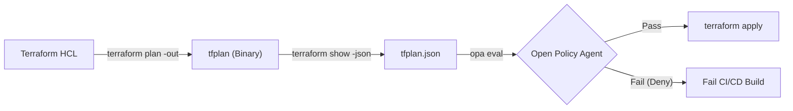

# Policy as Code: OPA with Terraform

## 1. The Need for Proactive Governance
Code reviews are insufficient for catching complex cloud misconfigurations. **Policy as Code** shifts security left by automatically evaluating infrastructure changes *before* they are deployed.

Open Policy Agent (OPA) is a CNCF graduated project that evaluates JSON data against rules written in a language called **Rego**.

## 2. The OPA-Terraform Pipeline
OPA cannot read raw `.tf` (HCL) files easily. Instead, it evaluates the JSON output of the execution plan.



## 3. Writing Rego Policies
Rego is a declarative logic language. Policies are fundamentally "deny lists" — if a `deny` rule returns true, the policy is violated.

### Example: Deny Public SSH Access
The following Rego policy inspects the JSON plan and fails the build if any AWS Security Group rule allows port 22 access from `0.0.0.0/0`.

```rego
package terraform.security_groups

import input as tfplan

# Define what constitutes a violation
deny[msg] {
    # 1. Iterate over all resource changes in the plan
    resource := tfplan.resource_changes[_]
    
    # 2. Check if the resource is an AWS security group rule
    resource.type == "aws_security_group_rule"
    
    # 3. Check if the action is 'create' or 'update'
    action := resource.change.actions[_]
    action == "create"
    
    # 4. Extract configuration
    config := resource.change.after
    
    # 5. Evaluate the dangerous condition
    config.from_port <= 22
    config.to_port >= 22
    "0.0.0.0/0" == config.cidr_blocks[_]
    
    # 6. Format the error message
    msg := sprintf("DANGER: Security Group Rule '%v' allows public SSH access (0.0.0.0/0 on port 22).", [resource.address])
}
```

## 4. Conftest
While you can use raw OPA, **Conftest** is a popular wrapper tool specifically designed for evaluating configuration files. 

```bash
# In your CI/CD Pipeline
terraform plan -out=tfplan
terraform show -json tfplan > tfplan.json

# Run conftest against the Rego policies directory
conftest test tfplan.json -p policy/
```
If a violation is found, `conftest` exits with a non-zero status code, breaking the build pipeline and preventing the insecure infrastructure from being deployed.
