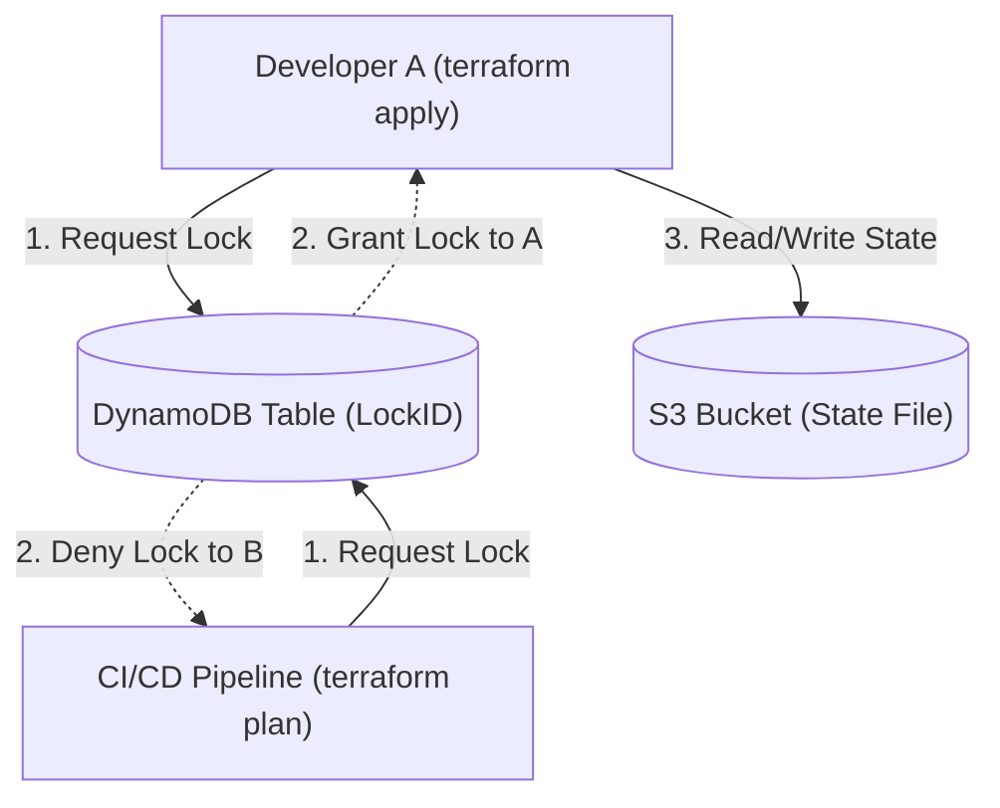

# Terraform: Advanced State Management

## 1. The Anatomy of `.tfstate`
Terraform does not query the cloud provider for every resource during every run. It maintains a mapping of your declarative HCL configuration to real-world infrastructure objects in a JSON file called the **State File** (`.tfstate`).

- **Performance**: Caching metadata (like EC2 instance IDs) drastically speeds up `terraform plan`.
- **Dependency Mapping**: State files store resource dependencies (even if deleted from the code), allowing Terraform to destroy resources in the correct order.
- **Risk**: State files often contain **plaintext secrets** (e.g., RDS passwords, private keys). They must never be committed to version control.

## 2. Remote State & Locking
In a team environment, local state files cause devastating race conditions and overwrites. You must configure a Remote Backend.

### S3 + DynamoDB Architecture (AWS)

- **S3 Bucket**: Stores the encrypted `terraform.tfstate`. Must have Object Versioning enabled for rollback capabilities.
- **DynamoDB Table**: Acts as a distributed mutex. When a plan/apply runs, a LockID is written to DynamoDB. Any concurrent runs will fail immediately, preventing state corruption.

## 3. Drift Detection and Reconciliation
Infrastructure Drift occurs when reality diverges from the state file (e.g., someone manually clicks "Edit" in the AWS Console).

### Handling Drift
1. **Detection**: Running `terraform plan` queries the provider (Refresh Phase) and compares the real state against the HCL code.
2. **Reconciliation**: Terraform will propose changes to force the real infrastructure back to what is defined in the HCL (e.g., deleting the manually added security group rule).

### Importing Unmanaged Resources
If a resource exists in the cloud but not in the state file, attempting to create it in HCL will result in a `Conflict/AlreadyExists` error.
You must use the `import` block (Terraform 1.5+) or the CLI:
```bash
# Old way
terraform import aws_instance.web i-1234567890abcdef0

# New way (HCL)
import {
  to = aws_instance.web
  id = "i-1234567890abcdef0"
}
```
