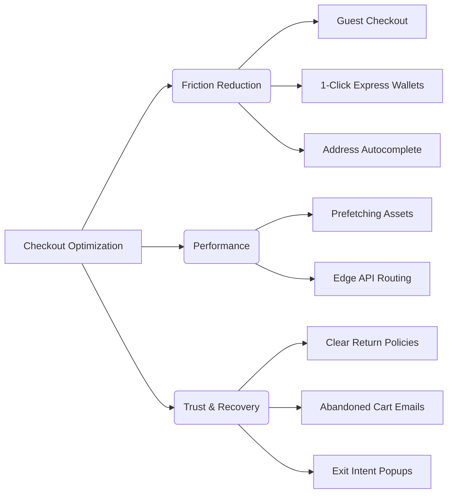

# Checkout Optimization

Techniques to reduce friction, minimize cart abandonment, and maximize conversion rates.

## Best Practices
1. **Express Checkout Options**: Integrate Apple Pay, Google Pay, and Shop Pay for 1-click checkout experiences.
2. **Guest Checkout Default**: Never force users to create an account before purchasing. Offer account creation post-checkout.
3. **Pre-fetching**: Preload checkout assets and dependencies when the user hovers over the "Checkout" button to eliminate perceived latency.
4. **Trust Signals**: Display security badges and clear return policies close to the payment CTA.

## Code Snippet: Payment Request API (Apple/Google Pay)
```javascript
// Quick implementation of Payment Request API
if (window.PaymentRequest) {
  const supportedInstruments = [{
    supportedMethods: 'https://google.com/pay',
    data: {
      environment: 'TEST',
      apiVersion: 2,
      apiVersionMinor: 0,
      // ... merchant info
    }
  }];

  const details = {
    total: { label: 'Total', amount: { currency: 'USD', value: '49.99' } },
  };

  const request = new PaymentRequest(supportedInstruments, details);
  
  document.getElementById('express-checkout-btn').addEventListener('click', async () => {
    try {
      const response = await request.show();
      // Process payment token with backend
      await processPayment(response);
      await response.complete('success');
    } catch (e) {
      console.error('Payment failed or cancelled', e);
    }
  });
}
```

## Optimization Strategy Tree

