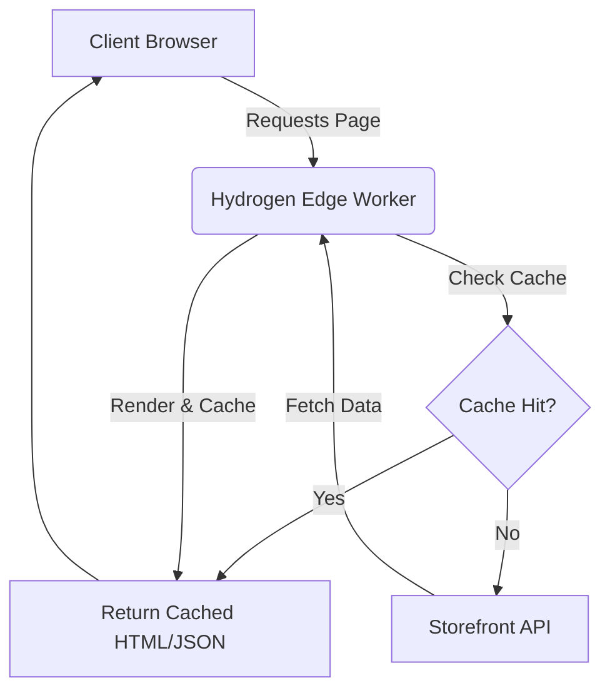

# Headless E-commerce (Shopify Hydrogen)

Focus on fetching data efficiently, caching, and edge computing for ultra-fast storefronts.

## Best Practices
1. **Use Caching Extensively**: Leverage `@shopify/hydrogen`'s `CacheLong`, `CacheShort`, and custom cache directives for all Storefront API queries.
2. **Fragment Colocation**: Define GraphQL fragments alongside components to ensure you only over-fetch what's strictly necessary for rendering.
3. **Edge Rendering**: Deploy Hydrogen on edge networks (like Oxygen, Cloudflare Workers) to minimize TTFB.

## Code Snippet: Querying Products
```typescript
import { CacheLong, gql } from '@shopify/hydrogen';
import type { LoaderArgs } from '@shopify/remix-oxygen';

const PRODUCTS_QUERY = gql`
  query FeaturedProducts {
    products(first: 3) {
      nodes {
        id
        title
        handle
        variants(first: 1) {
          nodes {
            price {
              amount
              currencyCode
            }
          }
        }
      }
    }
  }
`;

export async function loader({ context }: LoaderArgs) {
  const { products } = await context.storefront.query(PRODUCTS_QUERY, {
    cache: CacheLong(),
  });
  return { products };
}
```

## Architecture Diagram

