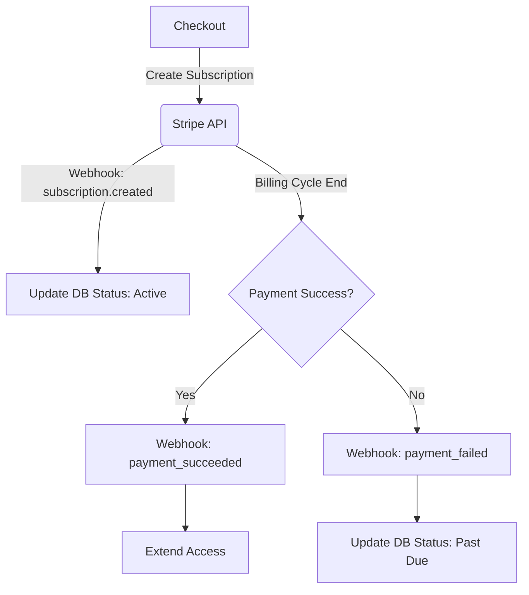

# Stripe Payments & Subscriptions

Manage Stripe subscription lifecycles securely via robust webhook handling and Idempotency.

## Best Practices
1. **Always Verify Webhook Signatures**: Prevent replay and spoofing attacks by verifying the Stripe-Signature header.
2. **Idempotency Keys**: Always pass idempotency keys for mutations (e.g., creating customers, subscriptions) to handle network retries safely.
3. **Async Webhook Processing**: Acknowledge the webhook with a `200 OK` immediately, then process the event asynchronously.

## Code Snippet: Webhook Handler
```typescript
import Stripe from 'stripe';
import { buffer } from 'micro';

const stripe = new Stripe(process.env.STRIPE_SECRET_KEY, { apiVersion: '2023-10-16' });

export const config = { api: { bodyParser: false } };

export default async function webhookHandler(req, res) {
  const buf = await buffer(req);
  const sig = req.headers['stripe-signature'];

  let event;
  try {
    event = stripe.webhooks.constructEvent(buf, sig, process.env.STRIPE_WEBHOOK_SECRET);
  } catch (err) {
    return res.status(400).send(`Webhook Error: ${err.message}`);
  }

  // Acknowledge receipt
  res.status(200).json({ received: true });

  // Process asynchronously
  switch (event.type) {
    case 'customer.subscription.created':
    case 'customer.subscription.updated':
    case 'customer.subscription.deleted':
      await handleSubscriptionChange(event.data.object);
      break;
    case 'invoice.payment_succeeded':
      await handlePaymentSucceeded(event.data.object);
      break;
    default:
      console.log(`Unhandled event type ${event.type}`);
  }
}
```

## Subscription Lifecycle Flow

