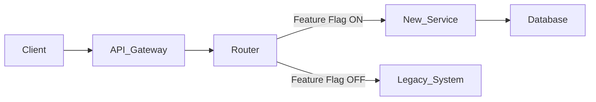

# Strangler Fig Pattern

## Pattern Overview

### Core Concept
Gradually replace legacy system functionality with new implementation while routing traffic between them. Named after strangler fig vines that grow around host trees.

### Architecture



## Implementation Steps

### Step 1: Identify Strangle Points
- Find natural module boundaries in legacy
- Look for independent feature sets
- Identify stable API surfaces
- Map to URL paths or domain events

### Step 2: Build Routing Infrastructure
```python
class MigrationRouter:
    def __init__(self):
        self.flag_service = FeatureFlagClient()

    def route_request(self, request):
        # Check if this feature should use new system
        if self.flag_service.is_enabled(
            f"migration.{request.path}",
            user_id=request.user_id
        ):
            return self.new_service.handle(request)
        return self.legacy_service.handle(request)
```

### Step 3: Implement Anti-Corruption Layer
```python
class LegacyTranslationLayer:
    def to_legacy_format(self, new_response):
        return {
            "status": new_response["state"],
            "data": new_response["payload"],
            "legacy_version": "compat"
        }

    def from_legacy_format(self, legacy_response):
        return {
            "state": legacy_response["status"],
            "payload": legacy_response["data"]
        }
```

### Step 4: Incremental Cutover
1. Select first module to replace
2. Build new implementation
3. Route 1% of traffic to new
4. Monitor metrics for 24h
5. Ramp traffic in stages
6. Confirm stability before next module

### Step 5: Legacy Decommission
- After all modules replaced
- Verify zero traffic to legacy
- Archive data and code
- Remove routing infrastructure
- Decommission legacy servers

## Common Pitfalls

### Shared Database
- Both systems access same DB → tight coupling
- Solution: ACL with data sync instead

### Long-Running Migration
- Migration stalls when team moves on
- Set deadline with executive sponsorship
- Dedicated migration team

### Missing Test Coverage
- Can't verify new system correctness
- Run parallel until confident
- Use production traffic replay

## Rollback Strategy

### Quick Rollback (<5min)
- Feature flag toggle back to legacy
- Data writes paused to new system
- DNS switch if needed

### Full Rollback (>1hr)
- Restore legacy from backup
- Replay missed transactions
- Verify data consistency

## Success Criteria
- Zero legacy traffic for 30 days
- All features verified in new system
- Performance meets or exceeds legacy
- Team trained on new system
- Documentation updated
