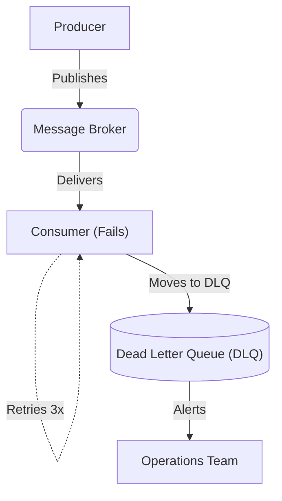

# Enterprise Integration Patterns: Messaging & Event Streaming

## 1. Core Messaging Patterns
Modern enterprise integration relies heavily on asynchronous messaging to decouple services and ensure high availability.

### Message Channel
- **Point-to-Point Channel**: Guarantees that only *one* receiver processes a given message. Commonly implemented via RabbitMQ/ActiveMQ queues.
- **Publish-Subscribe Channel**: Broadcasts a single message to *multiple* independent receivers. Implemented via Kafka Topics, AWS SNS, or Azure Service Bus Topics.

### Message Routing & Transformation
- **Content-Based Router**: Inspects the message payload and routes it to the appropriate downstream queue (e.g., routing orders to different warehouses based on region).
- **Message Translator**: Converts message formats between incompatible systems (e.g., transforming legacy XML to modern JSON) without modifying the sender or receiver.
- **Claim Check Pattern**: When a message payload is too large for the message broker (e.g., a 50MB PDF), the sender uploads the file to object storage (S3) and only sends the reference URL (the "claim check") through the message queue.

## 2. Event Streaming vs Message Brokers
It is crucial to distinguish between traditional message queues and modern event streaming platforms.

### Message Brokers (RabbitMQ, SQS)
- **Smart Broker, Dumb Consumer**: The broker tracks which messages have been acknowledged.
- **Destructive Read**: Once a message is consumed and acknowledged, it is deleted from the queue.
- **Use Case**: Task queues, sending emails, processing background jobs where each task must be done exactly once by any available worker.

### Event Streaming (Apache Kafka, AWS Kinesis)
- **Dumb Broker, Smart Consumer**: The broker simply appends messages to an immutable log. The consumer tracks its own "offset".
- **Replayability**: Messages remain on the log until a retention policy (e.g., 7 days) expires. Multiple consumer groups can read the exact same messages at different speeds.
- **Use Case**: Real-time analytics, event sourcing, replicating database changes (CDC), and auditing.

## 3. Resilience Patterns

- **Dead Letter Queue (DLQ)**: If a consumer repeatedly fails to process a message (poison pill), it is moved to a DLQ for manual inspection, preventing the queue from blocking.
- **Idempotent Receiver**: In distributed systems, at-least-once delivery is the norm. Receivers must be designed to handle duplicate messages safely by tracking unique `Message-ID`s.
