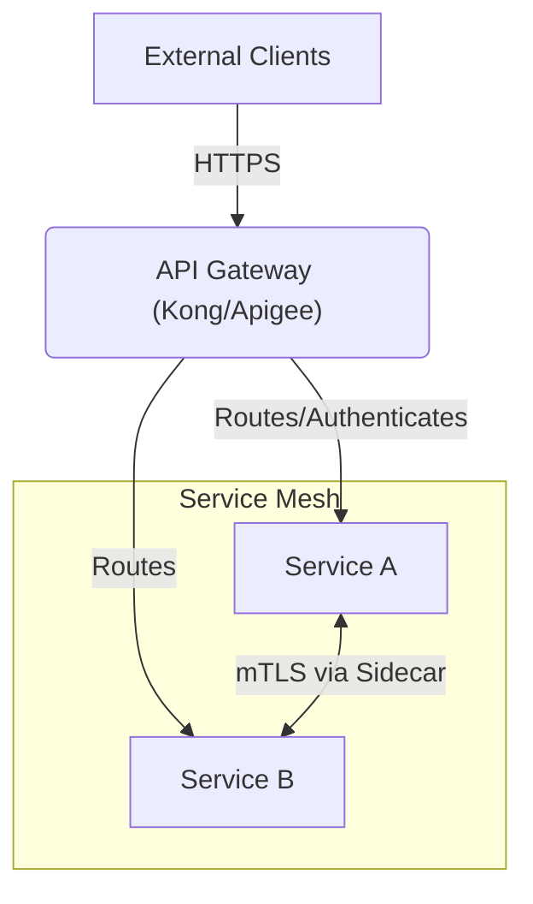

# Enterprise Integration Patterns: Distributed Transactions & APIs

## 1. The Saga Pattern (Distributed Transactions)
In a microservices architecture, a single business transaction (e.g., "Book a Trip") often spans multiple databases. Two-Phase Commit (2PC) is too slow and locks databases. We use the Saga pattern instead.

### Choreography
Each local transaction publishes an event that triggers local transactions in other services.
- **Flow**: Order Service creates order -> Emits `OrderCreated` -> Inventory Service reserves items -> Emits `InventoryReserved` -> Payment Service processes payment.
- **Pros**: No centralized controller, loosely coupled.
- **Cons**: Difficult to trace the flow of a complex transaction. Risk of cyclic dependencies.

### Orchestration
A centralized controller (the Orchestrator) tells each participant what local transactions to execute.
- **Flow**: Order Orchestrator calls Inventory API -> Wait for success -> Calls Payment API.
- **Pros**: Easy to understand the workflow and monitor state.
- **Cons**: The Orchestrator can become a single point of failure or a bottleneck (God Service).

### Compensating Transactions
If a step in a Saga fails, the system cannot simply `ROLLBACK`. It must execute compensating transactions (e.g., if Payment fails, call the Inventory API to release the reserved items).

## 2. API Gateway & Service Mesh
Integrating hundreds of microservices requires centralized entry points and network control.

### API Gateway (North-South Traffic)
- **Role**: Sits at the edge of the network.
- **Capabilities**: Rate limiting, API Key validation, IP whitelisting, response caching, and routing external traffic to internal services.
- **Pattern**: Backends for Frontends (BFF) - Creating specific API Gateways tailored to the needs of different clients (e.g., one Gateway for Mobile, one for Web).

### Service Mesh (East-West Traffic)
- **Role**: Manages service-to-service communication within the cluster.
- **Capabilities**: Mutual TLS (mTLS) encryption, circuit breaking, automatic retries, and distributed tracing injection without modifying the application code.
- **Implementation**: Typically uses the Sidecar pattern (e.g., Envoy proxy running alongside the application container).
