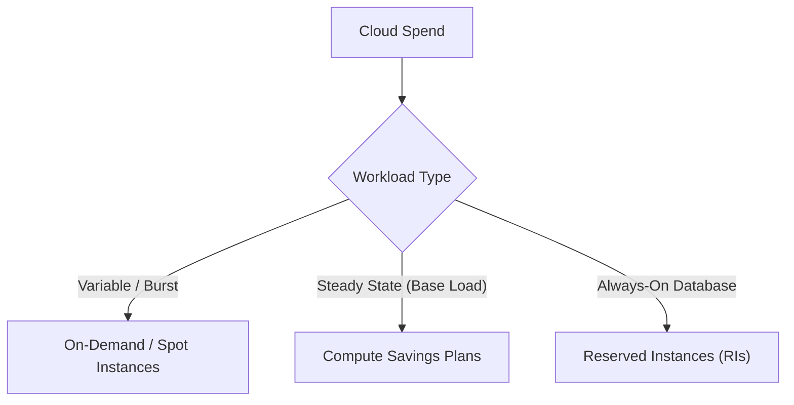

# FinOps: Cloud Financial Operations & Optimization

## 1. The FinOps Lifecycle
FinOps is the practice of bringing financial accountability to the variable spend model of the cloud. It operates in three phases:
1. **Inform**: Visibility into allocation, benchmarking, budgeting, and forecasting.
2. **Optimize**: Identifying optimization opportunities (rightsizing, commitments).
3. **Operate**: Continuously evaluating business objectives against cloud metrics.

## 2. Advanced Optimization Strategies

### Architectural Rightsizing
- **CPU/Memory Optimization**: Downgrading EC2 instances from `m5.2xlarge` to `m5.xlarge` based on 90-day CloudWatch metrics showing < 30% utilization.
- **Graviton / ARM Transition**: Recompiling applications to run on ARM-based processors (like AWS Graviton) which offer up to 40% better price-performance compared to x86.
- **Storage Tiering**: Transitioning S3 buckets from Standard to S3 Infrequent Access (IA) or Glacier using Lifecycle Policies for objects older than 30 days.

### Commitment Discount Models
Cloud providers offer significant discounts (up to 72%) in exchange for committing to usage.

- **Reserved Instances (RIs)**: Committing to a specific instance type and operating system in a specific region for 1 or 3 years. Highest discount, but lowest flexibility.
- **Savings Plans**: Committing to a specific dollar amount of compute usage per hour (e.g., $10/hour). Applies globally across any instance family and region. High flexibility.
- **Spot Instances**: Bidding on spare cloud capacity. Extremely cheap (up to 90% discount) but can be terminated with 2 minutes notice. Ideal for stateless, fault-tolerant workloads like batch processing or CI/CD pipelines.

## 3. Unit Economics & Showback
The ultimate goal of FinOps is not just reducing the total bill, but understanding the **Unit Cost**.

### Cost Allocation & Tagging
Without 100% tagging compliance, tracking costs is impossible.
- **Mandatory Tags**: `CostCenter`, `Environment` (prod/dev), `Owner`, `Project`.
- **Enforcement**: Using AWS Organizations Service Control Policies (SCPs) to deny the creation of any resource that lacks mandatory tags.

### Showback vs Chargeback
- **Showback**: Providing dashboards to engineering teams showing exactly how much their services cost. Drives behavioral change through visibility.
- **Chargeback**: Actually billing the engineering teams' internal budgets for their cloud usage.

### The Unit Metric
Instead of asking "Why did our AWS bill go up 20%?", FinOps asks: "What is our Cloud Cost per Active User?"
If the AWS bill goes up 20%, but the user base grew 50%, the **Unit Economics** improved, meaning the architecture is scaling efficiently.
