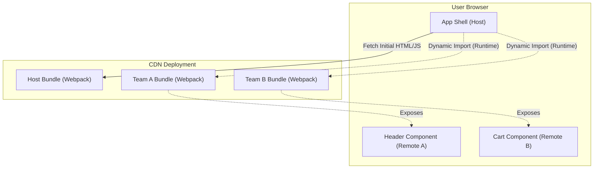

# Micro-frontends & Module Federation

## Core Architecture

Micro-frontends extend the concepts of microservices to the frontend world. Instead of a monolithic SPA (Single Page Application), the UI is composed of independent, deployable fragments.

### 1. Webpack Module Federation
Introduced in Webpack 5, Module Federation allows a JavaScript application to dynamically load code from another application at runtime. 
- **Host:** The main shell application.
- **Remote:** The micro-frontend exposing specific components or routes.
- **Shared Dependencies:** React or Lodash can be marked as shared, so the browser downloads them only once, preventing bundle bloat.

### Architecture Map

