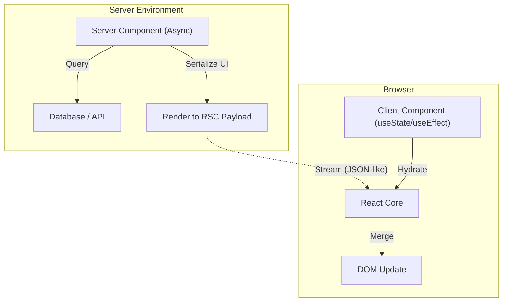

# React Server Components (RSC)

## Core Architecture

React Server Components (RSC) represent a fundamental shift in how React apps are rendered, blending the benefits of Server-Side Rendering (SSR) with Client-Side SPAs.

### 1. RSC vs SSR
- **SSR (Legacy):** Renders the component tree to an HTML string on the server. The browser downloads the HTML, then downloads all the JS, and "hydrates" the page to make it interactive. All component code is sent to the client.
- **RSC:** Components execute exclusively on the server. They have direct access to databases or file systems. Their code is **never** sent to the client. The server streams a proprietary UI representation (not HTML) to the client, which React merges into the existing DOM without destroying client state.

### Architecture Map

