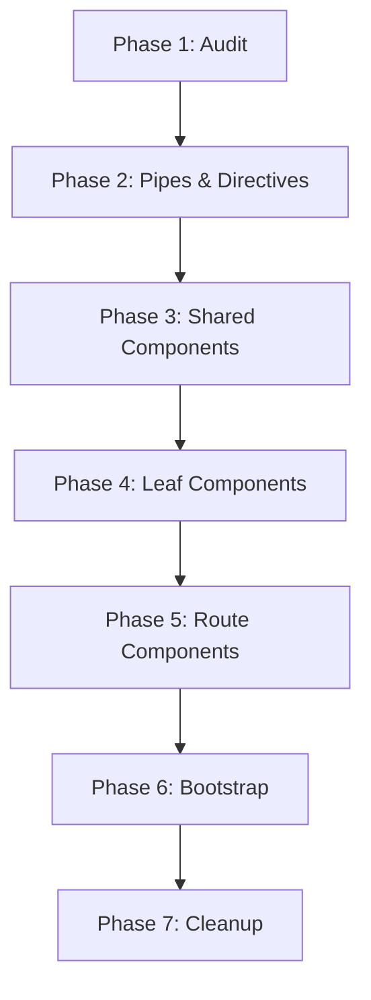

# Angular Standalone Migration

## Overview

Standalone components, introduced in Angular 14 and promoted to stable in Angular 15, remove the dependency on `NgModule` for declaring components, directives, and pipes. Every Angular element can self-declare its dependencies, eliminating the need for module wrappers.

```typescript
@Component({
  selector: 'app-user-profile',
  standalone: true,
  imports: [NgIf, DatePipe, UserAvatarComponent],
  template: `
    <div *ngIf="user()">
      <app-user-avatar [user]="user()" />
      <p>Joined: {{ user().createdAt | date }}</p>
    </div>
  `,
})
export class UserProfileComponent {
  user = input.required<User>()
}
```

### Migration Strategy

Two approaches exist for migrating an NgModule-based application to standalone:

**Incremental migration** — Recommended for production applications. Angular's migration schematics convert one component at a time while maintaining hybrid mode.

**Complete rewrite** — Suitable only for small applications or greenfield projects. Rewriting from scratch offers no practical advantage over incremental conversion.

```bash
# Run the automated schematic to convert all components
ng generate @angular/core:standalone

# Or migrate selectively
ng generate @angular/core:standalone --mode convert-to-standalone
```

### Compatibility Considerations

Before migrating, verify that all third-party libraries support standalone usage:

```typescript
// Angular Material v15+ provides standalone imports
import { MatButtonModule } from '@angular/material/button'
// becomes:
import { MatButton } from '@angular/material/button'

// NgRx v16+ supports standalone providers
import { provideState, provideStore } from '@ngrx/store'
```

## Pre-Migration Preparation

### Audit Existing NgModules

Create an inventory of all NgModules in the application. Classify each module into one of three categories:

```typescript
// 1. Feature modules — easiest to migrate, convert to standalone routes
@NgModule({
  declarations: [ProductListComponent, ProductDetailComponent],
  imports: [CommonModule, SharedModule, RouterModule.forChild(routes)],
})
export class ProductsModule {}

// 2. Shared modules — debe refactorizarse en importaciones directas
@NgModule({
  declarations: [ButtonComponent, InputComponent, CardComponent],
  exports: [ButtonComponent, InputComponent, CardComponent],
})
export class SharedModule {}

// 3. Core/singleton modules — requires provider refactoring
@NgModule({
  providers: [AuthService, ApiInterceptor],
})
export class CoreModule {}
```

### Identify Shared Dependencies

Map every shared dependency across the codebase. Dependencies imported in multiple modules must become standalone directives, pipes, or components before migration proceeds.

```typescript
// src/app/shared/directives/highlight.directive.ts
@Directive({
  selector: '[appHighlight]',
  standalone: true,
})
export class HighlightDirective {
  @Input() appHighlight = 'yellow'
  hostStyle = hostBinding('style.backgroundColor')
}
```

### Plan Migration Order

Follow this migration sequence:

1. **Pipes and directives first** — Lowest risk, pure transformations, no side effects
2. **Shared components** — UI primitives used across features
3. **Leaf components** — Components with no children that need migration
4. **Route components** — Pages and routed containers
5. **Services and providers** — Injectable refactoring last
6. **Bootstrap** — Convert `platformBrowserDynamic` to `bootstrapApplication`

## Creating Standalone Components

### Standalone Flag

Every standalone component must set `standalone: true` in its decorator metadata:

```typescript
@Component({
  standalone: true,
  selector: 'app-order-summary',
  imports: [CurrencyPipe, NgFor, OrderItemComponent],
  template: `...`,
  changeDetection: ChangeDetectionStrategy.OnPush,
})
export class OrderSummaryComponent {
  items = input.required<OrderItem[]>()
  total = computed(() =>
    this.items().reduce((sum, item) => sum + item.price, 0)
  )
}
```

### Standalone Imports

Components import their dependencies directly rather than through a module:

```typescript
// Before — NgModule provides dependencies
@NgModule({
  imports: [CommonModule, ReactiveFormsModule],
  declarations: [OrderFormComponent],
})
export class OrderModule {}

@Component({ ... })
export class OrderFormComponent { }

// After — component imports its own dependencies
@Component({
  standalone: true,
  imports: [NgIf, ReactiveFormsModule, ValidationMessageComponent],
  template: `...`,
})
export class OrderFormComponent {
  form = new FormGroup({
    email: new FormControl('', [Validators.required, Validators.email]),
    quantity: new FormControl(1, [Validators.min(1)]),
  })
}
```

### Component-Level Dependencies

Each component declares exactly what it needs, enabling better tree-shaking:

```typescript
@Component({
  standalone: true,
  imports: [
    // Angular built-in directives
    NgIf, NgFor, AsyncPipe, DatePipe,
    // Shared components
    ButtonComponent, CardComponent, SpinnerComponent,
    // Feature-specific
    OrderStatusPipe,
  ],
})
export class OrdersPageComponent { }
```

## Standalone Pipes and Directives

### Converting to Standalone

Pipes and directives follow the same `standalone: true` pattern:

```typescript
// standalone.pipe.ts
@Pipe({
  name: 'truncate',
  standalone: true,
})
export class TruncatePipe implements PipeTransform {
  transform(value: string, maxLength = 100): string {
    return value.length > maxLength
      ? value.slice(0, maxLength) + '...'
      : value
  }
}

// standalone.directive.ts
@Directive({
  selector: '[appDebounceClick]',
  standalone: true,
})
export class DebounceClickDirective {
  @Output() debounceClick = new EventEmitter<MouseEvent>()
  private clicks = new Subject<MouseEvent>()
  private subscription = this.clicks.pipe(debounceTime(300)).subscribe(e =>
    this.debounceClick.emit(e)
  )

  @HostListener('click', ['$event'])
  onClick(event: MouseEvent) {
    event.preventDefault()
    this.clicks.next(event)
  }
}
```

### Direct Imports vs Scope

With NgModules, pipes and directives were available through the module's `exports`. With standalone, each consumer imports what it needs:

```typescript
// Component imports its own pipes and directives
@Component({
  standalone: true,
  imports: [TruncatePipe, DebounceClickDirective],
  template: `
    <button appDebounceClick (debounceClick)="save()">
      {{ label | truncate: 20 }}
    </button>
  `,
})
export class SaveButtonComponent {
  label = input('Submit')
  save = output()
}
```

## Standalone Bootstrap

### Bootstrap Application

Replace `platformBrowserDynamic` with `bootstrapApplication`:

```typescript
// main.ts — Angular 15+ standalone bootstrap
import { bootstrapApplication } from '@angular/platform-browser'
import { provideRouter } from '@angular/router'
import { provideHttpClient, withInterceptors } from '@angular/common/http'
import { provideAnimations } from '@angular/platform-browser/animations'
import { AppComponent } from './app/app.component'
import { routes } from './app/app.routes'
import { authInterceptor } from './app/core/interceptors/auth.interceptor'
import { errorInterceptor } from './app/core/interceptors/error.interceptor'

bootstrapApplication(AppComponent, {
  providers: [
    provideRouter(routes),
    provideHttpClient(
      withInterceptors([authInterceptor, errorInterceptor])
    ),
    provideAnimations(),
  ],
})
```

### App Config Pattern

Extract providers into a separate configuration file for testability:

```typescript
// app.config.ts
import { ApplicationConfig } from '@angular/core'
import { provideRouter, withComponentInputBinding } from '@angular/router'
import { provideHttpClient, withFetch } from '@angular/common/http'
import { provideAnimations } from '@angular/platform-browser/animations'
import { provideStore } from '@ngrx/store'
import { provideEffects } from '@ngrx/effects'
import { routes } from './app.routes'
import { reducers } from './store'

export const appConfig: ApplicationConfig = {
  providers: [
    provideRouter(routes, withComponentInputBinding()),
    provideHttpClient(withFetch()),
    provideAnimations(),
    provideStore(reducers),
    provideEffects([]),
  ],
}
```

```typescript
// main.ts
import { bootstrapApplication } from '@angular/platform-browser'
import { AppComponent } from './app/app.component'
import { appConfig } from './app/app.config'

bootstrapApplication(AppComponent, appConfig)
  .catch(err => console.error(err))
```

### Legacy Bootstrap vs Standalone

```typescript
// Before — NgModule bootstrap
import { platformBrowserDynamic } from '@angular/platform-browser-dynamic'

platformBrowserDynamic().bootstrapModule(AppModule)
  .catch(err => console.error(err))

// After — Standalone bootstrap
import { bootstrapApplication } from '@angular/platform-browser'

bootstrapApplication(AppComponent, appConfig)
  .catch(err => console.error(err))
```

## Provide Functions

### provideRouter

```typescript
import { provideRouter, withRouterConfig, withInMemoryScrolling } from '@angular/router'

export const appConfig: ApplicationConfig = {
  providers: [
    provideRouter(
      routes,
      withRouterConfig({
        onSameUrlNavigation: 'reload',
        paramsInheritanceStrategy: 'always',
      }),
      withInMemoryScrolling({
        scrollPositionRestoration: 'enabled',
        anchorScrolling: 'enabled',
      }),
    ),
  ],
}
```

### provideHttpClient

```typescript
import { provideHttpClient, withInterceptors, withFetch, withXsrfConfiguration } from '@angular/common/http'

export const appConfig: ApplicationConfig = {
  providers: [
    provideHttpClient(
      withFetch(),
      withInterceptors([loggingInterceptor, authInterceptor]),
      withXsrfConfiguration({
        cookieName: 'XSRF-TOKEN',
        headerName: 'X-XSRF-TOKEN',
      }),
    ),
  ],
}
```

### provideAnimations

```typescript
import { provideAnimations } from '@angular/platform-browser/animations'
// or for noop animations (testing, SSR):
import { provideNoopAnimations } from '@angular/platform-browser/animations'

export const appConfig: ApplicationConfig = {
  providers: [
    provideAnimations(),
    // provideNoopAnimations(),
  ],
}
```

### provideStore (NgRx)

```typescript
import { provideStore, provideState } from '@ngrx/store'
import { provideEffects } from '@ngrx/effects'
import { provideStoreDevtools } from '@ngrx/store-devtools'
import { provideRouterStore, routerReducer } from '@ngrx/router-store'
import { isDevMode } from '@angular/core'

export const appConfig: ApplicationConfig = {
  providers: [
    provideStore({
      router: routerReducer,
    }),
    provideState('products', productsReducer),
    provideState('orders', ordersReducer),
    provideEffects([ProductsEffects, OrdersEffects]),
    provideRouterStore(),
    provideStoreDevtools({
      maxAge: 25,
      logOnly: !isDevMode(),
    }),
  ],
}
```

### Custom Providers

```typescript
// Custom provide function for domain-specific configuration
import { InjectionToken, Provider, EnvironmentProviders, makeEnvironmentProviders } from '@angular/core'

export interface AppConfig {
  apiBaseUrl: string
  appName: string
  version: string
  features: {
    darkMode: boolean
    betaFeatures: boolean
  }
}

export const APP_CONFIG = new InjectionToken<AppConfig>('app.config')

export function provideAppConfig(config: AppConfig): EnvironmentProviders {
  return makeEnvironmentProviders([
    { provide: APP_CONFIG, useValue: config },
  ])
}

// Usage in app.config.ts
export const appConfig: ApplicationConfig = {
  providers: [
    provideRouter(routes),
    provideHttpClient(),
    provideAppConfig({
      apiBaseUrl: '/api/v2',
      appName: 'Order Management',
      version: '2.1.0',
      features: {
        darkMode: true,
        betaFeatures: false,
      },
    }),
  ],
}
```

## Route-Level Standalone

### LoadComponent for Lazy Routes

```typescript
import { Routes } from '@angular/router'

export const routes: Routes = [
  {
    path: 'dashboard',
    loadComponent: () => import('./features/dashboard/dashboard-page.component')
      .then(m => m.DashboardPageComponent),
    title: 'Dashboard',
    canActivate: [authGuard],
  },
  {
    path: 'products',
    loadChildren: () => import('./features/products/products.routes')
      .then(m => m.productsRoutes),
    canMatch: [featureFlagGuard('products')],
  },
  {
    path: 'orders/:id',
    loadComponent: () => import('./features/orders/order-detail-page.component')
      .then(m => m.OrderDetailPageComponent),
    resolve: { order: orderResolver },
    canDeactivate: [unsavedChangesGuard],
  },
]
```

### Standalone Route Guards

Route guards become plain injectable functions rather than class-based guards:

```typescript
// auth.guard.ts
import { inject } from '@angular/core'
import { Router } from '@angular/router'
import { AuthService } from './auth.service'

export function authGuard(): boolean {
  const auth = inject(AuthService)
  const router = inject(Router)

  if (auth.isAuthenticated()) {
    return true
  }

  router.navigate(['/login'], {
    queryParams: { returnUrl: router.url },
  })
  return false
}

// Role-based guard factory
export function roleGuard(...allowedRoles: string[]) {
  return (): boolean => {
    const auth = inject(AuthService)
    return auth.hasRole(...allowedRoles)
  }
}
```

### Standalone Resolvers

```typescript
// order.resolver.ts
import { inject } from '@angular/core'
import { ActivatedRouteSnapshot } from '@angular/router'
import { OrderService } from './order.service'

export function orderResolver(route: ActivatedRouteSnapshot) {
  const orderService = inject(OrderService)
  const id = route.paramMap.get('id')
  if (!id) throw new Error('Order ID is required')
  return orderService.getOrder(id)
}

// Using resolvers in routes
export const orderRoutes: Routes = [
  {
    path: ':id',
    loadComponent: () => import('./order-detail-page.component')
      .then(m => m.OrderDetailPageComponent),
    resolve: { order: orderResolver },
  },
]
```

## Feature Modules to Standalone Migration

### Module Decomposition

Break each feature module into individual standalone pieces:

```typescript
// Before — ProductsModule
@NgModule({
  imports: [
    CommonModule,
    SharedModule,
    ReactiveFormsModule,
    RouterModule.forChild([
      { path: '', component: ProductListComponent },
      { path: ':id', component: ProductDetailComponent },
      { path: ':id/edit', component: ProductEditComponent },
    ]),
  ],
  declarations: [
    ProductListComponent,
    ProductDetailComponent,
    ProductEditComponent,
  ],
})
export class ProductsModule {}
```

```typescript
// After — Standalone feature routes
// products.routes.ts
import { Routes } from '@angular/router'

export const productsRoutes: Routes = [
  {
    path: '',
    loadComponent: () => import('./pages/product-list/product-list.component')
      .then(m => m.ProductListComponent),
    title: 'Products',
  },
  {
    path: ':id',
    loadComponent: () => import('./pages/product-detail/product-detail.component')
      .then(m => m.ProductDetailComponent),
    title: 'Product Detail',
    resolve: { product: productResolver },
  },
  {
    path: ':id/edit',
    loadComponent: () => import('./pages/product-edit/product-edit.component')
      .then(m => m.ProductEditComponent),
    title: 'Edit Product',
    canDeactivate: [unsavedChangesGuard],
  },
]

// product-list.component.ts
@Component({
  standalone: true,
  imports: [NgFor, AsyncPipe, DatePipe, ProductCardComponent, SearchBarComponent, PaginationComponent],
  template: `...`,
})
export class ProductListComponent {
  products$ = inject(ProductService).getAll()
}
```

### Eliminating forRoot/forChild Patterns

```typescript
// Before — Module with forRoot/forChild
@NgModule({
  providers: [AnalyticsService],
})
export class AnalyticsModule {
  static forRoot(config: AnalyticsConfig): ModuleWithProviders<AnalyticsModule> {
    return {
      ngModule: AnalyticsModule,
      providers: [
        { provide: ANALYTICS_CONFIG, useValue: config },
        { provide: ANALYTICS_TRACKER, useClass: config.provider === 'ga' ? GATracker : MixpanelTracker },
      ],
    }
  }

  static forChild(featureName: string): ModuleWithProviders<AnalyticsModule> {
    return {
      ngModule: AnalyticsModule,
      providers: [
        { provide: FEATURE_NAME, useValue: featureName },
      ],
    }
  }
}
```

```typescript
// After — Provide function pattern
export function provideAnalytics(config: AnalyticsConfig): EnvironmentProviders {
  return makeEnvironmentProviders([
    AnalyticsService,
    { provide: ANALYTICS_CONFIG, useValue: config },
    { provide: ANALYTICS_TRACKER, useClass: config.provider === 'ga' ? GATracker : MixpanelTracker },
    provideFeatureTracking,
  ])
}

function provideFeatureTracking(): Provider[] {
  return [
    // Feature-level tracking setup
  ]
}

// app.config.ts
export const appConfig: ApplicationConfig = {
  providers: [
    provideAnalytics({
      provider: 'ga',
      trackingId: 'G-XXXXXXXXXX',
    }),
  ],
}
```

## Shared Module Migration

### Removing SharedModule

The SharedModule pattern accumulates unused dependencies over time. Replace it with direct imports:

```typescript
// Before — SharedModule
@NgModule({
  declarations: [
    ButtonComponent, InputComponent, CardComponent,
    TooltipDirective, HighlightDirective,
    TruncatePipe, FormatDatePipe,
  ],
  exports: [
    ButtonComponent, InputComponent, CardComponent,
    TooltipDirective, HighlightDirective,
    TruncatePipe, FormatDatePipe,
    CommonModule, ReactiveFormsModule,
  ],
})
export class SharedModule {}

// Before — Consumer imports SharedModule
@Component({
  standalone: true,
  imports: [SharedModule], // imports everything, even unused parts
})
export class ConsumerComponent {}
```

```typescript
// After — Direct imports
@Component({
  standalone: true,
  imports: [
    ButtonComponent, CardComponent, TooltipDirective,
    FormatDatePipe,
  ],
  template: `...`,
})
export class ConsumerComponent {}
```

### Barrel Files

Create barrel files to simplify multi-import scenarios without losing tree-shaking:

```typescript
// shared/index.ts
export { ButtonComponent } from './components/button.component'
export { InputComponent } from './components/input.component'
export { CardComponent } from './components/card.component'
export { TooltipDirective } from './directives/tooltip.directive'
export { FormatDatePipe } from './pipes/format-date.pipe'
```

```typescript
// Components import only what they need
import { ButtonComponent, CardComponent } from '@shared/index'
```

## Lazy Loading with Standalone

### LoadChildren with Standalone Routes

```typescript
import { Routes } from '@angular/router'

export const routes: Routes = [
  {
    path: 'admin',
    loadChildren: () => import('./features/admin/admin.routes')
      .then(m => m.adminRoutes),
    canMatch: [roleGuard('admin')],
    title: 'Admin Panel',
  },
]

// admin.routes.ts
export const adminRoutes: Routes = [
  {
    path: '',
    loadComponent: () => import('./pages/admin-dashboard/admin-dashboard.component')
      .then(m => m.AdminDashboardComponent),
  },
  {
    path: 'users',
    loadComponent: () => import('./pages/admin-users/admin-users.component')
      .then(m => m.AdminUsersComponent),
  },
  {
    path: 'settings',
    loadComponent: () => import('./pages/admin-settings/admin-settings.component')
      .then(m => m.AdminSettingsComponent),
    canActivate: [settingsGuard],
  },
]
```

### Route-Based Code Splitting

Each `loadComponent` call creates a separate chunk, enabling fine-grained code splitting:

```typescript
export const routes: Routes = [
  {
    path: '',
    loadComponent: () => import('./pages/home/home-page.component')
      .then(m => m.HomePageComponent),
  },
  {
    path: 'products',
    loadChildren: () => import('./features/products/products.routes')
      .then(m => m.productsRoutes),
    data: { preload: true }, // Strategic preloading
  },
  {
    path: 'reports',
    loadComponent: () => import('./pages/reports/reports-page.component')
      .then(m => m.ReportsPageComponent),
    canActivate: [featureFlagGuard('reports')],
  },
]
```

```typescript
// Custom preloading strategy
import { PreloadingStrategy, Route } from '@angular/router'
import { Observable, of, timer } from 'rxjs'

export class SelectivePreloadingStrategy implements PreloadingStrategy {
  preload(route: Route, load: () => Observable<any>): Observable<any> {
    if (route.data?.['preload']) {
      return route.data?.['preloadDelay']
        ? timer(route.data['preloadDelay']).pipe(switchMap(() => load()))
        : load()
    }
    return of(null)
  }
}
```

## Dependency Injection in Standalone

### Environment Injectors

Services provided at the `bootstrapApplication` level use the environment injector:

```typescript
// app.config.ts
export const appConfig: ApplicationConfig = {
  providers: [
    provideRouter(routes),
    provideHttpClient(),
    // These services are available application-wide
    AuthService,
    LoggingService,
    // Feature stores at the app level
    provideStore(reducers),
  ],
}
```

### Platform Injectors

Services that must survive application bootstrapping cycles:

```typescript
// platform.ts
import { createPlatform, InjectionToken } from '@angular/core'
import { platformBrowser } from '@angular/platform-browser'

const PLATFORM_CONFIG = new InjectionToken<PlatformConfig>('platform.config')

// Platform-level providers persist across app bootstrap
const platform = platformBrowser([
  { provide: PLATFORM_CONFIG, useValue: platformConfig },
])
```

### Element Injectors

Standalone components create their own injector hierarchy via providers:

```typescript
@Component({
  standalone: true,
  providers: [
    OrderFormService,   // Scoped to this component and its children
    { provide: FORM_CONFIG, useValue: formConfig },
  ],
  template: `
    <app-order-form />
    <app-order-preview />
  `,
})
export class OrderCreateComponent {
  private formService = inject(OrderFormService)
}
```

## Provider Scoping

### ProvidedIn

```typescript
// Tree-shakable service — available everywhere
@Injectable({ providedIn: 'root' })
export class GlobalService { }

// Feature-scoped service — provided only when feature loads
@Injectable({ providedIn: 'platform' })
export class PlatformWideService { }

// Lazy-scoped service — provided with a specific route
@Injectable()
export class LazyFeatureService { }
```

### WithComponentInputBinding

```typescript
import { provideRouter, withComponentInputBinding } from '@angular/router'

export const appConfig: ApplicationConfig = {
  providers: [
    provideRouter(
      routes,
      withComponentInputBinding(), // Bind route params to component inputs
    ),
  ],
}

// Component receives route params as inputs
@Component({
  standalone: true,
  template: `<p>Product ID: {{ id() }}</p>`,
})
export class ProductDetailComponent {
  // Bound from route param ':id'
  readonly id = input.required<string>()
}
```

### Environment-Specific Providers

```typescript
// environments/environment.ts
export const environment = {
  production: false,
  apiBaseUrl: 'http://localhost:4200/api',
  enableDebugTools: true,
}

// environments/environment.prod.ts
export const environment = {
  production: true,
  apiBaseUrl: 'https://api.example.com',
  enableDebugTools: false,
}
```

```typescript
// app.config.ts
import { isDevMode } from '@angular/core'

export const appConfig: ApplicationConfig = {
  providers: [
    provideHttpClient(),
    // Dev-only interceptors
    ...(isDevMode()
      ? [provideHttpClient(withInterceptors([debugInterceptor]))]
      : []),
    // Environment-based providers
    {
      provide: API_BASE_URL,
      useValue: environment.apiBaseUrl,
    },
    // Only enable debug tools in development
    ...(environment.enableDebugTools
      ? [DebugToolsService]
      : []),
  ],
}
```

## Testing Standalone Components

### TestBed Configuration Changes

```typescript
import { TestBed } from '@angular/core/testing'
import { ProductListComponent } from './product-list.component'
import { ProductService } from './product.service'
import { of } from 'rxjs'

describe('ProductListComponent', () => {
  beforeEach(async () => {
    await TestBed.configureTestingModule({
      imports: [ProductListComponent], // Standalone component imported directly
      providers: [
        {
          provide: ProductService,
          useValue: {
            getAll: () => of([{ id: '1', name: 'Test Product' }]),
          },
        },
      ],
    }).compileComponents()
  })

  it('should display products', () => {
    const fixture = TestBed.createComponent(ProductListComponent)
    fixture.detectChanges()
    const compiled = fixture.nativeElement
    expect(compiled.textContent).toContain('Test Product')
  })
})
```

### Component Harness Updates

```typescript
import { HarnessLoader } from '@angular/cdk/testing'
import { TestbedHarnessEnvironment } from '@angular/cdk/testing/testbed'
import { MatButtonHarness } from '@angular/material/button/testing'
import { ProductCardComponent } from './product-card.component'

describe('ProductCardComponent', () => {
  let loader: HarnessLoader

  beforeEach(async () => {
    await TestBed.configureTestingModule({
      imports: [ProductCardComponent],
    }).compileComponents()

    const fixture = TestBed.createComponent(ProductCardComponent)
    fixture.componentRef.setInput('product', {
      id: '1',
      name: 'Widget',
      price: 29.99,
    })
    loader = TestbedHarnessEnvironment.loader(fixture)
  })

  it('should emit addToCart on button click', async () => {
    const addToCartSpy = spyOn(TestBed.inject(ProductCardComponent).addToCart, 'emit')
    const button = await loader.getHarness(MatButtonHarness.with({ text: 'Add to Cart' }))
    await button.click()
    expect(addToCartSpy).toHaveBeenCalledWith('1')
  })
})
```

### HttpClientTestingModule Alternatives

```typescript
import { TestBed } from '@angular/core/testing'
import { provideHttpClient } from '@angular/common/http'
import { provideHttpClientTesting, HttpTestingController } from '@angular/common/http/testing'
import { ProductService } from './product.service'

describe('ProductService', () => {
  let httpTesting: HttpTestingController
  let service: ProductService

  beforeEach(() => {
    TestBed.configureTestingModule({
      providers: [
        provideHttpClient(),
        provideHttpClientTesting(),
        ProductService,
      ],
    })

    httpTesting = TestBed.inject(HttpTestingController)
    service = TestBed.inject(ProductService)
  })

  afterEach(() => {
    httpTesting.verify()
  })

  it('should fetch products', () => {
    const mockProducts = [{ id: '1', name: 'Widget' }]

    service.getAll().subscribe(products => {
      expect(products).toEqual(mockProducts)
    })

    const req = httpTesting.expectOne('/api/products')
    expect(req.request.method).toBe('GET')
    req.flush(mockProducts)
  })
})
```

### ProviderResolver for Complex Mocking

```typescript
import { TestBed } from '@angular/core/testing'
import { OrderDetailComponent } from './order-detail.component'
import { OrderService } from './order.service'
import { ActivatedRoute } from '@angular/router'
import { of } from 'rxjs'

describe('OrderDetailComponent', () => {
  function configureTestBed(overrides: { orderId?: string; order?: any } = {}) {
    TestBed.configureTestingModule({
      imports: [OrderDetailComponent],
      providers: [
        {
          provide: ActivatedRoute,
          useValue: {
            snapshot: { paramMap: { get: () => overrides.orderId ?? '123' } },
          },
        },
        {
          provide: OrderService,
          useValue: {
            getOrder: (id: string) => of(overrides.order ?? { id, status: 'pending' }),
          },
        },
      ],
    })
    return TestBed.createComponent(OrderDetailComponent)
  }

  it('should display order details', () => {
    const fixture = configureTestBed({ orderId: '456', order: { id: '456', status: 'shipped' } })
    fixture.detectChanges()
    expect(fixture.nativeElement.textContent).toContain('shipped')
  })
})
```

## Migration Tools

### Automated Schematic

```bash
# Run all migration schematics in sequence
ng generate @angular/core:standalone

# Migration steps performed by the schematic
# 1. Convert all components to standalone: true
# 2. Move declarations to component imports
# 3. Convert bootstrap to bootstrapApplication
# 4. Remove empty NgModules
# 5. Update route configurations

# Selective migration options
ng generate @angular/core:standalone \
  --mode convert-to-standalone \
  --path src/app/features/products
```

### Migration Schematics

The schematic handles the following transformations automatically:

```typescript
// Before
@NgModule({
  declarations: [HeroComponent],
  imports: [CommonModule],
  exports: [HeroComponent],
})
export class HeroModule {}

// After — Schematic removes NgModule, converts component
@Component({
  standalone: true,
  imports: [CommonModule],
  selector: 'app-hero',
  template: `...`,
})
export class HeroComponent {}
```

### Custom Migration Script

For complex migrations, write custom scripts to handle project-specific patterns:

```typescript
// scripts/standalone-migration.ts
import { readFileSync, writeFileSync, readdirSync } from 'fs'
import { join } from 'path'

function addStandaloneFlag(filePath: string) {
  const content = readFileSync(filePath, 'utf-8')

  // Add standalone: true after @Component({
  const updated = content.replace(
    /@Component\(\{/,
    `@Component({\n  standalone: true,`
  )

  writeFileSync(filePath, updated)
  console.log(`Updated: ${filePath}`)
}

function scanAndConvert(directory: string) {
  const entries = readdirSync(directory, { withFileTypes: true })

  for (const entry of entries) {
    const fullPath = join(directory, entry.name)

    if (entry.isDirectory()) {
      scanAndConvert(fullPath)
    } else if (entry.name.endsWith('.component.ts')) {
      addStandaloneFlag(fullPath)
    }
  }
}

scanAndConvert('./src/app')
```

## Common Migration Patterns

### Converting forRoot to provideX Pattern

```typescript
// Before — NgModule with forRoot
@NgModule({
  providers: [ToastService],
})
export class ToastModule {
  static forRoot(config: ToastConfig): ModuleWithProviders<ToastModule> {
    return {
      ngModule: ToastModule,
      providers: [
        { provide: TOAST_CONFIG, useValue: config },
        ToastService,
      ],
    }
  }
}

// AppModule imports
@NgModule({
  imports: [ToastModule.forRoot({ duration: 3000, position: 'top-right' })],
})
export class AppModule {}

// After — Provide function
export function provideToast(config: ToastConfig): EnvironmentProviders {
  return makeEnvironmentProviders([
    { provide: TOAST_CONFIG, useValue: config },
    ToastService,
  ])
}

// app.config.ts
export const appConfig: ApplicationConfig = {
  providers: [
    provideToast({ duration: 3000, position: 'top-right' }),
  ],
}
```

### Shared Module Decomposition

```typescript
// Before — Monolithic SharedModule
@NgModule({
  imports: [CommonModule, ReactiveFormsModule],
  declarations: [
    ButtonComponent, InputComponent, SelectComponent,
    ModalComponent, TooltipDirective, MaskDirective,
    TruncatePipe, FilterPipe, SortPipe,
    HighlightDirective, LazyLoadDirective,
    CardComponent, BadgeComponent, AvatarComponent,
  ],
  exports: [
    // All of the above + CommonModule + ReactiveFormsModule
    ButtonComponent, InputComponent, SelectComponent,
    ModalComponent, TooltipDirective, MaskDirective,
    TruncatePipe, FilterPipe, SortPipe,
    HighlightDirective, LazyLoadDirective,
    CardComponent, BadgeComponent, AvatarComponent,
    CommonModule, ReactiveFormsModule,
  ],
})
export class SharedModule {}
```

```typescript
// After — Direct imports in each consumer
// Each component imports only what it uses
@Component({
  standalone: true,
  imports: [
    ButtonComponent,
    InputComponent,
    CardComponent,
    ReactiveFormsModule,
  ],
  template: `...`,
})
export class CheckoutFormComponent {}

@Component({
  standalone: true,
  imports: [
    ModalComponent,
    ButtonComponent,
    BadgeComponent,
  ],
  template: `...`,
})
export class OrderDetailModalComponent {}
```

## Caveats and Edge Cases

### Circular Dependencies

Standalone components that import each other create circular dependencies:

```typescript
// Avoid! Component A imports Component B, which imports Component A
@Component({
  standalone: true,
  imports: [ComponentB],
  template: `<app-component-b />`,
})
export class ComponentA {}

@Component({
  standalone: true,
  imports: [ComponentA], // Circular!
  template: `<app-component-a />`,
})
export class ComponentB {}
```

**Solution**: Extract shared content into a third component or use content projection:

```typescript
// Extract shared layout
@Component({
  standalone: true,
  imports: [NgContent],
  template: `<div class="card"><ng-content /></div>`,
})
export class CardContainerComponent {}

// Parent manages composition
@Component({
  standalone: true,
  imports: [CardContainerComponent, ComponentA, ComponentB],
  template: `
    <app-card-container>
      <app-component-a />
    </app-card-container>
    <app-card-container>
      <app-component-b />
    </app-card-container>
  `,
})
export class ParentComponent {}
```

### Module Providers for Lazy Routes

When converting lazy modules to standalone, providers that were scoped to the module must be handled explicitly:

```typescript
// Before — Module-scoped providers
@NgModule({
  providers: [ProductsService, ProductsState],
})
export class ProductsModule {}

// After — Route-scoped providers
export const productsRoutes: Routes = [
  {
    path: '',
    providers: [ProductsService, ProductsState], // Route-level providers
    children: [
      {
        path: '',
        loadComponent: () => import('./pages/product-list.component')
          .then(m => m.ProductListComponent),
      },
    ],
  },
]
```

### Platform-Level Providers

Some providers must remain at the platform level and cannot be migrated:

```typescript
// Providers that must remain in platform-browser
import { APP_ID, PLATFORM_ID } from '@angular/core'

// Error handler and sanitizer are platform-level
import { ErrorHandler } from '@angular/core'
import { DomSanitizer } from '@angular/platform-browser'

// These should NOT be moved into standalone component providers
bootstrapApplication(AppComponent, {
  providers: [
    { provide: ErrorHandler, useClass: SentryErrorHandler },
    // Keep these at the bootstrap level
  ],
})
```

### Module Imports That Wrap Libraries

Some libraries require NgModule wrappers. Use standalone compatibility wrappers:

```typescript
// If a library doesn't support standalone, create a wrapper
@NgModule({
  imports: [LegacyLibraryModule.forRoot()],
  exports: [LegacyLibraryModule],
})
export class LegacyLibraryWrapperModule {}

// Then import the wrapper in your standalone component
@Component({
  standalone: true,
  imports: [LegacyLibraryWrapperModule], // NgModule import in standalone
  template: `<legacy-library-component />`,
})
export class HybridComponent {}
```

## Performance Implications

### Tree-Shaking Improvements

Standalone components enable better dead-code elimination:

```typescript
// Before — NgModule imports prevent tree-shaking
// Even if only 2 of 10 components are used, all 10 load
@NgModule({
  declarations: [
    CompA, CompB, CompC, CompD, CompE, // All bundled together
    CompF, CompG, CompH, CompI, CompJ,
  ],
})
export class FeatureModule {}

// After — Each component is its own chunk
// Unused components are tree-shaken away
@Component({
  standalone: true,
  imports: [CompA, CompB], // Only what's needed
})
export class ConsumerComponent {}
```

### Bundle Size Reduction

```bash
# Measure before migration
npm run build -- --stats-json
npx source-map-explorer dist/*.js

# After migration, expect:
# - 15-30% reduction in main bundle size
# - Finer-grained lazy loading chunks
# - Reduced initial payload for entry routes
```

### Lazy Loading Effects

```typescript
// Fine-grained lazy loading reduces initial bundle
export const routes: Routes = [
  {
    path: 'dashboard',
    loadComponent: () => import('./dashboard/dashboard.component')
      .then(m => m.DashboardComponent),
  },
  {
    path: 'analytics',
    loadComponent: () => import('./analytics/analytics.component')
      .then(m => m.AnalyticsComponent),
  },
]

// Previously with modules, the entire feature loaded together
// Now individual pages can be loaded independently
```

## Hybrid Mode

### Mixing Standalone and NgModules

Standalone components can be used within NgModule-based applications during migration:

```typescript
@NgModule({
  declarations: [LegacyListComponent],
  imports: [
    CommonModule,
    NewStandaloneComponent, // Standalone component imported directly
  ],
})
export class ProductsModule {}

// The standalone component is used alongside NgModule components
@Component({
  standalone: true,
  imports: [NgFor, DatePipe],
  template: `...`,
})
export class NewStandaloneComponent {}
```

### Coexistence Patterns

```typescript
// NgModule can export standalone components
@NgModule({
  imports: [StandaloneButtonComponent],
  exports: [StandaloneButtonComponent],
})
export class ButtonModule {}

// Standalone components can import NgModules
@Component({
  standalone: true,
  imports: [CommonModule, ReactiveFormsModule, LegacyFormModule],
  template: `...`,
})
export class HybridFormComponent {}
```

### Transition Phases



Phase 1 - Audit all NgModules and map dependencies
Phase 2 - Convert pipes and directives to standalone
Phase 3 - Convert shared components to standalone
Phase 4 - Convert leaf components (no children)
Phase 5 - Convert routed components and update route configs
Phase 6 - Switch bootstrap to `bootstrapApplication`
Phase 7 - Remove empty NgModules and dead code

## Post-Migration

### Removing NgModule Boilerplate

```typescript
// Files to delete after migration:
// - app.module.ts
// - feature.module.ts (for each feature)
// - shared.module.ts
// - core.module.ts
// - Any empty NgModule files

// Example deletions:
// Delete: src/app/app.module.ts
// Delete: src/app/features/products/products.module.ts
// Delete: src/app/shared/shared.module.ts
// Delete: src/app/core/core.module.ts
```

### Improving Tree-Shaking

```typescript
// Before migration — barrel file imports everything
import { SharedModule } from '@shared/shared.module'

// After migration — tree-shakeable imports
import { ButtonComponent } from '@shared/components/button.component'
import { InputComponent } from '@shared/components/input.component'

// Angular's compiler can now eliminate unused components
```

### Cleanup Checklist

```markdown
- [ ] All components have `standalone: true`
- [ ] No NgModule files remain in the codebase
- [ ] Bootstrap uses `bootstrapApplication`
- [ ] All route configs use `loadComponent` instead of `loadChildren` (for component routes)
- [ ] All `forRoot`/`forChild` patterns replaced with `provide*` functions
- [ ] All guards converted to functional guards
- [ ] All pipes and directives are standalone
- [ ] Test configuration updated for standalone
- [ ] Barrel files created for shared component groups
- [ ] Bundle size measured and compared against baseline
```

## Integration with State Management

### NgRx Standalone APIs

```typescript
import { provideState, provideStore, provideEffects } from '@ngrx/store'
import { provideStoreDevtools } from '@ngrx/store-devtools'
import { provideRouterStore } from '@ngrx/router-store'

export const appConfig: ApplicationConfig = {
  providers: [
    provideStore({
      router: routerReducer,
    }),
    provideState('orders', ordersReducer),
    provideState('products', productsReducer),
    provideEffects([OrdersEffects, ProductsEffects]),
    provideRouterStore(),
    provideStoreDevtools({ maxAge: 25 }),
  ],
}
```

### Signals Integration

```typescript
import { signalStore, withState, withMethods, withComputed, patchState } from '@ngrx/signals'
import { inject } from '@angular/core'
import { OrderService } from './order.service'

interface OrdersState {
  orders: Order[]
  selectedOrderId: string | null
  loading: boolean
  error: string | null
}

const initialState: OrdersState = {
  orders: [],
  selectedOrderId: null,
  loading: false,
  error: null,
}

export const OrdersStore = signalStore(
  withState(initialState),
  withComputed(({ orders, selectedOrderId }) => ({
    selectedOrder: computed(() =>
      orders().find(o => o.id === selectedOrderId())
    ),
    orderCount: computed(() => orders().length),
    hasOrders: computed(() => orders().length > 0),
  })),
  withMethods((store, orderService = inject(OrderService)) => ({
    async loadOrders() {
      patchState(store, { loading: true, error: null })
      try {
        const orders = await orderService.getAll().toPromise()
        patchState(store, { orders: orders ?? [], loading: false })
      } catch (err) {
        patchState(store, {
          loading: false,
          error: err instanceof Error ? err.message : 'Unknown error',
        })
      }
    },
    selectOrder(id: string) {
      patchState(store, { selectedOrderId: id })
    },
  })),
)

// Component usage
@Component({
  standalone: true,
  providers: [OrdersStore], // Scoped store instance
  template: `...`,
})
export class OrdersComponent {
  readonly store = inject(OrdersStore)

  constructor() {
    this.store.loadOrders()
  }
}
```

## Integration with Angular Material

### Material Component Imports

```typescript
// Before — NgModule approach
import { MatButtonModule } from '@angular/material/button'
import { MatCardModule } from '@angular/material/card'
import { MatInputModule } from '@angular/material/input'
import { MatTableModule } from '@angular/material/table'

@NgModule({
  imports: [
    MatButtonModule, MatCardModule, MatInputModule, MatTableModule,
  ],
})
export class MaterialModule {}

// After — Standalone direct imports
@Component({
  standalone: true,
  imports: [
    MatButton,
    MatCard,
    MatInput,
    MatTable,
  ],
  template: `
    <mat-card>
      <mat-card-header><mat-card-title>Products</mat-card-title></mat-card-header>
      <mat-card-content>
        <table mat-table [dataSource]="products">
          <ng-container matColumnDef="name">
            <th mat-header-cell *matHeaderCellDef>Name</th>
            <td mat-cell *matCellDef="let product">{{ product.name }}</td>
          </ng-container>
          <tr mat-header-row *matHeaderRowDef="['name']"></tr>
          <tr mat-row *matRowDef="let row; columns: ['name']"></tr>
        </table>
      </mat-card-content>
    </mat-card>
  `,
})
export class ProductsTableComponent {}
```

### Material Migration Patterns

```typescript
// Angular Material v15+ provides per-component standalone exports
// Migration pattern for Material modules:

// Before
import { MatDialogModule } from '@angular/material/dialog'
// Used via: imports: [MatDialogModule]

// After
import { MatDialog } from '@angular/material/dialog'
import { MatDialogActions, MatDialogClose, MatDialogContent, MatDialogTitle } from '@angular/material/dialog'

@Component({
  standalone: true,
  imports: [
    MatDialogTitle,
    MatDialogContent,
    MatDialogActions,
    MatDialogClose,
    MatButton,
  ],
  template: `
    <h2 mat-dialog-title>Confirm</h2>
    <mat-dialog-content>Are you sure?</mat-dialog-content>
    <mat-dialog-actions>
      <button mat-button [mat-dialog-close]="false">Cancel</button>
      <button mat-button [mat-dialog-close]="true">Confirm</button>
    </mat-dialog-actions>
  `,
})
export class ConfirmDialogComponent {}
```

## Code Examples

### Full Migration Walkthrough

```typescript
// STEP 1: Original NgModule-based code
// ======================================

// app.module.ts
@NgModule({
  declarations: [AppComponent],
  imports: [
    BrowserModule,
    AppRoutingModule,
    CoreModule,
    SharedModule,
    HttpClientModule,
    BrowserAnimationsModule,
  ],
  providers: [
    { provide: ErrorHandler, useClass: AppErrorHandler },
  ],
  bootstrap: [AppComponent],
})
export class AppModule {}

// app-routing.module.ts
const routes: Routes = [
  { path: '', component: HomeComponent },
  { path: 'products', loadChildren: () => import('./products/products.module').then(m => m.ProductsModule) },
]

@NgModule({
  imports: [RouterModule.forRoot(routes)],
  exports: [RouterModule],
})
export class AppRoutingModule {}

// products.module.ts
@NgModule({
  imports: [CommonModule, SharedModule, RouterModule.forChild([
    { path: '', component: ProductListComponent },
    { path: ':id', component: ProductDetailComponent },
  ])],
  declarations: [ProductListComponent, ProductDetailComponent],
  providers: [ProductService],
})
export class ProductsModule {}

// main.ts
platformBrowserDynamic().bootstrapModule(AppModule)
  .catch(err => console.error(err))
```

```typescript
// STEP 2: Converted to Standalone
// ================================

// app.config.ts
import { ApplicationConfig } from '@angular/core'
import { provideRouter } from '@angular/router'
import { provideHttpClient } from '@angular/common/http'
import { provideAnimations } from '@angular/platform-browser/animations'

export const appConfig: ApplicationConfig = {
  providers: [
    provideRouter(routes),
    provideHttpClient(),
    provideAnimations(),
    { provide: ErrorHandler, useClass: AppErrorHandler },
  ],
}

// app.routes.ts
import { Routes } from '@angular/router'

export const routes: Routes = [
  {
    path: '',
    loadComponent: () => import('./features/home/home-page.component')
      .then(m => m.HomePageComponent),
  },
  {
    path: 'products',
    loadChildren: () => import('./features/products/products.routes')
      .then(m => m.productsRoutes),
  },
]

// products/products.routes.ts
import { Routes } from '@angular/router'
import { ProductService } from './services/product.service'

export const productsRoutes: Routes = [
  {
    path: '',
    providers: [ProductService], // Route-scoped providers
    children: [
      {
        path: '',
        loadComponent: () => import('./pages/product-list/product-list.component')
          .then(m => m.ProductListComponent),
      },
      {
        path: ':id',
        loadComponent: () => import('./pages/product-detail/product-detail.component')
          .then(m => m.ProductDetailComponent),
      },
    ],
  },
]

// main.ts
import { bootstrapApplication } from '@angular/platform-browser'
import { AppComponent } from './app/app.component'
import { appConfig } from './app/app.config'

bootstrapApplication(AppComponent, appConfig)
  .catch(err => console.error(err))
```

### Before/After: Service with forRoot

```typescript
// Before
@NgModule({
  providers: [NotificationService],
})
export class NotificationModule {
  static forRoot(config: NotificationConfig): ModuleWithProviders<NotificationModule> {
    return {
      ngModule: NotificationModule,
      providers: [
        { provide: NOTIFICATION_CONFIG, useValue: config },
      ],
    }
  }
}

// After
export function provideNotification(config: NotificationConfig): EnvironmentProviders {
  return makeEnvironmentProviders([
    NotificationService,
    { provide: NOTIFICATION_CONFIG, useValue: config },
  ])
}
```

### Before/After: Guard

```typescript
// Before — Class-based guard
@Injectable({ providedIn: 'root' })
export class AuthGuard implements CanActivate {
  constructor(private auth: AuthService, private router: Router) {}

  canActivate(): boolean {
    if (this.auth.isAuthenticated()) return true
    this.router.navigate(['/login'])
    return false
  }
}

// After — Functional guard
export function authGuard(): boolean {
  const auth = inject(AuthService)
  const router = inject(Router)

  if (auth.isAuthenticated()) return true
  router.navigate(['/login'])
  return false
}
```

### Before/After: Pipe

```typescript
// Before
@Pipe({ name: 'duration' })
export class DurationPipe implements PipeTransform {
  transform(minutes: number): string {
    const h = Math.floor(minutes / 60)
    const m = minutes % 60
    return h > 0 ? `${h}h ${m}m` : `${m}m`
  }
}

// After
@Pipe({
  name: 'duration',
  standalone: true,
})
export class DurationPipe implements PipeTransform {
  transform(minutes: number): string {
    const h = Math.floor(minutes / 60)
    const m = minutes % 60
    return h > 0 ? `${h}h ${m}m` : `${m}m`
  }
}
```

## Troubleshooting

### Common Errors

```
Error: Component X is used in the template but is not imported
```
**Fix**: Add the component to the `imports` array of the host component.

```
Error: A component must be imported in a standalone component's imports or its NgModule
```
**Fix**: Ensure the component is either standalone with `imports` or declared in an NgModule.

```
Error: Can't resolve all parameters for Y
```
**Fix**: Check that providers are correctly configured in `appConfig.providers` or route-level `providers`.

### Performance Debugging

```bash
# Analyze bundle after migration
ng build --stats-json
npx source-map-explorer dist/browser/*.js

# Check for unexpected module retention
# Look for components that should be lazy but are in the main bundle
```

## Key Points

- Standalone components are the default in Angular 15+, eliminating NgModule boilerplate
- Migrate incrementally; hybrid mode supports both standalone and NgModule coexistence
- Convert pipes and directives first, then components, then bootstrap
- Replace `forRoot`/`forChild` patterns with `provide*` functions
- Use `bootstrapApplication` with `ApplicationConfig` for app initialization
- `loadComponent` enables fine-grained code splitting per route
- Functional guards and resolvers replace class-based implementations
- Import Material and third-party components directly in `imports` array
- Barrel files simplify imports while preserving tree-shaking
- Route-level `providers` replace module-scoped providers
- `provideHttpClientTesting` replaces `HttpClientTestingModule`
- Run `ng generate @angular/core:standalone` for automated migration
- Measure bundle size before and after migration to verify improvements
- Standalone components improve tree-shaking and reduce bundle size
- Signal-based state management integrates naturally with standalone architecture
