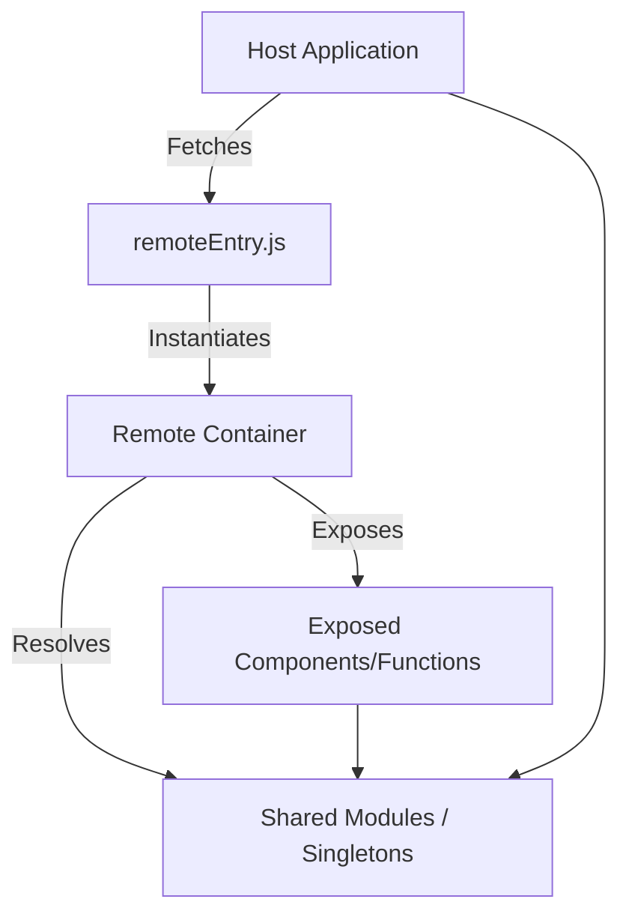

# Webpack Module Federation & Rspack: Runtime Dependency Sharing Architecture

## Core Principles
Micro-frontend architecture relying on Module Federation (MF) abstracts the runtime boundary by generating a remote container (`remoteEntry.js`) that exposes designated modules and manages shared dependencies via semantic versioning constraints. At runtime, the host application dynamically resolves exposed modules through the global scope, avoiding redundant downloading and parsing of shared libraries (e.g., React, ReactDOM) through the singleton pattern.

Rspack, utilizing the Rust-based swc compiler, achieves near parity with Webpack 5's Module Federation Plugin but optimizes the dependency graph resolution and AST traversal phases, yielding order-of-magnitude improvements in HMR and cold starts.

## Architecture

