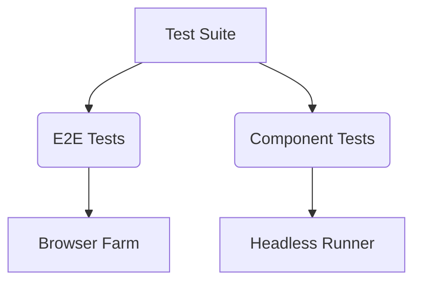

# E2E & Component Testing (Playwright)

Use **Playwright** for both robust end-to-end testing across modern engines and component testing.

## E2E Testing Snippet
```typescript
import { test, expect } from '@playwright/test';

test('user login flow', async ({ page }) => {
  await page.goto('/login');
  await page.fill('[data-testid="username-input"]', 'testuser');
  await page.fill('[data-testid="password-input"]', 'password');
  await page.click('[data-testid="login-button"]');
  await expect(page.locator('.dashboard')).toBeVisible();
});
```

## Component Testing Snippet
```typescript
import { test, expect } from '@playwright/experimental-ct-react';
import { Button } from './Button';

test('renders correctly', async ({ mount }) => {
  const component = await mount(<Button>Click me</Button>);
  await expect(component).toContainText('Click me');
  await component.click();
});
```

## Testing Strategy

