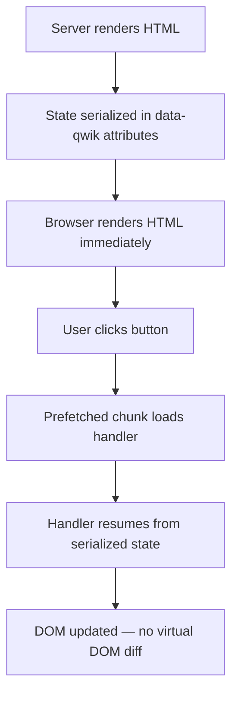

# Qwik Resumable Patterns

## Resumability vs Hydration

| Aspect | Hydration (React/Vue) | Resumability (Qwik) |
|--------|----------------------|---------------------|
| Initial JS | Must download and replay all component code | Zero JS needed for page to be interactive |
| State restoration | Re-execute all components to rebuild virtual DOM | State serialized in HTML, resumed without replay |
| Code split | Manual (React.lazy, Suspense) | Automatic — per component and per event |
| Time to interactive | Blocks on full hydration completes | Near-instant — only loads code for user interaction |
| Bundle size | Scales with component tree | Scales with unique interactions, not component count |

## How Resumability Works



1. **Server render**: Component runs once, produces HTML + serialized state.
2. **Serialization**: State stored in `data-qwik` attributes on DOM elements.
3. **Download**: Zero component code downloaded on initial page load.
4. **Resume**: On interaction, Qwik loads only the handler chunk.
5. **Update**: Handler mutates DOM directly — no virtual DOM.

## Lazy Loading Boundaries

### Every $() Creates a Boundary
```typescript
export default component$(() => {           // lazy component chunk
  const count = useSignal(0)

  const log = $((msg: string) => {           // lazy closure chunk
    console.log(msg, count.value)
  })

  return (
    <button onClick$={() => count.value++}>  // lazy event chunk
      {count.value}
    </button>
  )
})
```

### Optimizer Rules
- `$` suffix must be immediately visible to the Qwik optimizer.
- No dynamic `$()` calls (e.g., `const fn = condition ? $('a') : $('b')`).
- All reactive reads must be inside `$()` closures.
- Strings and primitives can cross lazy boundaries; functions and closures must use `$`.

## Serialization Protocol

### What Gets Serialized
- `useSignal`, `useStore` values
- `routeLoader$` return values
- `useVisibleTask$` references
- Props passed to child components

### Storage
```html
<!-- Serialized in HTML as data attributes -->
<div data-qwik="/src/components/counter.tsx#Counter[0]" data-key="count" data-value="5">
```
Qwik's serializer handles:
- Primitives (string, number, boolean, null, undefined)
- Plain objects and arrays
- Date and RegExp
- Map, Set, BigInt (with polyfill)
- URL, URLSearchParams

### What Cannot Be Serialized
- Functions and closures (use `$()` to pass across boundaries)
- Symbols
- WeakMap, WeakRef, FinalizationRegistry
- DOM element references

## Fine-Grained Reactivity

### useSignal vs useStore
```typescript
// useSignal — single primitive value
const count = useSignal(0)
const name = useSignal('')
count.value = 5          // triggers re-render of only this text node

// useStore — deeply reactive object
const form = useStore({
  email: '',
  password: '',
  meta: { lastAttempt: null as Date | null },
})
form.email = 'test@test.com'   // triggers re-render of only the email text node
```

Qwik tracks reads at the property level. Changing `form.email` re-renders only the text node reading `form.email`, not the whole component. No virtual DOM — direct DOM mutation with `sync` task.

### useComputed$
```typescript
const doubled = useComputed$(() => count.value * 2)
```
Recomputes only when dependencies change. Returns a `Signal`.

## Optimizer Configuration

### Vite Plugin Setup
```typescript
// vite.config.ts
import { qwikVite } from '@builder.io/qwik/optimizer'

export default defineConfig({
  plugins: [qwikVite()],
  build: {
    target: 'es2020',
    minify: 'esbuild', // or 'terser' for deeper optimization
  },
})
```

### Bundle Analysis
```bash
npx qwik build --analyze
```
Opens a visual bundle analyzer showing which chunks are created per `$()` boundary.

## Resumability Anti-Patterns
- ❌ **Eager state initialization**: Serializing large objects on every request — lazy-load heavy data.
- ❌ **Missing $ boundaries**: Passing callbacks without `$()` — breaks lazy loading.
- ❌ **Global mutable state**: Using `let` variables outside `component$` — optimizer can't track.
- ❌ **useVisibleTask$ for data fetching**: Use `routeLoader$` for server data, `useVisibleTask$` only for client effects.
