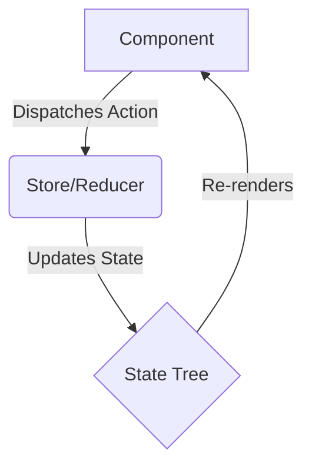

# State Management (Zustand & Redux Toolkit)

Use **Zustand** for lightweight, decentralized state, and **Redux Toolkit (RTK)** for complex, application-wide state with heavy business logic.

## Zustand Pattern
```typescript
import { create } from 'zustand';

interface UserState {
  user: string | null;
  login: (user: string) => void;
  logout: () => void;
}

export const useUserStore = create<UserState>((set) => ({
  user: null,
  login: (user) => set({ user }),
  logout: () => set({ user: null }),
}));
```

## RTK Pattern
```typescript
import { createSlice, configureStore, PayloadAction } from '@reduxjs/toolkit';

const authSlice = createSlice({
  name: 'auth',
  initialState: { user: null as string | null },
  reducers: {
    login: (state, action: PayloadAction<string>) => { state.user = action.payload; },
  },
});

export const store = configureStore({ reducer: { auth: authSlice.reducer } });
```

## Architecture Flow

