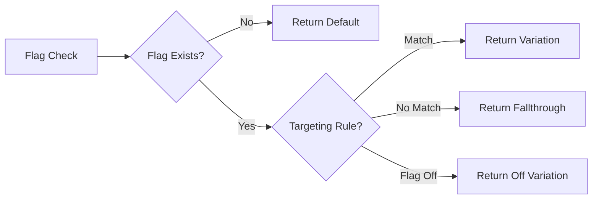

# Feature Flag Strategies

## Flag Types

| Type | Purpose | Example | Lifetime |
|------|---------|---------|----------|
| Release | Toggle on/off for rollout | `new-checkout` | Days-weeks |
| Experiment | A/B test variant | `pricing-v2` | Weeks-months |
| Ops | Control system behavior | `maintenance-mode` | Hours (incident) |
| Permission | Feature for specific users | `early-access` | Permanent |

## Gradual Rollout Strategy

```
Phase 1: Internal (dev team + QA)
Phase 2: 10% of users (monitor errors)
Phase 3: 25% of users (monitor performance)
Phase 4: 50% of users (widen gradually)
Phase 5: 100% rollout (remove flag within 2 releases)
```

## Targeting Rules (LaunchDarkly)

```json
{
  "variations": [false, true],
  "rules": [
    {
      "description": "Internal users always on",
      "clauses": [{
        "attribute": "email",
        "op": "endsWith",
        "values": ["@company.com"]
      }],
      "variation": 1
    },
    {
      "description": "Beta users via segment",
      "clauses": [{
        "attribute": "segmentMatch",
        "op": "isMemberOf",
        "values": ["beta-testers"]
      }],
      "variation": 1
    }
  ],
  "fallthrough": {
    "variation": 0
  },
  "offVariation": 0
}
```

## Percentage Rollout with Consistent Bucketing

```typescript
// Deterministic assignment — same user always gets same variant
function computeBucket(userId: string, flagKey: string, totalBuckets = 100): number {
  const hash = simpleHash(`${flagKey}:${userId}`)
  return hash % totalBuckets
}

function simpleHash(str: string): number {
  let hash = 0
  for (let i = 0; i < str.length; i++) {
    const char = str.charCodeAt(i)
    hash = ((hash << 5) - hash) + char
    hash |= 0 // Convert to 32-bit int
  }
  return Math.abs(hash)
}

// Usage: user in bucket 0-9 gets the new feature
const bucket = computeBucket(user.id, 'new-checkout')
const enabled = bucket < 10 // 10% rollout
```

## A/B Test Design

```typescript
interface ABTestConfig {
  key: string
  variants: string[]
  weights: number[] // must sum to 1.0
  metrics: string[] // tracked metrics
}

const tests: Record<string, ABTestConfig> = {
  pricingPage: {
    key: 'pricing-v2',
    variants: ['control', 'treatment-a', 'treatment-b'],
    weights: [0.5, 0.3, 0.2],
    metrics: ['click-signup', 'time-on-page', 'conversion-rate'],
  },
}

function assignVariant(userId: string, config: ABTestConfig): string {
  const bucket = computeBucket(userId, config.key, 100)
  let cumulative = 0
  for (let i = 0; i < config.variants.length; i++) {
    cumulative += config.weights[i] * 100
    if (bucket < cumulative) return config.variants[i]
  }
  return config.variants[0] // fallback
}
```

## Flag Evaluation Lifecycle



## Cleanup Strategy

```typescript
// BEFORE — flag present
function CheckoutPage() {
  const isNew = useFlag('new-checkout')
  return isNew ? <NewCheckout /> : <LegacyCheckout />
}

// AFTER — flag removed, only winner remains
function CheckoutPage() {
  return <NewCheckout />
}

// ALWAYS — track cleanup in your backlog
// Add // FLAG-CLEANUP: new-checkout to code during rollout
// Search for FLAG-CLEANUP after full rollout
```

## Naming Convention

```
<area>-<feature>[-<variant>]
new-checkout
pricing-v2
checkout-promo-banner
dashboard-analytics-redesign
```

## Common Pitfalls

| Pitfall | Solution |
|---------|----------|
| Flag checking with string keys everywhere | Single typed flag definition file |
| No default value when provider fails | Always pass `defaultVal` |
| Flag never removed | Clean within 2 releases |
| A/B test without exposure tracking | Fire exposure event on assignment |
| Boolean-only flags | Use string/json for multi-variant |
| Provider SDK scattered across components | Provider abstraction layer |
