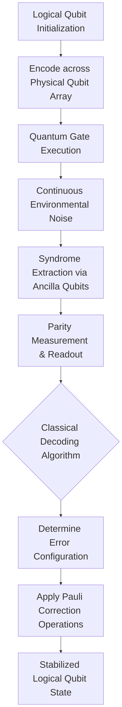

# Quantum Error Correction: Taming Decoherence

The fragility of quantum states is the fundamental barrier to utility-scale quantum computing. Environmental coupling induces decoherence (loss of phase information) and quantum noise, destroying superposition and entanglement in microseconds. Quantum Error Correction (QEC) is the rigorous mathematical and physical framework required to preserve quantum information indefinitely.

## 1. The Threat: Decoherence and Quantum Noise
Unlike classical bits, which suffer only bit-flip errors ($X$ errors), qubits suffer both bit-flip and phase-flip errors ($Z$ errors). Furthermore, continuous unitary rotations mean errors exist on a continuous spectrum. We project these continuous errors into discrete Pauli basis errors ($X, Y, Z$) for digital correction.

## 2. Surface Codes & Topological Protection
Surface codes are the most viable QEC architecture for 2D superconducting qubit arrays due to their high error threshold (~1%) and nearest-neighbor connectivity requirements. They embed quantum information into the global topological properties of a multi-qubit lattice. Localized noise cannot alter these global topological invariants without spanning the entire lattice.

## 3. Logical Qubits vs. Physical Qubits
A "logical qubit" is an abstraction representing a single, error-free quantum state, physically encoded across an ensemble of "physical qubits." Physical qubits are divided into data qubits (holding the actual state) and ancilla/measure qubits (used to extract error syndromes without collapsing the logical state). The ratio of physical to logical qubits defines the overhead of the fault-tolerant architecture.

