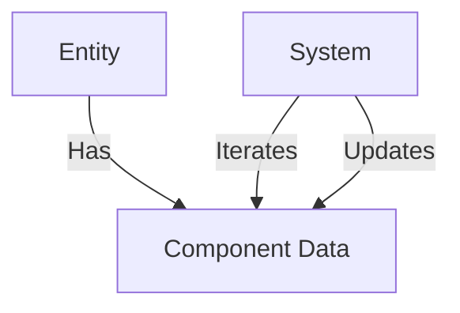

# ECS Architecture (Entity Component System)

Use ECS for high-performance, data-driven game development, focusing on data locality and cache friendliness.

## Core Concepts
- **Entities**: Unique IDs representing game objects (no inherent data).
- **Components**: Pure data structures attached to entities.
- **Systems**: Logic that processes entities possessing specific component combinations.

## Unity DOTS / Generic Example

```csharp
using Unity.Entities;
using Unity.Transforms;
using Unity.Mathematics;

// Component: Pure Data
public struct Velocity : IComponentData {
    public float3 Value;
}

// System: Pure Logic
public partial class MovementSystem : SystemBase {
    protected override void OnUpdate() {
        float deltaTime = SystemAPI.Time.DeltaTime;
        
        // Iterate over all entities with LocalTransform and Velocity
        Entities.ForEach((ref LocalTransform transform, in Velocity vel) => {
            transform.Position += vel.Value * deltaTime;
        }).ScheduleParallel();
    }
}
```

## ECS Data Flow


