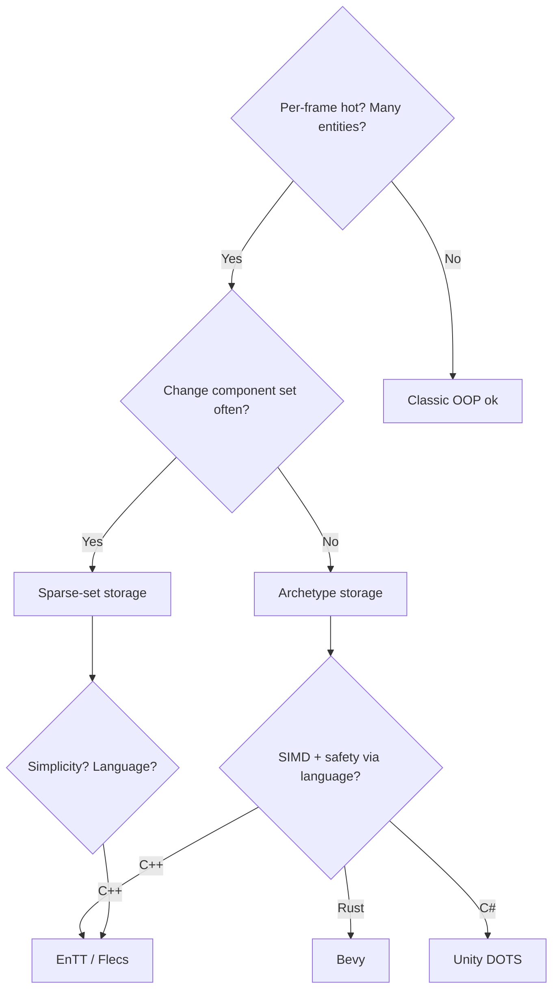

# ECS Architecture (Entity Component System) — Deep Guide

ECS is a data-driven design pattern for game engines that separates **entities** (IDs), **components** (pure data), and **systems** (logic operating on component sets). Its core win: cache-friendly iteration over contiguous component arrays plus implicit parallelism.

## 1. Core Concepts

- **Entity**: a unique ID (uint32 index + generation). No data, just identity.
- **Component**: a plain struct; data only, no behavior.
- **System**: logic that reads/writes specific component sets, executed each frame (or at defined rate).

```cpp
struct Transform { Vec3 pos; Quat rot; Vec3 scale; };
struct Velocity  { Vec3 linear; Vec3 angular; };

void moveSystem(Slice<Transform> t, Slice<Velocity> v, float dt) {
    for (i) t[i].pos += v[i].linear * dt;      // two contiguous arrays
}
```

## 2. Why ECS: Performance Reasoning

Traditional OOP (GameObject with `Actor::Update()` virtual call per object) has:

- Vtable indirection → breaks ILP, no inlining.
- Objects scattered in heap → cache misses (each 64-byte cache line may hold wasted data).
- Member layout interleaves hot/cold data.

ECS wins:

- Components stored in **contiguous arrays** (SoA) → cache streaming.
- Systems are `for` loops over slices → auto-vectorizable (SIMD).
- Systems with disjoint write sets run in parallel.

## 3. Storage Strategies

### 3.1 Sparse-Set (Sparse Array)

```
dense[]:  component data in entity order, tightly packed
sparse[]: entity id -> index into dense
```

- Add/remove O(1) with swap-remove.
- Iteration touches only dense[] (contiguous, cache-friendly) + entity ids.
- Used by EnTT default.

### 3.2 Archetype (Structure of Arrays per group)

Entities grouped by **exact component signature** (archetype). Each archetype owns a column array per component:

```
Archetype "Transform+Velocity":
  entityIDs: [12, 17, 9]
  Transform: [t12, t17, t9]   contiguous
  Velocity:  [v12, v17, v9]   contiguous
```

- Adding/removing a component **moves the entity to another archetype** (type change).
- Iterating a system = iterate matching archetypes only. Perfect locality.
- Used by Unity DOTS, Flecs, Bevy (design).

### 3.3 Hybrid / ECS-storage-as-optional

Many engines allow per-entity "prefab-like" dynamic storage. Choose based on:

| Factor | Sparse-set | Archetype |
|--------|-----------|-----------|
| Add/remove component cost | O(1) | move entity (memcpy) |
| Iteration locality | dense per component | perfect array per archetype |
| Fragmentation | none | many archetypes = sparse |
| Simplicity | simpler | needs archetype registry |

## 4. Querying & Matching

A system declares required components: `Query<Transform, Velocity>(All)`.

- Archetype-based: match on bitmask of signature → iterate matching archetypes.
- Sparse-set: iterate dense[], check presence via `storage.contains(entity)`.

Entity IDs filtering: `any`/`maybe`-style optional components need a "present bitset" check; optional components can iterate a second storage.

## 5. System Scheduling

### 5.1 Ordering & Dependencies

Systems schedule in a DAG respecting read/write on component storages:

```
TransformSystem <-> PlayerMovement <-> CameraSystem
(Velocity RW)     (Transform RW)     (Transform R)
```

- Build a graph of per-storage access; parallelize systems whose storages don't conflict.
- `After(system)`, `Before(system)` ordering; or "this system writes X so those that read X run next".
- Job-based: each system dispatched to worker threads (Bevy `ParForEach`, Unity `ScheduleParallel`).

### 5.2 Per-Frame vs Fixed-Rate

- Simulation systems tied to fixed timestep (30/60/120Hz).
- Rendering interpolation reads sim state with lerp factor.

### 5.3 Command Buffers / Deferred Structural Changes

Adding/removing components mid-iteration invalidates iterators. Rule: queue structural changes in a **command buffer** / deferred list applied after iteration. (Unity `EntityCommandBuffer`, Bevy `Commands`.)

## 6. Cross-Cutting Concerns

### 6.1 Change Detection (Dirty Flags)

- Each storage keeps a per-frame "changed" bitset or version per archetype row.
- Systems like "network send", "recompute bounds", or "update render node" only run on entities whose components changed.
- Bevy `Added<T>`, `Changed<T>` filters; Unity `SystemAPI.GetComponentLookup`.

### 6.2 Relationships & Query Hierarchies

Parent/child: store optional `Parent` + `Children` components. World-space recompute only on dirty leaf.

### 6.3 Events & Messages

ECS events (collision events, input) as transient entity/component pools — event systems read then delete. Avoid per-frame entity spam; use component-versioned event queues for perf.

## 7. Serialization / Networking / Replays

- Entities serialized by id + comp list; archetype moves restored on load.
- Network: replicate only changed components using change detection; hide float noise by bit-snapping.
- Replays: log system inputs; deterministic ECS reproduces.

## 8. Real Engines Comparison

| Engine | Storage | Strengths |
|--------|---------|-----------|
| **Unity DOTS** | Archetype (Burst/Jobs) | SIMD burst, editor tooling, ECS + jobs |
| **Bevy** | Archetype (Rust) | safe parallelism, great ergonomics, GPU-driven |
| **EnTT** | Sparse-set (C++) | no-reflection, header-only, fastest add/remove |
| **Flecs** | Archetype+C (C/... plugins) | fast, relations, prefab support, single include |
| **Machina/Garnet** | sparse / arche | niche |

### 8.1 When NOT to use ECS

- Tiny simple games: GameObject/MonoBehaviour faster to prototype.
- UI, narrative systems, inventory logic with heavy dynamic mixing.
- Deep polymorphic AI with per-entity context → still can be ECS but readability drops.
- If the team lacks data-oriented mindset, ECS can hurt velocity.

## 9. ECS Anti-Patterns

| Anti-pattern | Consequence |
|--------------|-------------|
| Components with pointers/references | breaks array continuity, serialization / cache |
| Systems calling `GetComponent<T>` in a loop | pointer chase kills the approach |
| Structural changes mid-iteration | iterator invalidation / undefined |
| One giant "Stats" component | hot/cold mix, cache waste |
| Over-strict ECS religion (all kinds, even trivial) | boilerplate bloat |
| Global mutable state in systems | breaks parallel schedule / determinism |

## 10. ECS Decision Tree


```mermaid
flowchart TD
    A{Per-frame hot? Many entities?} -->|Yes| B{Change component set often?}
    A -->|No| C[Classic OOP ok]
    B -->|Yes| D[Sparse-set storage]
    B -->|No| E[Archetype storage]
    E --> F{SIMD + safety via language?}
    F -->|Rust| G[Bevy]
    F -->|C#| H[Unity DOTS]
    F -->|C++| I[EnTT / Flecs]
    D --> J{Simplicity? Language?}
    J -->|C++| I
```

## 11. Deep Dive References

Deep storage internals, scheduling, and engine-specific patterns live in:

- `skills/game/game-engine/ecs-pattern/SKILL.md` (full deep dive: archetypes, scheduling, SIMD, benchmarks)
- `skills/game/game-engine/ecs-pattern/references/archetype-storage-deep-dive.md`
- `skills/game/game-engine/ecs-pattern/references/system-scheduling-pipelines.md`
- `skills/game/game-engine/ecs-pattern/references/unity-dots-in-practice.md`
- `skills/game/game-engine/ecs-pattern/references/bevy-ecs-patterns.md`
- `skills/game/game-engine/ecs-pattern/references/entt-and-flecs.md`

## 12. Getting Started Checklist

1. Model components as structs; split hot vs cold data.
2. Choose storage (sparse-set for churn, archetype for bulk).
3. Define systems per frame; build dependency graph.
4. Implement command buffer for structural changes.
5. Add change-detection for dirty-driven systems.
6. Measure: iteration throughput, cache misses, parallel speedup.