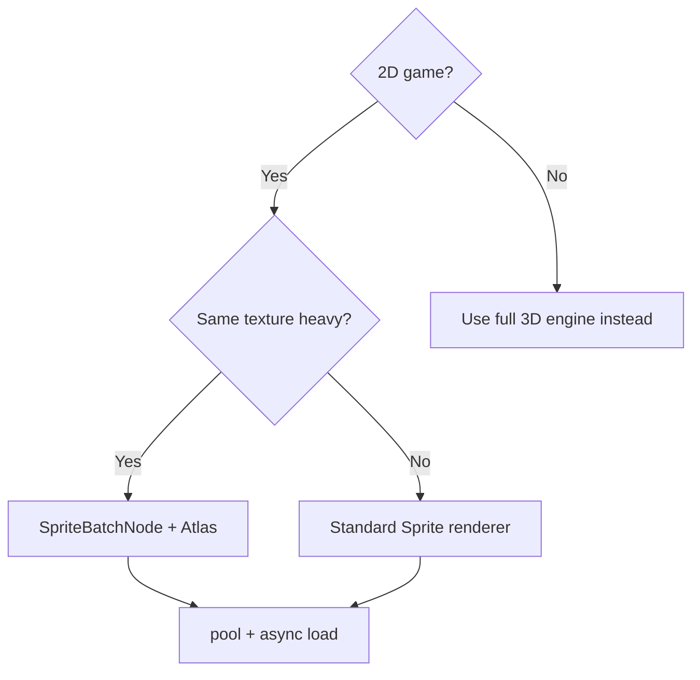

# Cocos2d-x Architectural Patterns

Cocos2d-x has a mature scene-graph architecture centered on the `Director` and `Node` tree. Understanding its internals lets you design for performance: batched rendering, minimal state changes, and memory discipline on mobile.

## 1. The Director Lifecycle

The `Director` singleton drives the game.

```
Director::mainLoop()
  -> calculateDeltaTime()
  -> update()         // scheduled updates + physics step (if enabled)
  -> drawScene()      // render current scene
```

- `Director::runWithScene()` sets the initial scene.
- `Director::replaceScene()` swaps current scene (with optional transition).
- `Director::pushScene()/popScene()` for pause menus layered over gameplay.

### 1.1 Frame pacing

- `Director::setAnimationInterval(1.0/60.0)` sets the desired FPS.
- On mobile, respect `setProjection`/retina scaling (`CC_CONTENT_SCALE_FACTOR`).
- Headless tests: `Director::setHighResFactor(0)` for pure-logic runs.

## 2. Scene Graph & Node Tree

- `Node` is the base: position, rotation, scale, skew, opacity, anchor point, children, z-order.
- Transform hierarchy: local transforms multiplied up the chain → world MVP.
- `addChild(node, zOrder)`.
- Depth-first traversal via `visit()`.

### 2.1 Transforms & Anchor Points

- `setAnchorPoint()` affects position relative to bounds (Cocos uses anchor = [0,1] vs Unity center).
- 2D games: work with `Vec2`/`Size`; world coordinates via `convertToWorldSpaceAR`.
- Be careful with parent scale/rotation affecting child positions — standard matrix chaining.

### 2.2 Event System

- `EventListenerTouchOneByOne` / `EventListenerTouchAllAtOnce`.
- Custom events: `EventDispatcher::dispatchCustomEvent("name", &data)`.
- Input -> mouse/touch classification abstracted by `Input` singleton.
- Listeners attach to nodes (`node->addEventListener()`); remember to remove on `onExit`.

## 3. Rendering Architecture: The Render Queue

Draw calls are NOT issued during traversal. `Node::visit()` pushes `RenderCommand`s into a `Renderer` queue:

```
visit() -> pushCommand(RenderCommand)  for each node
Renderer::render() -> sort commands (by z-order; transparent after opaque)
                   -> group by texture/shader to batch draw calls
                   -> flush GPU commands
```

### 3.1 Batching Strategy

- **SpriteBatchNode / `TextureAtlas`**: keep many sprites sharing ONE texture; they draw in one batch.
- `Renderer` batches consecutive commands with the same texture + shader.
- Sorting: opaque up-front (no blending), transparent sorted back-to-front.

### 3.2 Reducing Draw Calls (mobile gold)

1. Pack art into atlases → fewer texture switches.
2. Use `SpriteBatchNode` for repeated textures.
3. Keep materials/shader switches minimal (MVV per vertex, no per-sprite shader).
4. Avoid per-node opacity/rotation trick for static UI; group static UI into one node.
5. Disable depth test for 2D when not needed.

### 3.3 Custom Rendering

- Subclass `Node` and override `draw(Renderer*)` to push custom `TrianglesCommand`/`CustomCommand`.
- `Renderer` supports custom geometry (a quad list) — great for particle trails, vector UI.

## 4. Action System (Animation Without Code)

- `Action`s: `MoveTo`, `Sequence`, `Spawn`, `RepeatForever`, `EaseIn`.
- `node->runAction(...)`; actions run inside `Node::i` update loop on the main thread.
- Hierarchy: `Sequence`/`Spawn` composite actions; `ActionInterval` for timed.
- `Director::getScheduler()` controls update priorities of actions.

### 4.1 Scheduler

- `scheduler->schedule(...)` with time intervals; `update(dt)` for every frame.
- `scheduleUpdate()` / `unscheduleUpdate()` on nodes.
- Pause/Resume: scheduler respects `Director::pause()`.

## 5. Physics in Cocos2d-x

- 2D: Box2D is the common physics backend (via `PhysicsBody` / `PhysicsWorld` or direct Box2D).
- 3D: Cocos2d-x has a lightweight 3D physics module (mostly unmaintained → prefer external).
- `PhysicsBody::createBox`, `PhysicsWorld` integrated to scene.
- Fixed timestep via scheduler; collisions: `EventListenerPhysicsContact`.

### 5.1 Sensor pattern

Create a body with `PhysicsMaterial()`, set `setSensor(true)` for triggers, listen `onContactBegin` for overlap detection.

## 6. Memory & Resource Management

- `Ref`/`RefCounted`-style retention: `retain()/release()` (Cocos uses its own `Ref`).
- `TextureCache::sharedTextureCache()->addImage()` caches textures (avoid duplicate loads).
- `SpriteFrameCache` for atlases.
- `ResourcesManager` for transparent asset handling.
- **Rule**: keep references to big assets; `removeUnusedTextures()` after scene transitions.

### 6.1 Pooling Pattern

```cpp
// recycle simple objects to avoid alloc/free churn
auto pool = NodePool::getInstance("bullet");
auto bullet = pool->getFromPoolOrCreate(...);
bullet->setPosition(pos);
this->addChild(bullet);
// on death: pool->returnToPool(bullet)
```

## 7. Cross-Platform Build Pattern

- Engine wraps platform code (`platform/`): iOS/Win32/Android/Mac/Linux; define `__APPLE__`, `CC_PLATFORM_*` macros.
- Resource paths: use `FileUtils::getInstance()->fullPathForFilename()`; Assets folder mapped per-platform.
- Audio: `AudioEngine::play2d`; OGG/MP3/WAV platform-specific loading via `AudioDecoder`.
- Bundle assets: pack into `.res` or Atlas; on Android use `assets/`.

### 7.1 Cocos Creator 3.x vs Cocos2d-x

| | Cocos2d-x (C++) | Cocos Creator (TS/editor) |
|--|------------------|---------------------------|
| Language | C++ | TypeScript |
| Rendering | OpenGL ES/Metal | Vulkan/GL/Metal (multibackend) |
| Editor | none (code-first) | full editor + scene system |
| Use case | perf-critical, engine-level | team-based game dev |

## 8. Common Anti-Patterns

| Anti-pattern | Consequence | Fix |
|--------------|-------------|-----|
| One texture per sprite | Draw call explosion | atlas + batch node |
| per-node `retain()` leaks | memory growth | pooled/refcache |
| Actions recreated each frame | alloc churn | reuse cached actions |
| Global `Director` misuse in logic | scene-restart bugs | keep in scene node |
| blocking file loads | UI stalls | async load + cache |

## 9. Decision Tree



## 10. References

- `skills/game/cocos2d/SKILL.md` — full Cocos2d game dev guide
- Cocos2d-x docs on Renderer, Director, Node, Actions, Physics