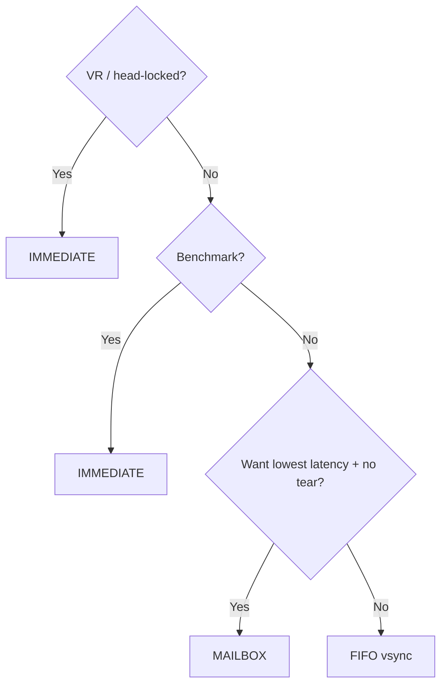
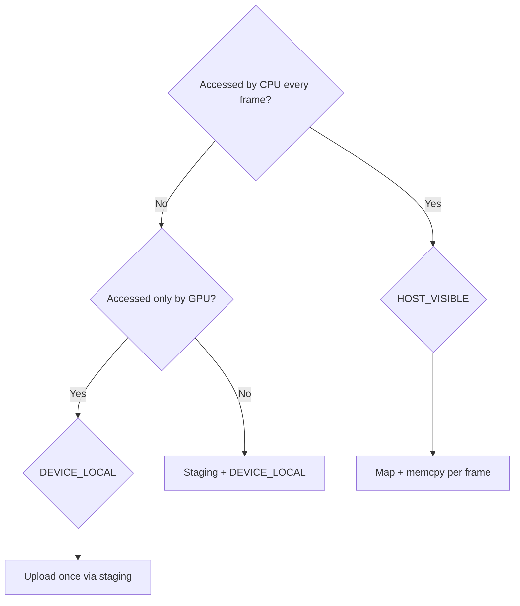

# Vulkan Deep Engineering Guide

Vulkan is a low-overhead, explicit GPU API. It gives fine control over every GPU step: no hidden state, no driver magic, no automatic synchronization. Performance is yours to manage - and so is every bug that comes with it.

## 1. Vulkan & The Explicit Model

### 1.1 Explicit vs Implicit (OpenGL/WebGL)

| Aspect | OpenGL | Vulkan |
|--------|--------|--------|
| State | Hidden global state machine | Everything explicit (pipeline state objects) |
| Threads | Single-threaded context | Record command buffers on any thread |
| Synchronization | Driver syncs | **You** place barriers/fences/semaphores |
| Memory | Driver allocates VRAM | **You** allocate `VkDeviceMemory` |
| Validation | Undefined behavior | Validation layers in debug builds |
| Errors | Some checks | `vkGetDeviceProcAddr` + validation callbacks |

### 1.2 The GPU Pipeline (Conceptual)

```
CommandBuffer (CPU records) -> Submit to Queue -> GPU executes -> Swapchain present
```

### 1.3 When to Use Vulkan

- Building a custom engine or renderer where OpenGL/WebGL abstraction is too slow.
- You need access to compute shaders, mesh shaders, ray tracing, async compute.
- Target PC/console/mobile where very low overhead matters.
- Portability across Windows/Linux/Android/macOS via the same API.

## 2. Initialization: Instance -> Device -> Queue

### 2.1 Instance

```cpp
VkInstanceCreateInfo ci{};
ci.sType = VK_STRUCTURE_TYPE_INSTANCE_CREATE_INFO;
ci.enabledLayerCount = (uint32_t)debugLayers.size();      // "VK_LAYER_KHRONOS_validation"
ci.ppEnabledLayerNames = debugLayers.data();
ci.enabledExtensionCount = (uint32_t)instanceExtensions.size();
ci.ppEnabledExtensionNames = instanceExtensions.data();

VkInstance instance;
vkCreateInstance(&ci, nullptr, &instance);
```

Required instance extensions: `VK_KHR_surface` (swapchain present), `VK_EXT_debug_utils` (debug callbacks). For windowing you also need the platform surface extension (`VK_KHR_win32_surface`, `VK_KHR_xcb_surface`, etc.).

### 2.2 Physical Device (GPU Selection)

```cpp
uint32_t count = 0;
vkEnumeratePhysicalDevices(instance, &count, nullptr);
std::vector<VkPhysicalDevice> devices(count);
vkEnumeratePhysicalDevices(instance, &count, devices.data());

for (VkPhysicalDevice dev : devices) {
    VkPhysicalDeviceProperties props;
    vkGetPhysicalDeviceProperties(dev, &props);
    // score by: VK_PHYSICAL_DEVICE_TYPE_DISCRETE_GPU, queue family support,
    // feature support (geometryShader, tessellationShader, rayTracingPipeline)
}
```

### 2.3 Queue Families

A GPU exposes queue families (graphics, compute, transfer, present):

```cpp
uint32_t familyCount = 0;
vkGetPhysicalDeviceQueueFamilyProperties(physDev, &familyCount, nullptr);
std::vector<VkQueueFamilyProperties> families(familyCount);
vkGetPhysicalDeviceQueueFamilyProperties(physDev, &familyCount, families.data());

int gfxFamily = -1, computeFamily = -1, presentFamily = -1;
for (uint32_t i = 0; i < families.size(); ++i) {
    if (families[i].queueFlags & VK_QUEUE_GRAPHICS_BIT) gfxFamily = i;
    if (families[i].queueFlags & VK_QUEUE_COMPUTE_BIT)  computeFamily = i;
    // presentFamily: vkGetPhysicalDeviceSurfaceSupportKHR(dev, i, surface, &supported)
}
```

### 2.4 Logical Device

```cpp
VkDeviceCreateInfo dci{};
dci.sType = VK_STRUCTURE_TYPE_DEVICE_CREATE_INFO;
dci.queueCreateInfoCount = 1;
dci.pQueueCreateInfos = &queueCreateInfo;   // { familyIndex = gfxFamily, queueCount = 1 }
dci.enabledExtensionCount = (uint32_t)deviceExtensions.size();
dci.ppEnabledExtensionNames = deviceExtensions.data();
// deviceExtensions: VK_KHR_swapchain, optional: VK_KHR_ray_tracing_pipeline,
// VK_EXT_descriptor_indexing, VK_KHR_buffer_device_address

VkDevice device;
vkCreateDevice(physDev, &dci, nullptr, &device);
vkGetDeviceQueue(device, gfxFamily, 0, &graphicsQueue);
```

### 2.5 Validation Layers

```cpp
if (enableValidation) {
    layers.emplace_back("VK_LAYER_KHRONOS_validation");
    VkDebugUtilsMessengerCreateInfoEXT msgCI{};
    msgCI.messageSeverity = VK_DEBUG_UTILS_MESSAGE_SEVERITY_ERROR_BIT_EXT
                          | VK_DEBUG_UTILS_MESSAGE_SEVERITY_WARNING_BIT_EXT;
    msgCI.pfnUserCallback = debugCallback;
    // set on instance create AND device create via pNext chain
}
```

## 3. The Swapchain

### 3.1 Create

```cpp
VkSwapchainCreateInfoKHR sci{};
sci.sType = VK_STRUCTURE_TYPE_SWAPCHAIN_CREATE_INFO_KHR;
sci.surface = surface;
sci.minImageCount = 2;          // double-buffered; 3 for triple buffering
sci.imageFormat = VK_FORMAT_B8G8R8A8_SRGB;      // common window format
sci.imageColorSpace = VK_COLOR_SPACE_SRGB_NONLINEAR_KHR;
sci.imageExtent = { windowWidth, windowHeight };
sci.imageArrayLayers = 1;
sci.imageUsage = VK_IMAGE_USAGE_COLOR_ATTACHMENT_BIT;
sci.preTransform = VK_SURFACE_TRANSFORM_IDENTITY_BIT_KHR;
sci.presentMode = VK_PRESENT_MODE_FIFO_KHR;    // vsync
sci.clipped = VK_TRUE;

VkSwapchainKHR swapchain;
vkCreateSwapchainKHR(device, &sci, nullptr, &swapchain);
// Get images: vkGetSwapchainImagesKHR(device, swapchain, &count, nullptr);
```

### 3.2 Present Modes

| Mode | Description | Use case |
|------|-------------|----------|
| `FIFO` | Queue-based vsync (tears nothing) | Default, console-like |
| `MAILBOX` | Triple-buffer vsync, lowest latency | Fast games, high-refresh |
| `IMMEDIATE` | No vsync, tear possible | Benchmarking, VR head-locked |
| `FIFO_RELAXED` | Late swap shows last frame | Rarely used |

### 3.3 Image Acquire -> Render -> Present Flow

```cpp
uint32_t imageIndex;
vkAcquireNextImageKHR(device, swapchain, UINT64_MAX,       // wait forever
                      imageAvailableSemaphore,             // signalled when image ready
                      VK_NULL_HANDLE, &imageIndex);

// record + submit command buffer that renders to this image
vkQueueSubmit(graphicsQueue, 1, &submitInfo, frameFence);

vkQueuePresentKHR(graphicsQueue, &presentInfo);  // { swapchain, imageIndex }
```

### 3.4 Swapchain Recreation

Handle window resize: recreate swapchain (images, framebuffers, at minimum image views). Query `VK_ERROR_OUT_OF_DATE_KHR` from present/acquire and recreate.
## 4. Render Passes & Framebuffers

### 4.1 Render Pass

```cpp
VkAttachmentDescription color{};
color.format = swapchainFormat;
color.samples = VK_SAMPLE_COUNT_1_BIT;
color.loadOp  = VK_ATTACHMENT_LOAD_OP_CLEAR;
color.storeOp = VK_ATTACHMENT_STORE_OP_STORE;
color.initialLayout = VK_IMAGE_LAYOUT_UNDEFINED;
color.finalLayout   = VK_IMAGE_LAYOUT_PRESENT_SRC_KHR;

VkAttachmentReference colorRef{ 0, VK_IMAGE_LAYOUT_COLOR_ATTACHMENT_OPTIMAL };

VkSubpassDescription subpass{};
subpass.pipelineBindPoint = VK_PIPELINE_BIND_POINT_GRAPHICS;
subpass.colorAttachmentCount = 1;
subpass.pColorAttachments = &colorRef;

VkRenderPassCreateInfo rpci{};
rpci.attachmentCount = 1;
rpci.pAttachments = &color;
rpci.subpassCount = 1;
rpci.pSubpasses = &subpass;

VkRenderPass renderPass;
vkCreateRenderPass(device, &rpci, nullptr, &renderPass);
```

### 4.2 Subpasses & Input Attachments

A render pass can hold multiple subpasses. Output of one subpass can be consumed by the next as an input attachment — this avoids intermediate memory round-trips:

```
Subpass 0:  draw geometry -> GBuffer (Color + Depth)
Subpass 1:  lighting pass reads GBuffer via input attachment
```

```cpp
VkAccessFlags  srcMask = VK_ACCESS_COLOR_ATTACHMENT_WRITE_BIT;
VkAccessFlags  dstMask = VK_ACCESS_INPUT_ATTACHMENT_READ_BIT;
// The driver handles implicit layout transitions between subpasses.
```

### 4.3 Framebuffer (one per swapchain image)

```cpp
VkFramebufferCreateInfo fci{};
fci.renderPass = renderPass;
fci.attachmentCount = 1;
fci.pAttachments = &swapchainImageView[i];   // image view for image i
fci.width = windowWidth; fci.height = windowHeight; fci.layers = 1;
vkCreateFramebuffer(device, &fci, nullptr, &framebuffers[i]);
```

## 5. Pipelines

### 5.1 The Graphics Pipeline - Monolithic Bake

Vulkan pre-bakes all state into a `VkPipeline`:

- Shader stages (VS + FS, optionally TS/GS/MS)
- Vertex input layout
- Input assembly
- Viewport + Scissor
- Rasterization
- Multisampling
- Depth/stencil
- Color blending
- Dynamic state (viewport/scissor if dynamic)

```cpp
VkGraphicsPipelineCreateInfo gpci{};
gpci.stageCount = 2;               // VS + FS
gpci.pStages = shaderStages;       // VkPipelineShaderStageCreateInfo
gpci.pVertexInputState = &vertexInput;
gpci.pInputAssemblyState = &inputAssembly;
gpci.pViewportState = &viewportState;
gpci.pRasterizationState = &rasterState;
gpci.pMultisampleState = &msState;
gpci.pDepthStencilState = &depthState;
gpci.pColorBlendState = &blendState;
gpci.layout = pipelineLayout;
gpci.renderPass = renderPass;
gpci.subpass = 0;

vkCreateGraphicsPipelines(device, pool, 1, &gpci, nullptr, &pipeline);
```

**Key insight**: pipelines are immutable once created, so switching between a small set of pre-baked pipelines is cheap. Cache pipelines per unique state set.

### 5.2 Pipeline Layout & Descriptor Set Layout

```cpp
VkDescriptorSetLayoutBinding binding{};
binding.binding = 0;
binding.descriptorType = VK_DESCRIPTOR_TYPE_UNIFORM_BUFFER;
binding.stageFlags = VK_SHADER_STAGE_VERTEX_BIT;
binding.descriptorCount = 1;

VkDescriptorSetLayoutCreateInfo dslci{};
dslci.bindingCount = 1;
dslci.pBindings = &binding;
vkCreateDescriptorSetLayout(device, &dslci, nullptr, &dslSetLayout);

VkPipelineLayoutCreateInfo plci{};
plci.setLayoutCount = 1;
plci.pSetLayouts = &dslSetLayout;
// push constants: plci.pushConstantRangeCount = 1; plci.pPushConstantRanges = &pcRange;
vkCreatePipelineLayout(device, &plci, nullptr, &pipelineLayout);
```

### 5.3 Dynamic State

Mark viewport/scissor as `VK_DYNAMIC_STATE_VIEWPORT` + `VK_DYNAMIC_STATE_SCISSOR` to change them per draw without a new pipeline.

## 6. Command Buffers & Recording

```cpp
VkCommandPoolCreateInfo poolCI{};
poolCI.queueFamilyIndex = gfxFamily;
poolCI.flags = VK_COMMAND_POOL_CREATE_RESET_COMMAND_BUFFER_BIT;
vkCreateCommandPool(device, &poolCI, nullptr, &cmdPool);

VkCommandBufferAllocateInfo cbai{};
cbai.commandPool = cmdPool;
cbai.level = VK_COMMAND_BUFFER_LEVEL_PRIMARY;
cbai.commandBufferCount = 1;
vkAllocateCommandBuffers(device, &cbai, &cmdBuffer);
```

Record per frame:

```cpp
vkResetCommandBuffer(cmdBuffer, 0);
VkCommandBufferBeginInfo begin{};
begin.flags = VK_COMMAND_BUFFER_USAGE_ONE_TIME_SUBMIT_BIT;
vkBeginCommandBuffer(cmdBuffer, &begin);

VkRenderPassBeginInfo rpbi{};
rpbi.renderPass = renderPass;
rpbi.framebuffer = framebuffers[imageIndex];
rpbi.renderArea.extent = { width, height };
VkClearValue clear = {{{0.1f, 0.2f, 0.3f, 1.f}}};
rpbi.clearValueCount = 1; rpbi.pClearValues = &clear;
vkCmdBeginRenderPass(cmdBuffer, &rpbi, VK_SUBPASS_CONTENTS_INLINE);

vkCmdBindPipeline(cmdBuffer, VK_PIPELINE_BIND_POINT_GRAPHICS, pipeline);
vkCmdBindDescriptorSets(cmdBuffer, VK_PIPELINE_BIND_POINT_GRAPHICS, pipelineLayout, 0, 1, &ds, 0, nullptr);
VkDeviceSize offset = 0;
vkCmdBindVertexBuffers(cmdBuffer, 0, 1, &vertexBuffer, &offset);
vkCmdBindIndexBuffer(cmdBuffer, indexBuffer, 0, VK_INDEX_TYPE_UINT32);
vkCmdDrawIndexed(cmdBuffer, indexCount, 1, 0, 0, 0);

vkCmdEndRenderPass(cmdBuffer);
vkEndCommandBuffer(cmdBuffer);
```

### Why Command Buffers Are Powerful

- Recorded once, submitted many times (cached geometry draws).
- Recorded from multiple threads and submitted to one queue.
- Secondary command buffers nest inside render passes to render in parallel chunks.

## 7. Synchronization - The Hardest Part

Vulkan never syncs for you. Five primitives:

| Primitive | Scope | Purpose |
|-----------|-------|---------|
| **Fence** | CPU<->GPU | CPU waits for GPU work completion |
| **Semaphore** | GPU->GPU | Order queue submissions on different queues |
| **Timeline Semaphore** | GPU->GPU | Ordered signal/wait across frames (extension) |
| **Event** | In-batch | GPU-internal stage-to-stage wait |
| **Pipeline Barrier** | Memory | Image/buffer layout + flush/invalidate |

### 7.1 The Classic Frame Skeleton

```cpp
// Frame loop (double buffering)
vkAcquireNextImageKHR(device, swapchain, UINT64_MAX,
                      imageAvailableSem[idx], VK_NULL_HANDLE, &idx);

vkWaitForFences(device, 1, &frameFences[idx], VK_TRUE, UINT64_MAX);

recordCommandBuffer(frameBuffers[idx], imageAvailableSem[idx], renderFinishedSem[idx]);

VkSubmitInfo si{};
VkSemaphore wait[] = { imageAvailableSem[idx] };  // wait for acquire
VkPipelineStageFlags waitStage = VK_PIPELINE_STAGE_COLOR_ATTACHMENT_OUTPUT_BIT;
si.waitSemaphoreCount = 1; si.pWaitSemaphores = wait; si.pWaitDstStageMask = &waitStage;
VkSemaphore signal[] = { renderFinishedSem[idx] };
si.signalSemaphoreCount = 1; si.pSignalSemaphores = signal;

vkResetFences(device, 1, &frameFences[idx]);
vkQueueSubmit(graphicsQueue, 1, &si, frameFences[idx]);

VkPresentInfoKHR pi{};
pi.waitSemaphoreCount = 1; pi.pWaitSemaphores = signal;
pi.swapchainCount = 1; pi.pSwapchains = &swapchain; pi.pImageIndices = &idx;
vkQueuePresentKHR(graphicsQueue, &pi);
```

### 7.2 Pipeline Barriers

Needed to transition image layouts between usages:

```cpp
VkImageMemoryBarrier barrier{};
barrier.oldLayout = VK_IMAGE_LAYOUT_UNDEFINED;
barrier.newLayout = VK_IMAGE_LAYOUT_COLOR_ATTACHMENT_OPTIMAL;
barrier.srcAccessMask = 0;
barrier.dstAccessMask = VK_ACCESS_COLOR_ATTACHMENT_WRITE_BIT;
barrier.srcQueueFamilyIndex = VK_QUEUE_FAMILY_IGNORED;
barrier.dstQueueFamilyIndex = VK_QUEUE_FAMILY_IGNORED;

vkCmdPipelineBarrier(cmdBuffer,
    VK_PIPELINE_STAGE_TOP_OF_PIPE_BIT,              // before any work
    VK_PIPELINE_STAGE_COLOR_ATTACHMENT_OUTPUT_BIT,  // before render
    0, 0, nullptr, 0, nullptr, 1, &barrier);
```

## 8. Memory Management

### 8.1 Allocating Device Memory

```cpp
VkMemoryRequirements req;
vkGetBufferMemoryRequirements(device, buffer, &req);

VkMemoryAllocateInfo mai{};
mai.allocationSize = req.size;
mai.memoryTypeIndex = findMemoryType(req.memoryTypeBits,
    VK_MEMORY_PROPERTY_DEVICE_LOCAL_BIT);

VkDeviceMemory mem;
vkAllocateMemory(device, &mai, nullptr, &mem);
vkBindBufferMemory(device, buffer, mem, 0);
```

### 8.2 Memory Types

| Flag | Location | Usage |
|------|----------|-------|
| `DEVICE_LOCAL` | VRAM | GPU-only buffers/textures |
| `HOST_VISIBLE | HOST_COHERENT` | System RAM mapped | staging, uniform upload |
| `HOST_VISIBLE | HOST_COHERENT | DEVICE_LOCAL` | ReBAR (RX 6000+) | mapped VRAM |

### 8.3 Upload Pattern (Staging)

1. Allocate host-visible staging buffer.
2. `memcpy` CPU data into mapped pointer.
3. `vkCmdCopyBuffer` staging -> device-local buffer inside a command buffer.
4. Insert a memory barrier so GPU reads the copy before using it.

```cpp
// Host-visible buffer
VkBuffer staging;
vkMapMemory(device, stagingMem, 0, size, 0, &ptr);
memcpy(ptr, cpuData, size);
vkUnmapMemory(device, stagingMem);

// Copy in a one-time command buffer + fence
vkCmdCopyBuffer(cmd, staging, deviceBuffer, 1, &region);
// run fence + wait before first device use
```

### 8.4 Descriptor Pools & Sets

```cpp
VkDescriptorPoolCreateInfo dpci{};
dpci.maxSets = 256;
VkDescriptorPoolSize poolSize{ VK_DESCRIPTOR_TYPE_UNIFORM_BUFFER, 256 };
dpci.poolSizeCount = 1; dpci.pPoolSizes = &poolSize;
vkCreateDescriptorPool(device, &dpci, nullptr, &descPool);

VkDescriptorSetAllocateInfo dsai{};
dsai.descriptorPool = descPool;
dsai.descriptorSetCount = 1;
dsai.pSetLayouts = &dslSetLayout;
vkAllocateDescriptorSets(device, &dsai, &descriptorSet);

VkWriteDescriptorSet wds{};
wds.dstSet = descriptorSet;
wds.descriptorCount = 1;
wds.descriptorType = VK_DESCRIPTOR_TYPE_UNIFORM_BUFFER;
wds.pBufferInfo = &bufferInfo;   // { buffer, offset, size }
vkUpdateDescriptorSets(device, 1, &wds, 0, nullptr);
```

## 9. Compute Shaders

Compute is Vulkan's workhorse for GPU-driven rendering, particles, physics, image processing.

```cpp
// Pipeline: pipelineBindPoint = VK_PIPELINE_BIND_POINT_COMPUTE
// shaderStages = { compute shader }
VkComputePipelineCreateInfo cpci{};
cpci.stage = computeStage;         // VkPipelineShaderStageCreateInfo
cpci.layout = computePipelineLayout;
vkCreateComputePipelines(device, pool, 1, &cpci, nullptr, &computePipeline);

// Dispatch
vkCmdBindPipeline(cmd, VK_PIPELINE_BIND_POINT_COMPUTE, computePipeline);
vkCmdBindDescriptorSets(cmd, VK_PIPELINE_BIND_POINT_COMPUTE, computeLayout, 0, 1, &ds, 0, nullptr);
vkCmdDispatch(cmd, workgroupX, workgroupY, workgroupZ);
```

```glsl
#version 450
layout(local_size_x = 256) in;              // workgroup = 256 threads
layout(std430, binding = 0) buffer Particle { vec4 pos[]; } p;

void main() {
    uint i = gl_GlobalInvocationID.x;
    p.pos[i] += vec4(0.01, 0.0, 0.0, 1.0);
}
```

### 9.1 Compute Workgroup Sizing

- Local size 64-256 threads is the sweet spot (GPUs schedule in warps/wavefronts).
- Total workgroup count should exceed SM/WGP count for full occupancy.
- Align dispatch to wave size (NVIDIA 32, AMD 64).

## 10. Render to Texture (Offscreen)

1. Create color + depth images with `VK_IMAGE_USAGE_COLOR_ATTACHMENT_BIT | VK_IMAGE_USAGE_SAMPLED_BIT`.
2. Create a render pass with matching attachments; framebuffer uses these images.
3. After render pass, transition color layout to `VK_IMAGE_LAYOUT_SHADER_READ_ONLY_OPTIMAL`.
4. Sample it in the main pass via a `VK_DESCRIPTOR_TYPE_COMBINED_IMAGE_SAMPLER`.

## 11. Vulkan Ray Tracing

### 11.1 The Ray Tracing Pipeline

Rays are traced against an acceleration structure built from BLAS (Bottom-Level, geometry) and TLAS (Top-Level, instances):

```
Build BLAS per mesh  ->  Instance refers BLAS  ->  Build TLAS from instances
```

### 11.2 Shaders

| Stage | Purpose |
|-------|---------|
| **RayGen** | Fires the rays, writes the output |
| **ClosestHit** | Closest intersection -> shade |
| **Miss** | Rays that hit nothing (skybox) |
| **AnyHit** | Alpha-testing / transparency |
| **Intersection** | Custom primitive intersection |

Use `VK_KHR_ray_tracing_pipeline` + `VK_KHR_acceleration_structure`. Building TLAS per frame is a well-known cost; batch instance updates.

## 12. Architecture Decision Trees

### 12.1 "Which present mode?"



### 12.2 "Which memory type for my buffer?"



## 13. Anti-Patterns

| Anti-pattern | Why it hurts | Fix |
|--------------|--------------|-----|
| `vkDeviceWaitIdle()` per frame | Stalls the GPU, kills pipelining | Use fences/semaphores per frame index |
| One big uniform buffer for everything | Driver stumbles, redundant uploads | Split UBOs by update frequency |
| Allocating device memory per object | Thousands of `vkAllocateMemory` | Suballocate from big pools |
| Ignoring image layout transitions | Garbage / artifacts / validation errors | Always place barriers |
| Synchronizing too much | Everything serialized | Use async queues, minimal barriers |
| Creating pipelines at runtime per material | Pipeline cache misses, stalls | Bake upfront; use pipeline cache |
| Mapping/unmapping every frame | Mapping cost + driver sync | Keep persistent mappings |
| Single global command buffer | No multi-thread recording | Per-thread pools + secondary buffers |
| Foregoing validation layers in dev | Silent corruption, hard bugs | Always enable in debug |

## 14. Debugging & Validation

- **Validation layers**: the #1 tool. Fix every VUID it reports.
- **RenderDoc**: frame captures, shader inspection, GPU timing.
- **NVIDIA Nsight / AMD RGA / RADAR**: profile passes, waves, occupancy.
- **GPU crash dump**: `VK_KHR_driver_properties` + vendor handling.
- Check `VkResult` from every call in debug builds.

## 15. Production Checklist (Lead-Level Vulkan)

1. Pipeline cache persisted across runs (`VK_PIPELINE_CACHE_CREATE_READ_ONLY_BIT`).
2. Descriptor pools sized properly; descriptor set caching.
3. Single allocation strategy: block allocator over `vkAllocateMemory`.
4. Command buffers per thread; secondary buffers for huge scenes.
5. Frame-in-flight synchronization with fences + semaphores (no `waitIdle`).
6. Staging uploads batched at start of frame.
7. Feature detection before enabling extensions.
8. Swapchain recreation path tested on resize / minimize.
9. Offscreen passes double-buffered, reused across frames.
10. Ray tracing BLAS built once, TLAS per frame, instances updated in place.

## 16. References

- `references/vulkan-initialization.md` - instance, device, queue, validation detail
- `references/swapchain-and-present.md` - swapchain creation, present modes, recreation
- `references/render-passes-and-pipelines.md` - subpasses, dynamic state, pipeline caching
- `references/synchronization-deep-dive.md` - barriers, fences, semaphores, timeline semaphores
- `references/memory-and-upload.md` - allocators, staging, image/buffer resources
- `references/compute-and-ray-tracing.md` - compute dispatch, RT pipelines, TLAS/BLAS
