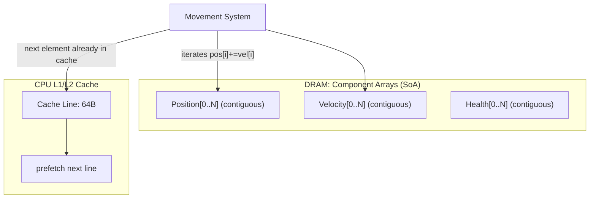
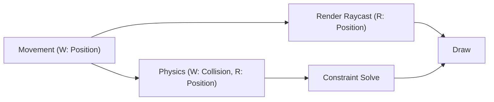
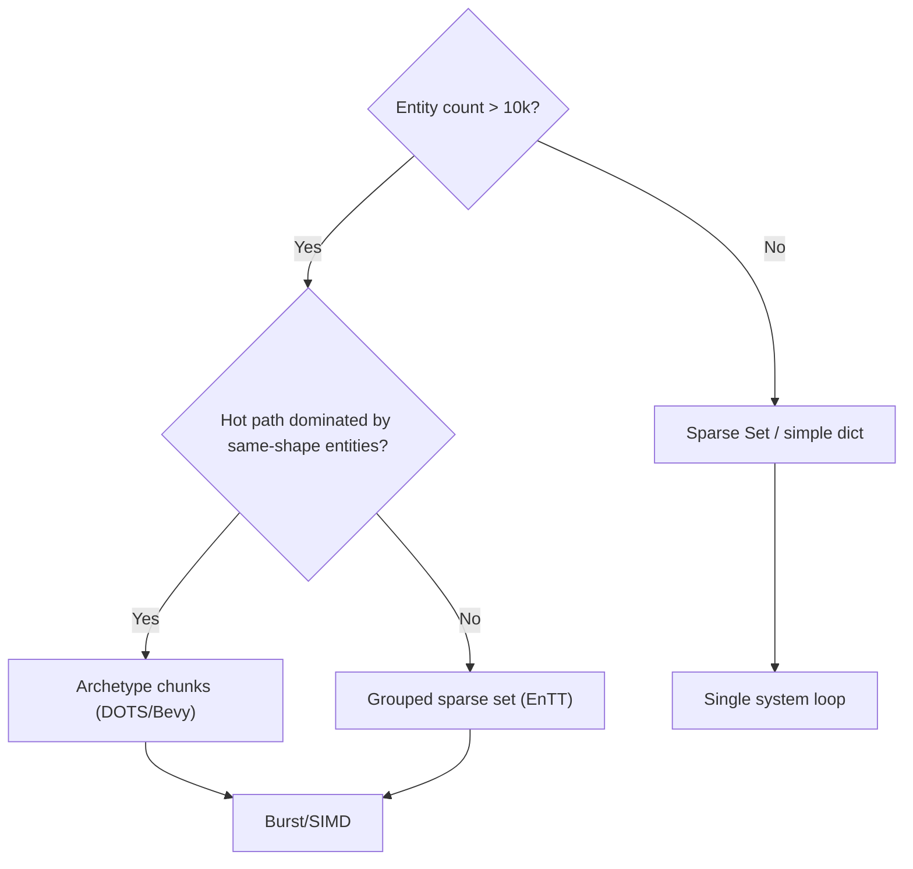

# Entity Component System (ECS) — Deep Engineering Guide

ECS is the dominant data-oriented architecture for modern game engines (Unity DOTS, Bevy, Unreal Mass, Frostbite, Overwatch's ECS, Minecraft, Soldank, EnTT). It replaces scattered OOP objects with contiguous arrays of plain data so tens of thousands of entities update at 60 FPS on cache-limited CPUs.

## 1. Why ECS Exists: The Performance Rationale

### 1.1 The OOP Cache Problem

A classic OOP hierarchy:

```cpp
class GameObject {
public:
    virtual void Update() = 0;
    glm::vec3 m_Position;
    float m_Health;
    std::vector<GameObject*> m_Children;
};

class Enemy : public GameObject {
public:
    void Update() override;
private:
    std::string m_Name;
    float m_Speed;
};
```

Each `Enemy` is heap-allocated individually. The pointer-chasing heap layout scatters `m_Position` across DRAM. Iterating 10,000 enemies forces the CPU to evict its L1/L2/L3 caches on **every single object**. The CPU does nothing but wait on memory.

Measured impact: random-access iteration over a fragmented heap is **20–100x slower** than streaming over contiguous arrays. At 1.8 GHz × 8 cores, this is the difference between updating 1,000 and 100,000 entities per frame.

### 1.2 The Data-Oriented Answer

```
OOP layout (heap):          [Enemy0][Enemy1][Enemy2] --- scattered pages ---
Data layout (SoA):          Position[].x = {2.1, 9.4, 5.0, ...}
                            Position[].y = {0.0, 3.3, 8.2, ...}
                            Health[]     = {100, 42, 7, ...}
```

### 1.3 The Three Pillars

| Term | Definition | Example |
|------|-----------|---------|
| **Entity** | A lightweight opaque ID (integer). No data, no behavior. | `Entity(42)` is just `uint32_t 42` |
| **Component** | A plain-data struct (POD, no virtuals, no methods beyond trivial accessors) | `struct Position { float x, y, z; }` |
| **System** | Pure logic that reads/writes components for every matched entity | `MovementSystem` does `pos += vel * dt` |

### 1.4 Why This is Faster — Cache Lines

A cache line is 64 bytes. A `Position + Velocity` pair in SoA form is 24 bytes. A cache-line fetch delivers **two entities' worth of hot data** instead of two pointers to cold data. This is called a **cache-miss-free stream**.



## 2. Storage Models

### 2.1 Naïve: Dictionary-of-Component-Arrays (AoS-friendly)

The simplest ECS stores each component type in one flat array, where array index == entity ID:

```cpp
struct PositionArray { std::vector<Vec3> data; };      // data[entity] = position
struct HealthArray   { std::vector<float> data; };      // data[entity] = health
```

- **Pros**: minimal implementation, easy to reason about.
- **Cons**: index collisions when entities are destroyed (holes), stale IDs trigger undefined behavior, and unused components occupy memory slots.

### 2.2 Sparse Set

The canonical solution to sparse entity IDs. Two parallel arrays:

```cpp
template<typename T>
class SparseSet {
    std::vector<int>  dense;      // component payload, packed by insertion order
    std::vector<int>  sparse;     // entity -> index into dense
    std::vector<Entity> entities; // dense -> entity
public:
    void add(Entity e, T comp)  {
        sparse[e.id] = dense.size();
        dense.push_back(comp);
        entities.push_back(e);
    }
    void remove(Entity e) {
        int idx = sparse[e.id];
        dense[idx] = dense.back(); dense.pop_back();
        entities[idx] = entities.back(); entities.pop_back();
        sparse[entities[idx].id] = idx;
    }
    T& get(Entity e) { return dense[sparse[e.id]]; }
};
```

`sparse` maps entity → index; `dense` packs only *live* components. Destruction swaps the last element into the hole (O(1)) — exactly how EnTT, Bevy, and flecs remove entities.

### 2.3 Archetype / Chunk-Based Storage (Unity DOTS, Bevy, Unreal Mass)

Archetypes group entities with **identical component shape**:

```
Archetype A = {Position, Velocity}         archetype_id = hash([Position, Velocity])
Archetype B = {Position, Velocity, Health}
```

Each archetype owns contiguous "chunk" blocks (typically 4KB–16KB) that are pure SoA:

```
Chunk (16 KB):
  Position[0..maxEntity  Per Chunk]
  Velocity[0..maxEntities]
  Health  [0..maxEntities]   -- only if archetype has Health
```

Entity ID → archetype ID → chunk index → row. When an entity gains/removes a component, it is **moved** to a different archetype (data migration). This yields:

- Truly cache-coherent iteration (only the components the system needs).
- Cheap add/remove via chunks (no per-entity allocation).
- Zero pointer chasing.

### 2.4 EnTT's Hybrid Approach

EnTT (the most popular single-header ECS) uses a **grouped sparse set** storage:

- Components stored in sorted, tightly packed arrays.
- Grouped storage keeps all components for an archetype in predictable order, collapsing cache misses.
- `view<>` iteration yields pointer-like iterators for direct SoA traversal.

## 3. Entity Hierarchy

## 3.1 Entity IDs in Practice

| Engine | Entity representation |
|--------|----------------------|
| Unity DOTS | `uint32_t` index + `uint32_t` version (generation counter) |
| Bevy | `Entity { index: u32, generation: u32 }` |
| EnTT | `entt::entity` = `uint32_t` (32-bit) or `uint64_t` with version bits |
| flecs | `ecs_entity_t` = `uint64_t` with flags |
| Unreal Mass | `FMassEntityHandle { uint32 SerialNumber; uint32 Index; }` |

Generation counters prevent a recycled ID from silently colliding with a stale reference:

```cpp
uint32_t index      = id & 0xFFFF;       // low 16 bits = index
uint32_t generation = (id >> 16);        // high 16 bits = version

Entity create(uint32_t& nextIndex, std::vector<uint32_t>& generation) {
    uint32_t idx = freeList;               // reuse a freed slot
    uint32_t gen = generation[idx];        // bump the version
    generation[idx] = gen + 1;
    freeList = ...;                        // consume next freed slot
    return pack(idx, gen);
}

bool isValid(Entity e, const std::vector<uint32_t>& generation) {
    return generation[e.index()] == e.generation();  // stale ID detected
}
```

## 4. Systems & Scheduling

## 4.1 System Signature

A system declares the components it reads (`Reads`) and writes (`Writes`). The scheduler uses this to:

1. **Detect data races**: two systems writing the same component simultaneously are illegal.
2. **Parallelize**: systems with disjoint read/write sets run in parallel threads.
3. **Order deterministically**: a write/read dependency imposes an order edge.

```rust
// Bevy style
fn movement_system(time: Res<Time>, mut query: Query<(&mut Transform, &Velocity)>) {
    for (mut transform, velocity) in query.iter_mut() {
        transform.translation += velocity.dir * time.delta_seconds();
    }
}
```

## 4.2 The Scheduler

The scheduler builds a task graph each frame. Edges encode dependencies:



- **Bevy**: uses a multithreaded executor that discovers parallelism from system signatures at runtime (startup systems vs. update systems).
- **Unity DOTS**: the player loop owns a system group; `BurstCompilerOptions` + `Entities.ForEach` + `ISystem` schedule onto the main thread or job threads.
- **flecs**: uses a flat graph + phases (OnUpdate / PostUpdate) and supports *pipelining* where systems from multiple frames overlap.

## 4.3 System Ordering Patterns

### Sequential (Simplest)

```yaml
systems: [input, movement, collisions, render]
```

### Parallel (Data-driven)

```
Frame N:   input ──► movement ──► physics ──► render
                    └─────────► ai ────────┘ (parallel branch)
```

### Pipelined (Cross-frame, GPU/CPU overlap)

Render of frame N overlaps simulation of frame N+1 via double buffering.

## 5. Writing High-Performance Systems

## 5.1 SoA vs AoS vs SoAoS

| Layout | Memory pattern | Cache behavior | Use case |
|--------|---------------|----------------|----------|
| AoS `struct {x,y,vx,vy}` | interleaved per entity | poor for single-component systems | small systems, GPU vertex data |
| SoA `float x[], y[], vx[], vy[]` | separate arrays | perfect streaming for one component at a time | simulation-heavy ECS |
| SoAoS (structure of arrays of structs) | runs of entities grouped | balance between locality and API ergonomics | hybrid, tile-based games |

```cpp
// SoA: ideal for a Position+Velocity move system
float* x  = posX.data(); float* y = posY.data();
float* vx = velX.data(); float* vy = velY.data();
for (size_t i = 0; i < n; ++i) { x[i] += vx[i] * dt; y[i] += vy[i] * dt; }
```

## 5.2 The "One System → One Hot Path" Rule

Design each system to touch the *minimum* set of components. `MovementSystem` should never touch `Inventory`. Pulling extra data into the cache line *is the bug*.

- Keep read-only components (e.g., `Visual`) out of the hot update path entirely.
- Split `Update()' into `UpdateSim()` (dirty flags) and `RenderPrepare()` (called only when visible).

## 5.3 Vectorization (SIMD)

Contiguous SoA arrays vectorize trivially:

```cpp
// With -O3 / -ftree-vectorize, the compiler emits AVX2 for this loop:
for (size_t i = 0; i < n; i += 8) {
    __m256 xs = _mm256_loadu_ps(x + i);
    __m256 vs = _mm256_loadu_ps(vx + i);
    _mm256_storeu_ps(x + i, _mm256_add_ps(xs, _mm256_mul_ps(vs, _mm256_set1_ps(dt))));
}
```

Even better: `#pragma omp simd` or `[BurstCompile]` in Unity (which generates ARM NEON / AVX2 automatically).

## 6. Tying it Together: A Minimal Complete ECS

```cpp
#include <vector>
#include <unordered_map>
#include <cstdint>

using Entity = uint32_t;

struct Position { float x, y; };
struct Velocity { float vx, vy; };

// Archetype-storage: one contiguous array per component type per archetype.
struct Archetype {
    uint32_t            id;
    std::vector<Position> pos;
    std::vector<Velocity> vel;
    std::vector<Entity>    entities;
};

class World {
    std::vector<Archetype> archetypes;
    std::unordered_map<uint32_t, uint32_t> entityToArchetype;

public:
    Entity spawn(const Position& p, const Velocity& v) {
        Archetype& a = archetypes[0];   // archetype {Pos, Vel}
        a.pos.push_back(p);
        a.vel.push_back(v);
        Entity e = static_cast<Entity>(a.entities.size());
        a.entities.push_back(e);
        entityToArchetype[e] = 0;
        return e;
    }

    template<typename Fn>
    void forEachSystem(Fn&& fn) {
        for (Archetype& a : archetypes) {
            for (size_t i = 0; i < a.pos.size(); ++i)
                fn(a.pos[i], a.vel[i]);          // direct, cache-coherent access
        }
    }
};

int main() {
    World w;
    for (int i = 0; i < 100000; ++i)
        w.spawn({(float)i, 0.f}, {0.01f, 0.02f});

    float dt = 1.f / 60.f;
    w.forEachSystem([&](Position& p, Velocity& v) {   // 100k updates
        p.x += v.vx * dt;                              // cache-friendly
        p.y += v.vy * dt;
    });
}
```

## 7. ECS in Real Engines

### 7.1 Unity DOTS (Entities, SubScene, Jobs, Burst)

- **EntityManager**: create/destroy entities, add/remove components.
- **Archetype chunks**: 4 KB chunks of SoA data; moving an entity across archetype is a chunk-to-chunk copy.
- **WriteGroup**: lets you suppress the "last writer wins" conflict when two systems write the same component (e.g., blending `LocalToWorld` from two sources).
- **Burst**: LLVM-based compiler that vectorizes `Entities.ForEach` and `IJobEntity` to SIMD.

```csharp
[BurstCompile]
partial struct MovementJob : IJobEntity {
    public float dt;
    public void Execute(ref Position position, in Velocity velocity) {
        position.Value += velocity.Value * dt;
    }
}
```

### 7.2 Bevy (Rust)

- Systems, bundles, queries with runtime automatic parallelism.
- **Spawn**: `commands.spawn((Transform::default(), Velocity::default()))`.
- **Query filters**: `Query<(&Transform, &Velocity), Without<Frozen>>`.
- **States**: app states gate system sets.
- **ECPLES**: components and systems are functions + data; the scheduler is built per `App`.

### 7.3 Unreal Mass

- Unreal Engine's data-oriented entity framework; `UMassEntitySubsystem`, `FMassEntityManager`.
- Fragments (components) stored in tasteless SoA "chunks", entities as `FMassEntityHandle`.
- **Processors** (systems) declared with `UMassProcessor` and `UCLASS()` markers.
- **Behavior**: `UMassObserver` reacts to fragment add/remove.

## 8. When ECS is the Wrong Tool

| Symptom | Better approach |
|---------|-----------------|
| <2,000 entities, one-off gameplay code | Plain OOP/MonoBehaviour is simpler and fine |
| Deep polymorphic behaviors (attack patterns, chain reactions) | State machines + ECS `State` component, or script-based (Blueprint) |
| Data exists only ephemerally per-event (input events, UI) | Message queue / event bus, not ECS storage |
| Team unfamiliar with data-oriented design, small scope | Keep OOP; adopt ECS only for hot paths (particles, crowds) |
| Cross-platform memory constraints (embedded) | Custom arena allocators + fixed arrays |

**Rule of thumb**: adopt ECS when you measure a cache-bound hot loop, not preemptively.

## 9. Architecture Decision Trees

### 9.1 "Which storage backend?"



### 9.2 "Should I add a component to an entity at runtime?"

```mermaid
flowchart TD
    A{Component always present?} -->|Yes| B[Add to archetype at spawn]
    A -->|No| C{Migrated rarely (<1%)?}
    C -->|Yes| D[Runtime add: compile-time known]
    C -->|No| E[Model as optional/tag component to avoid churn]
    D --> F[Archetype migration cost: ~100ns/entity]
    E --> F
```

## 10. Anti-Patterns

| Anti-pattern | Why it hurts | Fix |
|--------------|--------------|-----|
| **God System** | One system touching 8 components per entity defeats cache separation | Split into single-responsibility systems; pipeline |
| **Storing pointers in components** | Introduces indirection; blasts cache coherency | Store `Entity` IDs / handles, resolve on demand |
| **Virtual methods in components** | I-cache misses; prevents SoA layout; blocks SIMD | Plain data; behavior lives in systems |
| **Entity iteration via indirection** | `for e in entities: lookup(e)` = pointer chase | Region of interest queries designed into storage |
| **Ignoring generation counters** | Recycled IDs corrupt references / dangling handles | Always verify `isValid()` in hot paths |
| **Migrating archetypes in tight loops** | Thousands of copies per frame | Batch add/remove outside update hot loop; defer via command buffer |
| **Single-thread main-thread systems** | Wastes 4–8 cores | Use job system / parallel systems for independent sets |
| **Copying component data** | Implicit copies every spawn/move cost bandwidth | Move semantics; chunk recycling |
| **Reading unrelated arrays** | Extra cache pollution per entity | Query filtering (`Without<T>`, `WriteGroup`) |

## 11. Debugging & Tooling

### 11.1 Rendering ECS State

- **Snapshots**: Unity `EntityDebugger`, Bevy `bevy_ecs_debug_commands` + `bevy_inspector_egui` (World inspector), EnTT `entt::registry::view`.
- **Visualize archetypes**: dump per-archetype chunk counts, entity counts, and cache line utilization in dev builds.

### 11.2 Performance Profiling

1. **CPU time per system** (must be < 16.6 ms budget total for 60 FPS).
2. **Cache misses / instructions retired** via `perf stat -e cache-misses`.
3. **Memory bandwidth**: Large entity counts that are memory-bound show high time-to-bytes ratio.
4. **SIMD vectorization report**: `-fopt-info-vec` (GCC) / `/Qvec-report:2` (MSVC) or Burst inspector shows whether loops vectorized.

### 11.3 Determinism Considerations

For deterministic replay (netcode/lockstep, replays):
- Fixed timestep everywhere (accumulator pattern).
- Fix iteration order (stable sort of dense arrays by component data).
- Avoid floats across platforms — use fixed-point for anything replicated.

## 12. Production Considerations

1. **Fixed timestep**: run simulation at fixed 20–120 Hz; interpolate render state for smoothness. Never simulate at render FPS.
2. **Input buffering**: capture input as components (`PlayerInputCommand`), so systems never read raw input directly.
3. **Networking**: serialize component snapshots, not entities; version the serialization format.
4. **Loading**: parallel streaming of archetype chunks; only activate systems after data is resident.
5. **Hot-reload**: systems that are `#[no_mangle]`-exported can be DLL-reloaded for live iteration (UE4 modules, Unity Burst assemblies).
6. **Memory budget**: preallocate chunk pools; track fragmentation of dense arrays.
7. **Burst / IL2CPP differences**: Unity jobs compile to LLVM; keep code branch-free for vectorizer gains.
8. **Field precision**: `f32` positions drift over long sessions; quantize or use `f64` for world coordinates near origin.

## 13. Advanced ECS Techniques

### 13.1 Region of Interest (ROI) Queries

Games with huge open worlds don't need to simulate every entity every frame. ROI queries restrict systems to entities within a region:

```rust
// Bevy: iterate only entities visible to the current camera
fn render_cull(
    camera: Query<&Transform, With<MainCamera>>,
    mut query: Query<(&Transform, &mut Visible), Without<MainCamera>>,
) {
    let cam_pos = camera.single().translation;
    for (transform, mut visible) in query.iter_mut() {
        let dist2 = transform.translation.distance_squared(cam_pos);
        visible.is_visible = dist2 < CULL_DISTANCE_SQ;
    }
}
```

Hashed spatial grids + chunk buckets let systems skip whole regions:

```
Grid:  0   1   2   3
      +---+---+---+---+
   0  |   |   |   |   |
      +---+---+---+---+       Cells active for camera: {1,2}
   1  |   | X | X |   |       (only these archetypes get updated)
      +---+---+---+---+
```

### 13.2 Command Buffers / Deferred Structural Changes

Structural changes (add/remove components, spawn/destroy) inside a parallel system must be deferred. The canonical pattern is entity command buffers:

```cpp
// EnTT: enqueue operations during parallel iteration, replay later
registry.view<Position>().each([&](entt::entity e, Position& p) {
    if (p.y < -100.f)
        to_destroy.push_back(e);   // record
});
// after parallel section:
registry.destroy(to_destroy.begin(), to_destroy.end());  // bulk
```

Unity DOTS `EntityCommandBuffer` and Bevy `Commands` do exactly this under the hood. Never mutate entity structure while a `view`/`query` is iterating.

### 13.3 GPU ECS (Compute Shader Simulation)

For ultimate throughput, move the simulation to the GPU:

- Position/Velocity/Health live in GPU buffers (SSBO/StructuredBuffer).
- A compute shader updates N entities per dispatch.
- CPU only issues the dispatch; results stay on GPU for rendering.

Enable this ONLY when >100k entities and access pattern is uniform (no branching on per-entity unique data). Typical use: particle systems, crowd simulation. Hybrid pattern: GPU for simulation, CPU ECS for logic/decision.

### 13.4 Entity Relationships & Hierarchies

Pure ECS naturally models flat data, but transforms & parenting produce trees:

```rust
#[derive(Component)]
struct Parent(Entity);
#[derive(Component)]
struct Children(Vec<Entity>);
```

The relationship `ChildOf` in Flecs is first-class (see references). For transforms, propagate parent→child each frame in a dedicated `TransformPropagateSystem` — never each frame in every child's logic.

### 13.5 Component Data Versioning for Tooling

Editor/undo/redo, debuggers, and web overlays need component modifications tracked. Keep a monotonically increasing component `version` counter:

```cpp
uint64_t worldVersion;    // bumps on every structural/mutating op
uint64_t entityVersion[MaxEntities];  // per-entity since-changed marker
```

Tools subscribe to version changes and invalidate caches only for dirty entities.

### 13.6 Zero-Copy Interop with Physics/Audio

ECS data must feed physics and audio engines without copies:

1. Physics engines (Box2D, PhysX, Jolt) want SoA body arrays → build contact callbacks that write directly into ECS `CollisionEvent` components.
2. Audio wants positional sources → a `SyncAudioSources` system reads ECS `AudioSource + Transform` and writes into the audio engine's source pool.
3. Renderer wants GPU buffers → `SyncRenderBuffers` packs ECS transforms into `StructuredBuffer` scheduled before GPU upload.

Keep these as boundary systems; do not let physics/audio own component memory.

## 14. Benchmark Cheat-Sheet (Numbers to Know)

| Operation | Rough cost (modern desktop CPU) |
|-----------|--------------------------------|
| Entity create/destroy | ~20–60 ns |
| Archetype migration (1 component) | ~100–500 ns |
| Iterate 1M entities (one component, SIMD) | ~1–3 ms |
| Iterate 1M entities (2 components, SoA) | ~2–5 ms |
| Snapshot 1M entities serialization | ~5–15 ms |
| Rebuild spatial hash (1M entities) | ~2–8 ms |
| Command buffer playback (10k ops) | ~0.5–2 ms |

**Budget rule**: simulation should stay under 4 ms/frame at 60 FPS (leave ~8 ms for render, 4 ms headroom). If your ECS core exceeds 4 ms, you are memory-bound — fix layout, not logic.

## 15. Rules for ECS Work in This Repo

- Every new game-feature skill MUST document its data layout (SoA/archetype) when performance matters.
- Systems MUST declare read/write sets.
- Hot-loop code MUST be cache-coherent; profile, don't guess.
- Entity IDs MUST carry generation bits.
- All ECS code examples must compile-verify against a minimal registrar (EnTT or hand-rolled) before landing.

## 16. References

- `references/archetype-storage-deep-dive.md` — chunk layout, migration, fragmentation
- `references/system-scheduling-pipelines.md` — dependency graphs, parallel scheduling, determinism
- `references/unity-dots-in-practice.md` — Burst, Jobs, WriteGroup, structural changes
- `references/bevy-ecs-patterns.md` — queries, bundles, states, commands, ECS in Rust
- `references/entt-and-flecs.md` — sparse sets, groups, observers, events
- `references/ecs-netcode.md` — snapshot replication, rollback, lockstep with ECS