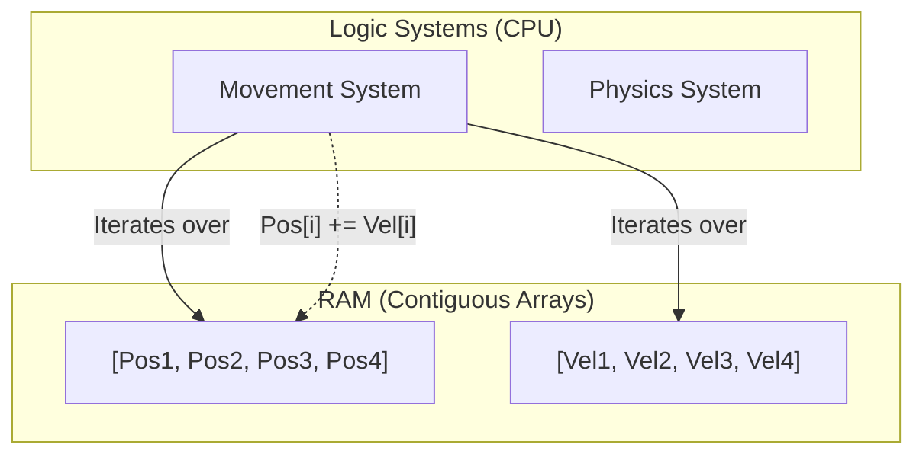

# Game Engine: Entity-Component-System (ECS)

## Core Architecture

ECS is an architectural pattern heavily used in modern game engines (Unity DOTS, Bevy, Unreal Mass) to handle tens of thousands of objects simultaneously at 60 FPS.

### 1. Data-Oriented Design vs OOP
- **OOP (Object-Oriented):** An `Enemy` class holds `Health`, `Position`, and an `Update()` method. Data is scattered across RAM in fragmented objects, causing CPU Cache Misses.
- **ECS (Data-Oriented):** 
  - **Entity:** Just an ID (e.g., `Int: 42`).
  - **Component:** Pure data structs (e.g., `struct Position { x, y }`). Stored in tightly packed, contiguous memory arrays.
  - **System:** Pure logic. Iterates over arrays of Components.

### 2. CPU Cache Coherency
Because Components are stored contiguously in memory, when a System reads the `Position` of Entity 1, the CPU pre-fetches the `Position` of Entity 2, 3, and 4 into the ultra-fast L1/L2 cache, resulting in blazing fast iteration.

### ECS Memory Map

