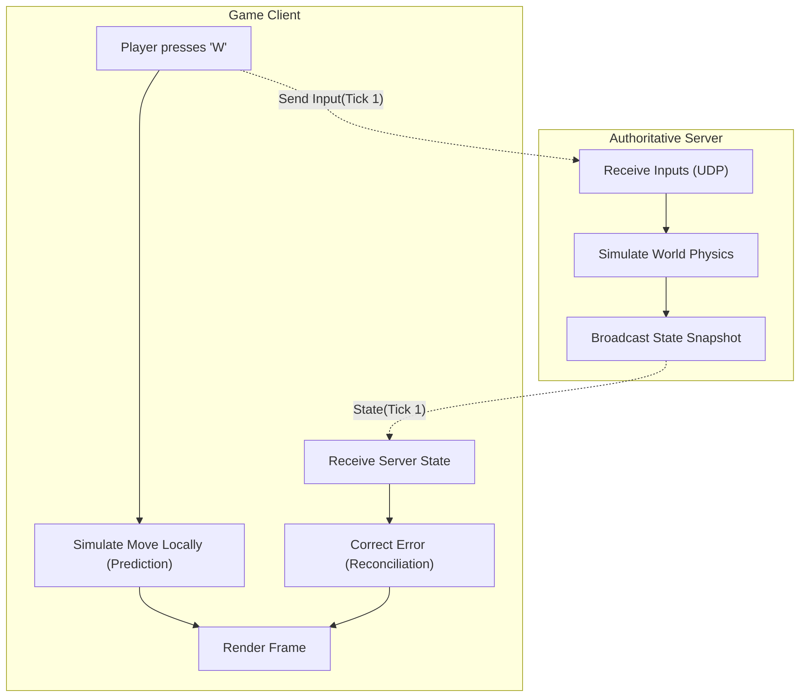

# Multiplayer Game Netcode

## Core Architecture

In fast-paced multiplayer games (FPS/Action), latency is the enemy. Standard TCP and simple Request/Response models are too slow.

### 1. Client Prediction
The client does not wait for the server to confirm movement. When the player presses "Forward", the client immediately moves the character on screen. It sends the input to the server simultaneously.

### 2. Server Reconciliation
The server is the authoritative source of truth. If the server calculates the player hit a wall (but the client predicted they didn't), the server sends the correct position back. The client "snaps" the player to the correct position (Reconciliation/Rubber-banding).

### 3. UDP vs TCP
Games use UDP. TCP resends lost packets and guarantees order, causing head-of-line blocking (lag spikes). In UDP, if a position packet is dropped, we don't care—a newer position packet is arriving in 16ms anyway.

### Netcode Flow Map

