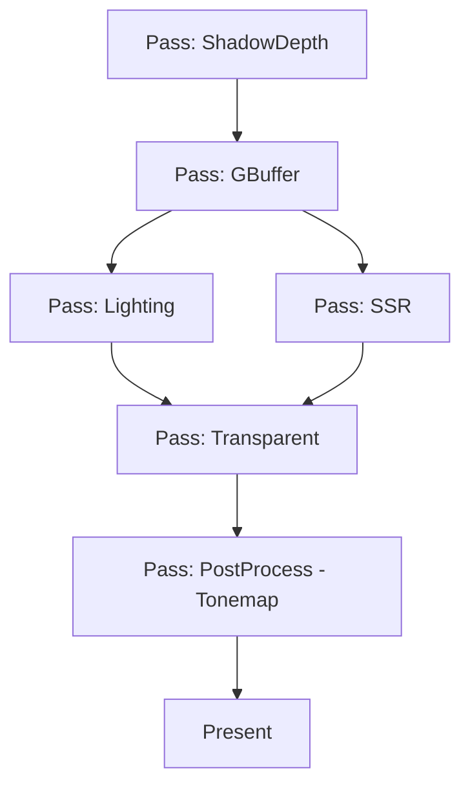
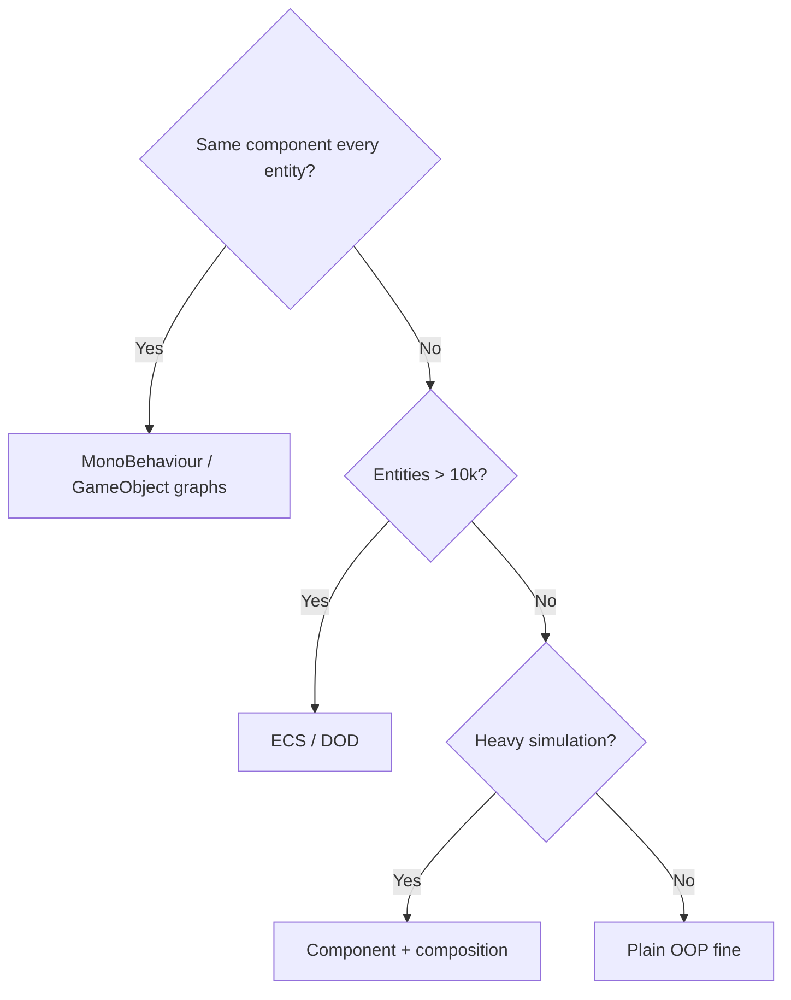
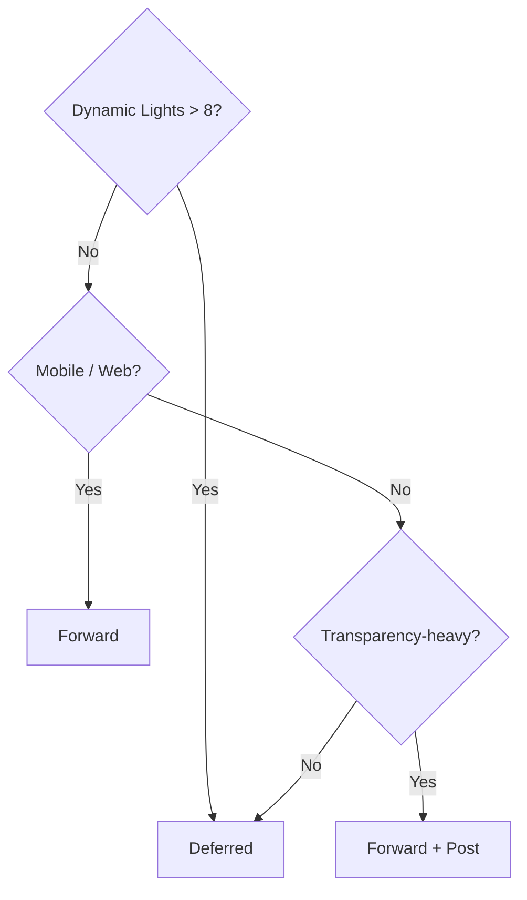

# Game Engine Design Patterns — Deep Engineering Guide

Game engines are the most demanding real-time software systems in common use. They combine graphics, physics, AI, networking, audio, and game logic, all under a hard 16.6 ms/frame budget. This skill covers the canonical design patterns proven across decades of engine work (Unreal, Unity, Doom, Halo, Quake, Minecraft, Godot, CryEngine) plus the newer data-oriented patterns.

## 1. The Game Loop

### 1.1 The Canonical Game Loop

```cpp
void GameLoop() {
    init();
    while (!quitRequested) {
        processInput();
        update(deltaTime);
        render();
    }
    cleanup();
}
```

### 1.2 Variable vs Fixed Timestep

| Timestep | Pros | Cons | Use case |
|----------|------|------|----------|
| **Variable** | Simple, smooth, no jitter | Non-deterministic physics; network-unsafe | UI, menus, simple games |
| **Fixed** | Deterministic, netcode-safe, stable physics | Requires interpolation for smoothness | Simulation, multiplayer, replays |
| **Hybrid (accumulator)** | Best of both | 2x state (sim + render) | Production games |

### 1.3 The Accumulator Pattern (Fixed with Interpolation)

```cpp
const float FIXED_DT = 1.0f / 60.0f;
float accumulator = 0.0f;
float lastTime = now();

while (running) {
    float frameTime = now() - lastTime;
    lastTime = now();
    frameTime = min(frameTime, 0.25f);   // clamp spiral of death
    accumulator += frameTime;

    while (accumulator >= FIXED_DT) {
        simulate(FIXED_DT);               // fixed, deterministic
        accumulator -= FIXED_DT;
    }
    float alpha = accumulator / FIXED_DT; // 0..1 for interpolation
    render(alpha);                        // interpolate sim state
}
```

### 1.4 The Spiral of Death

If `simulate()` takes longer than the frame budget, the accumulator never drains and the game becomes slower and slower. Mitigations:
- Clamp `frameTime` to a max (e.g., 250 ms).
- Skip a fixed step if backlog is deep.
- Cap the number of fixed steps per frame.

## 2. Component Architecture Patterns

### 2.1 The Component Pattern (vs Inheritance)

Instead of deep inheritance trees (`Character -> Enemy -> Boss -> FinalBoss`), compose behaviors from components:

```cpp
class GameObject {
    std::vector<Component*> components;   // UObject, Component, Actor in UE/proprietary
public:
    void Update() { for (auto* c : components) c->Update(); }
};

class HealthComponent : public Component { float hp; };
class PositionComponent : public Component { Vec3 pos; };
```

### 2.2 Component → ECS Migration Ladder

```
Pure OOP GameObject
   │  (class, virtual Update)
   ▼
Component/MonoBehaviour (game logic components)
   │  (behaviors decomposed into Update/onEvent)
   ▼
Composition over inheritance (mix components, no giant class)
   │
   ▼
Data-oriented ECS (full DOD: see ecs-pattern skill)
```

Choose the rung that matches your team's needs and measured performance — not the trend.

### 2.3 Unity MonoBehaviour-style Scripts

Unity's `MonoBehaviour` is a *script component*: a C# class with lifecycle callbacks:

```csharp
public class PlayerController : MonoBehaviour {
    public float speed = 5f;
    void Update() {
        float h = Input.GetAxis("Horizontal");
        transform.position += new Vector3(h * speed * Time.deltaTime, 0, 0);
    }
}
```

## 3. Data-Oriented Patterns

### 3.1 The Data Locality Pattern

Hot loops must scan contiguous memory. Two rules:
1. Group data by update rate (hot vs cold).
2. Store per-system needs contiguously (SoA).

```
BAD:  std::vector<std::unique_ptr<Enemy>>  → heap scattered
GOOD: struct { float x[N]; float y[N]; float hp[N]; }  → contiguous
```

### 3.2 The Dirty Flag Pattern

Avoid re-computing expensive derived state when inputs are unchanged:

```cpp
class Transform {
    Vec3  position, scale;
    Mat4  worldMatrix;      // derived
    bool  dirty = true;     // flag
public:
    void setPosition(const Vec3& p) { position = p; dirty = true; }
    const Mat4& world() {
        if (dirty) { worldMatrix = compose(position, rotation, scale); dirty = false; }
        return worldMatrix;
    }
};
```

Great for: transform hierarchies, shader uniform upload, shadow map caching, UI repaint.

## 4. Memory Management Patterns

### 4.1 Object Pooling

Creating/destroying objects per-frame causes allocation churn, GC pressure, and cache pollution. Pools pre-allocate and recycle:

```cpp
template<typename T>
class ObjectPool {
    std::vector<T>     storage;    // pre-allocated
    std::vector<bool>  inUse;
    std::vector<size_t> freeList;   // stack of free indices
public:
    explicit ObjectPool(size_t cap) : storage(cap), inUse(cap, false) {
        freeList.reserve(cap);
        for (size_t i = cap; i-- > 0;) freeList.push_back(i);
    }
    size_t acquire() {
        size_t i = freeList.back(); freeList.pop_back();
        inUse[i] = true;
        return i;
    }
    void release(size_t i) { inUse[i] = false; freeList.push_back(i); }
};
```

Used by: bullets, particles, damage numbers, network packets.

### 4.2 Pooling in Unity

Unity's `object pooling` is essential to avoid GC spikes:

```csharp
public class BulletPool : MonoBehaviour {
    public GameObject bulletPrefab;
    private Queue<GameObject> pool = new Queue<GameObject>();

    public GameObject Get() {
        if (pool.Count == 0) {
            var b = Instantiate(bulletPrefab);
            b.SetActive(false);
            pool.Enqueue(b);
        }
        var bullet = pool.Dequeue();
        bullet.SetActive(true);
        return bullet;
    }
    public void Release(GameObject b) {
        b.SetActive(false);
        pool.Enqueue(b);
    }
}
```

### 4.3 Arena / Stack Allocators

Per-frame scratch data (collision pairs, command lists) should never hit the general heap:

```cpp
class ArenaAllocator {
    std::vector<std::byte> buffer;
    size_t offset = 0;
public:
    void* alloc(size_t n) {
        void* p = buffer.data() + offset;
        offset = align_up(offset + n, 16);
        return p;
    }
    void reset() { offset = 0; }   // O(1) "free everything"
};
// Usage: physics scratch buffers allocated per frame, reset each frame.
```

## 5. Spatial Partitioning Patterns

### 5.1 Grid vs Quadtree vs BVH vs Spatial Hash

| Structure | Best for | Cost |
|-----------|----------|------|
| **Uniform grid** | Large counts, uniform density (bullets, particles) | O(1) lookup per cell |
| **Quadtree/Octree** | Non-uniform density (RTS world, terrain) | O(log n) traversal |
| **BVH** (Dynamic Bounding Volume Hierarchy) | Physics broad-phase, ray casts | rebuild each frame |
| **Spatial hash** | String-to-pattern matching of positions | hash table, O(1) avg |

### 5.2 Spatial Hash

```cpp
struct SpatialGrid {
    float cellSize;
    std::unordered_map<std::pair<int,int>, std::vector<Entity>> cells;
    std::pair<int,int> cellOf(Vec2 pos) const {
        return { static_cast<int>(std::floor(pos.x / cellSize)),
                 static_cast<int>(std::floor(pos.y / cellSize)) };
    }
};
```

### 5.3 Broad-phase in Physics

Physics runs broad-phase then narrow-phase (detailed intersection):

```
Broad phase (AABB sweep) → candidate pairs
  → Narrow phase (SAT/GJK) → contact manifold
    → Solve (impulse) → integrate velocity/position
```

## 6. Game Object Communication Patterns

### 6.1 Command Pattern

Encapsulate actions as objects for undo, replay, input rebinding:

```cpp
class Command {
public:
    virtual ~Command() = default;
    virtual void Execute() = 0;
    virtual void Undo()  = 0;
};

class MoveCommand : public Command {
    Entity entity; Vec3 delta;
public:
    void Execute() override { entity.move(delta); }
    void Undo() override    { entity.move(-delta); }
};

std::stack<std::unique_ptr<Command>> undoStack;
```

Used by: editor (undo/redo), netcode (deterministic command stream), input rebinding.

### 6.2 Observer Pattern (Events)

Decouple producers and consumers for game events (death, score, achievements):

```cpp
class EventBus {
    std::unordered_map<EventType, std::vector<std::function<void(const Event&)>>> listeners;
public:
    void subscribe(EventType t, std::function<void(const Event&)> fn) { listeners[t].push_back(fn); }
    void publish(EventType t, const Event& e) {
        for (auto& fn : listeners[t]) fn(e);
    }
};
```

Caution: avoid observer chains that fire mid-update and mutate world state. Defer events to end of frame (event queue).

### 6.3 Service Locator (DI-lite)

Provide global access to services (audio, rendering, input, networking) while keeping swap-ability:

```cpp
class AudioService { public: virtual void play(const Sound&) = 0; };
class NullAudio : public AudioService { public: void play(const Sound&) override {} };   // dev mute
class RealAudio : public AudioService { public: void play(const Sound&) override { /* ... */ } };
class Audio {
    static AudioService* service;
public:
    // Low-latency callback execution
    void play(const Sound& s) { if (service) service->play(s); }
    void setService(AudioService* s) { service = s; }
};
```

This is literally how shared audio/video backends work (e.g., GameAudioClient in Xbox, SDL_Audio).

## 7. Behavioral Patterns

### 7.1 State Pattern (Finite State Machines)

NPC AI / player controls as explicit state objects:

```cpp
class CharacterState {
public:
    virtual void update(Character& c, float dt) = 0;
    virtual void onEnter(Character& c) {}
    virtual void onExit(Character& c) {}
};

class IdleState : public CharacterState {
public:
    void update(Character& c, float dt) override {
        if (c.isMoving()) c.setState(State::Run);
        if (c.isAttacking()) c.setState(State::Attack);
    }
};
class RunState : public CharacterState { /* ... */ };
class AttackState : public CharacterState { /* ... */ };
```

### 7.2 Hierarchical State Machines

Add parent/child states for repeated sub-behavior (e.g., `Combat` state with `Meelee/Throw/Guard` children).

### 7.3 Behavior Trees (for AI)

Alternate to FSM — trees of `Sequence`/`Selector`/`Decorator` nodes with `Blackboard`:

```
RootSelect
 ├─ Sequence:   SeeEnemy → ChaseEnemy
 └─ Sequence:   LowHP → Flee → Heal
```

Used by: Unreal Behavior Tree, GDC-standard AI, Unity `Behavior Designer`.

## 8. Rendering Pipeline Patterns

### 8.1 Double Bucketing / Render Queue

Sort draw calls to minimize state changes:

```
Sort key:  [Shader] [Material] [Mesh] [Depth]
Within key: opaque front-to-back, transparent back-to-front
```

### 8.2 Instancing

Draw many identical meshes in one call:

```glsl
// Vertex shader reads instance data from a StructuredBuffer
layout(std430, binding=0) buffer InstanceData { mat4 instanceMatrices[]; };
```

1 draw call renders 100,000 trees instead of 100,000 draw calls.

### 8.3 Deferred vs Forward Rendering

| | Forward | Deferred |
|--|---------|----------|
| Light cost | O(lights × objects) | lights texture-space, O(lights) |
| MSAA | trivial | hard |
| Transparency | natural | tricky |
| Memory | low | GBuffer overhead (G-buffer textures) |
| Use case | character-focused, VR, mobile | many dynamic lights (dungeons, night city) |

### 8.4 TAA / Temporal Accumulation

Anti-aliasing that blurs across frames using motion vectors. Pairs with the frame-buffer's concept of "previous frame" (double buffer).

## 9. Frame Graph / Modern Rendering Architecture

Modern engines (Unreal, Unity SRP, Frostbite) organize GPU work as a **frame graph**:



### 9.1 Why Frame Graphs Matter

1. **Automatic resource aliasing**: Temp buffers share memory when lifetimes don't overlap.
2. **Multi-GPU / async compute**: Passes with no dependency run on separate queues.
3. **Deterministic rendering**: Stable pass order avoids flicker/tearing.
4. **X-plat portability**: RenderDoc + Vulkan/D3D12 backends from one description.

## 10. Audio & Asset Patterns

### 10.1 Asset Management Pattern

Assets loaded via a central cache keyed by path:

```cpp
AssetCache cache;
Texture* tex = cache.load<Texture>("textures/wall.png");
// Missing → loads from disk; Present → returns cached ptr; Disposed → reference-counted
```

### 10.2 Audio Ducking / RMS Mixing

- Volume normalization to avoid clipping.
- Environment-aware reverb via zones.

## 11. Architecture Decision Trees

### 11.1 "Which world/entity model for my game?"



### 11.2 "Which renderer approach?"



## 12. Anti-Patterns

| Anti-pattern | Symptom | Fix |
|--------------|---------|-----|
| **God Object** | One class touched by everything | Decompose components; ECS |
| **Allocation in update loop** | GC spikes / jank | Object pools, arena |
| **Deep inheritance** | Fragile base classes, late binding misses | Composition over inheritance |
| **Observer spaghetti** | Debugging impossible, cyclical events | Event queue + ordering at frame end |
| **Single-thread renderer** | GPU underutilized, light culling stalls | Frame graph + async compute |
| **Global mutable state** | Race conditions, non-reproducible bugs | Service locator + immutable snapshots |
| **Updating at render FPS** | Non-determinism, physics drift | Fixed timestep accumulator |
| **Loading assets mid-frame** | Frame spikes | Preload / streaming in background |
| **No spatial index** | O(n²) collision checks | Grid / BVH / spatial hash |

## 13. Engine Architecture Checklist (Lead-Level)

Before shipping a frame, a Lead Tech Game Engine engineer verifies:

1. **Frame budget**: sim < 4 ms, render < 8 ms, headroom < 4 ms (60 FPS).
2. **Determinism**: fix timestep, stable ordering, no unordered iteration.
3. **Memory**: no allocations in hot loops, pooling everywhere, arena per-frame scratch.
4. **Rendering**: draw call budget, state-change minimization, instancing used, frame graph in place.
5. **Parallelism**: simulation systems on worker threads; GPU/CPU overlap (pipelining).
6. **Assets**: streaming, reference counting, cache coherence.
7. **Tooling**: profiler hooks wired, editor integration, hot-reload for gameplay code.
8. **Netcode readiness**: snapshot-able state, serializable components, rollback strategy.

## 14. References

- `references/game-loop-and-timestep.md` — fixed/variable timesteps, accumulator, interpolation, spiral of death
- `references/component-architecture.md` — GameObject, Component, MonoBehaviour, composition patterns
- `references/memory-and-pools.md` — pool/arena/free-list allocators, cache-friendly design, GC avoidance
- `references/spatial-partitioning.md` — grid, quadtree, octree, BVH, spatial hash implementations
- `references/behavior-patterns.md` — state machine, behavior tree, utility AI, GOAP, event queues
- `references/rendering-pipeline-patterns.md` — frame graph, forward/deferred, instancing, LOD, batching