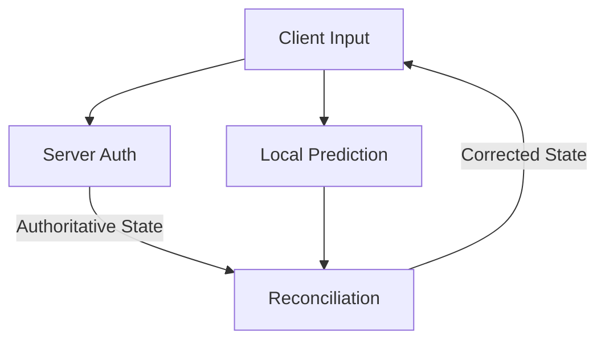

# Multiplayer Netcode

Design robust multiplayer experiences using Client Prediction and Server Reconciliation to hide latency and ensure fairness.

## Client Prediction
Clients immediately simulate local inputs to avoid perceived lag, while simultaneously transmitting inputs to the server.

```csharp
void Update() {
    // 1. Capture Input
    var input = CaptureInput();
    
    // 2. Send to Server (Unreliable/Reliable depending on game)
    SendInputToServer(input);
    
    // 3. Predict locally
    ApplyInputToLocalState(input);
    SaveStateForReconciliation(currentTick, currentState);
}
```

## Server Reconciliation
When authoritative state arrives, compare it with past predicted states. If they differ, snap to the server state and quickly re-apply pending inputs.

```csharp
void OnServerStateReceived(ServerState state) {
    if (LocalStateDiffers(state)) {
        SnapToState(state);
        ReapplyPendingInputs(state.Tick);
    }
}
```

## Architecture Flow


