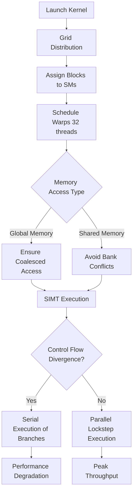

# CUDA Programming Fundamentals

Adopt a rigorous, hardware-aware approach to CUDA programming. Mastery of the hardware execution model is required to extract theoretical peak performance from NVIDIA GPUs.

## Execution Hierarchy: Grid, Block, Thread

- **Grid:** The total domain of computation, executed on the GPU. Composed of blocks.
- **Thread Block:** A localized group of threads executing on a single Streaming Multiprocessor (SM). Threads within a block can synchronize (`__syncthreads()`) and share data via Shared Memory. Maximum 1024 threads per block.
- **Warp:** The fundamental unit of execution. 32 threads executing in lockstep (SIMT - Single Instruction, Multiple Threads). All branching and memory access analysis must be performed at the warp granularity.

## Memory Hierarchy Mastery

1. **Global Memory (DRAM):** High capacity, high latency (400-800 cycles). Optimization mandates coalesced accesses. A 32-thread warp accessing 32 contiguous 4-byte words results in a single 128-byte transaction.
2. **Shared Memory (SRAM):** User-managed L1 cache. Ultra-low latency (~30 cycles), extremely high bandwidth. Sits on-chip (within the SM). Use for intermediate reductions, convolution stencils, and tile-based matrix multiplications. Beware of bank conflicts: simultaneous access to the same memory bank by different threads in a warp serializes the access.
3. **Registers:** Fastest memory, dedicated to individual threads. Over-allocation of registers limits the number of concurrent blocks on an SM (reducing occupancy).

## Pathologies and Mitigations

- **Warp Divergence:** If threads in a warp diverge on a data-dependent branch, the SM executes both paths serially, masking off inactive threads. Mitigation: Reorganize data to ensure threads in a warp take the same control path, or replace branches with predicated instructions or mathematical masks.
- **Stale Pointers / PCIe Thrashing:** Avoid unified memory page faults in critical paths. Prefetch data explicitly (`cudaMemPrefetchAsync`).

## CUDA Execution Flow

