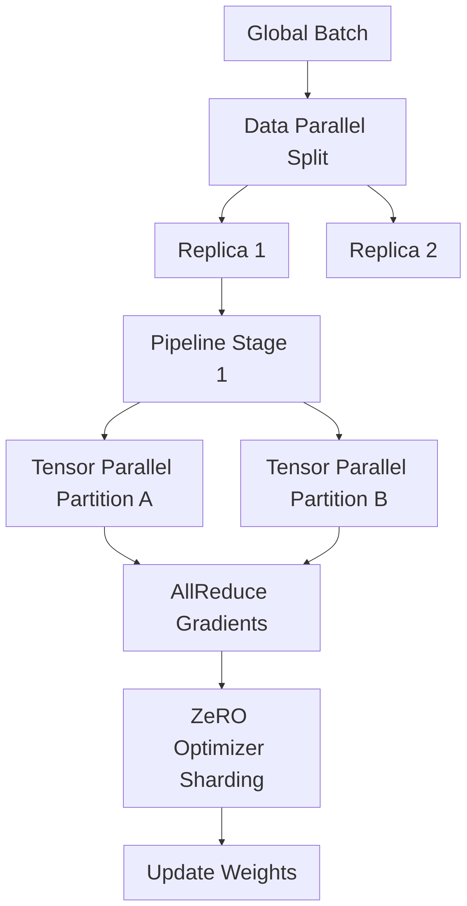

# Hardware Acceleration: Distributed Training

## Theoretical Foundation
Scaling beyond single-node boundaries necessitates orthogonal partitioning strategies across data, tensor, and pipeline dimensions.
1. **Data Parallelism (DP)**: Orthogonal to model topology; replicates models across devices, synchronizing gradients via `AllReduce`.
2. **Tensor Parallelism (TP)**: Intra-layer partitioning. Matrix multiplications are sharded across devices. Requires high-bandwidth interconnects (NVLink) due to synchronous communication overhead.
3. **Pipeline Parallelism (PP)**: Inter-layer partitioning. Sequential execution across devices with micro-batching to mitigate pipeline bubbles (1F1B scheduling).

## DeepSpeed ZeRO (Zero Redundancy Optimizer)
Eliminates memory redundancies in DP:
- **ZeRO-1**: Shards Optimizer States.
- **ZeRO-2**: Shards Gradients (+ ZeRO-1).
- **ZeRO-3**: Shards Parameters (+ ZeRO-2). Enables models exceeding aggregated GPU VRAM via dynamic prefetching (`AllGather`) and eviction.

## Network Topology & Communication
- **NCCL (NVIDIA Collective Communications Library)**: Optimizes primitives (`AllReduce`, `AllGather`, `ReduceScatter`).
- **Intra-Node**: NVLink yields ultra-high bandwidth (>900 GB/s) essential for TP.
- **Inter-Node**: Infiniband (RDMA) minimizes latency, strictly required for PP and ZeRO-3 parameter synchronization.

## Architecture Flow

