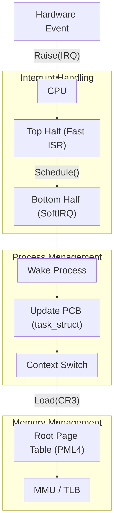

# Kernel Development Mechanics

## Process Control Block (PCB)
The PCB (e.g., `task_struct` in Linux) is the foundational data structure representing a thread of execution. It encapsulates:
- Execution state (runnable, sleeping, stopped).
- CPU context (register values saved during context switches).
- Memory management information (pointer to the page directory `mm_struct`).
- Open file descriptors and signal handlers.

## Page Tables and Virtual Memory
Virtual memory abstraction relies on hardware MMU and OS page tables.
- **Hierarchical Paging:** Modern systems use multi-level page tables (e.g., 4-level paging in x86_64: PML4, PDP, PD, PT) to sparse-map the vast 64-bit address space efficiently.
- **TLB & Context Switches:** The Translation Lookaside Buffer caches recent translations. A context switch usually involves writing a new physical address to the CR3 register, flushing non-global TLB entries.

## Interrupt Handlers (ISRs)
Hardware interrupts trigger an asynchronous context switch.
- **Top Half:** Executes immediately in interrupt context with interrupts disabled. Aims to acknowledge the hardware and schedule deferred work, maintaining ultra-low latency.
- **Bottom Half (SoftIRQs, Tasklets, Workqueues):** Executes deferred, non-time-critical processing in process context or with interrupts enabled, preventing system starvation.

