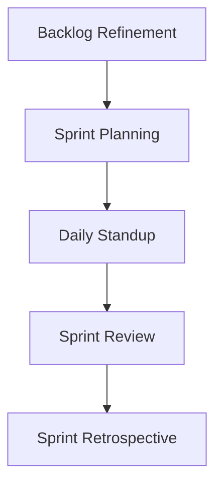

# Agile Scrum Management

## Key Concepts
- **Sprints**: 2-week iterations for focused delivery.
- **Story Points**: Use Fibonacci sequence (1, 2, 3, 5, 8, 13) for complexity sizing.

## Workflow


## Template: Sprint Config
```yaml
sprint:
  duration_weeks: 2
  capacity_points: 50
  meetings:
    standup: "10:00 AM Daily"
    planning: "Monday 9:00 AM"
    review: "Friday 3:00 PM"
```
