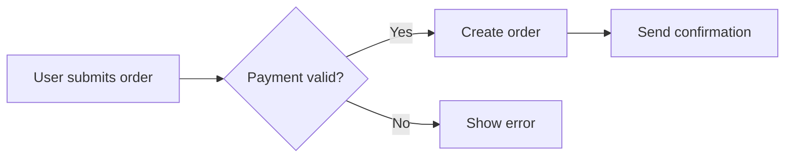

# Business Analysis

## Purpose
Elicit, analyze, and document requirements through user stories, acceptance criteria, process models, and stakeholder analysis.

## Agent Protocol

### Trigger
Exact user phrases: "business analysis", "requirements", "user story", "acceptance criteria", "Gherkin", "INVEST", "process flow", "use case", "stakeholder analysis", "BRD", "functional requirements", "specification", "write story", "refine story", "requirements gathering".

### Input Context
Before activating, verify:
- The feature or problem domain is known.
- The user role and goal are understood (who needs what and why).
- Existing documentation or context is available (brief, PRD, or conversation).

### Output Artifact
Writes user stories to `docs/stories/` or acceptance criteria to the appropriate spec document.

### Response Format
Answer exactly:
```
Story: {title}
As a: {user role}
I want: {goal}
So that: {benefit / value}

Acceptance Criteria:
Scenario: {title}
  Given {context}
  When {action}
  Then {expected outcome}
```

No preamble. No postamble. No explanations. No filler/hedging/transitions. Compress output — why use many token when few do trick. No explanations of agile or BDD concepts.

### Completion Criteria
This skill is complete when:
- [ ] User story follows INVEST criteria (Independent, Negotiable, Valuable, Estimable, Small, Testable).
- [ ] Acceptance criteria are written in Gherkin format.
- [ ] Stakeholder concerns are addressed or noted for follow-up.
- [ ] Non-functional requirements are documented where applicable.

### Max Response Length
One story: 15 lines. Acceptance criteria: 10 lines per scenario.

## Workflow

### Step 1: Requirements Elicitation
Ask and document:

| Question | Purpose |
|----------|---------|
| Who is the user? | Define role and persona |
| What do they need to achieve? | Define the goal |
| Why is this valuable? | Define the benefit |
| What could go wrong? | Edge cases and error paths |
| How will we know it's done? | Acceptance criteria |

### Step 2: Write User Stories
```
As a {role}
I want {feature / goal}
So that {benefit / value}
```

**INVEST checklist:**
- [ ] **I**ndependent — can be delivered separately
- [ ] **N**egotiable — details can be refined
- [ ] **V**aluable — delivers value to user or business
- [ ] **E**stimable — team can estimate effort
- [ ] **S**mall — fits within one sprint
- [ ] **T**estable — clear pass/fail criteria

### Step 3: Acceptance Criteria (Gherkin)
```
Scenario: {title}
  Given {precondition / context}
  When {action / trigger}
  Then {expected result}
```

Additional keywords:
- `And` — additional precondition, action, or result
- `But` — negative condition
- `Scenario Outline` + `Examples` — data-driven scenarios

```
Scenario Outline: Login with valid credentials
  Given the user is on the login page
  When they enter "<email>" and "<password>"
  And they click "Sign In"
  Then they are redirected to the dashboard

  Examples:
    | email              | password    |
    | user@example.com   | Pass123!    |
    | admin@example.com  | Admin@456   |
```

**Boundary scenarios to cover:**
- Happy path
- Invalid input (empty, malformed, out of range)
- Permission denied
- Resource not found
- Concurrent access
- Timeout / network failure
- Duplicate submission

### Step 4: Process Modeling
Document workflows as structured steps:



When Mermaid is not available, use step-by-step:
```
1. User submits order form
2. System validates payment
   - If valid: create order, send confirmation
   - If invalid: show error message, log attempt
3. Order appears in user's order history
```

### Step 5: Non-Functional Requirements
| Category | Examples |
|----------|----------|
| Performance | Response time < 2s, supports 1000 concurrent users |
| Security | TLS 1.3, OAuth2, input sanitization |
| Usability | WCAG 2.1 AA, mobile-responsive |
| Reliability | 99.9% uptime, automatic failover |
| Scalability | Horizontal scaling, stateless design |

## Rules
- Every story must have at least one positive and one negative acceptance criterion
- Stories must be small enough to complete within one sprint — split if larger
- Acceptance criteria must be testable (pass/fail, not subjective)
- Gherkin scenarios must use business language, not implementation details
- Do not include solution details in user stories (keep WHY not HOW)
- INVEST checklist mandatory before a story is ready for development

## References
  - references/ba-advanced.md — Ba Advanced Topics
  - references/ba-fundamentals.md — Ba Fundamentals
  - references/gherkin-patterns.md — Gherkin Patterns
  - references/requirements-gathering.md — Requirements Gathering
  - references/story-splitting.md — Story Splitting Techniques
  - references/user-story-mapping.md — User Story Mapping
## Handoff
After completing this skill:
- Next skill: **qa** — to plan testing for the defined requirements
- Pass context: user stories with acceptance criteria, NFRs, process models
