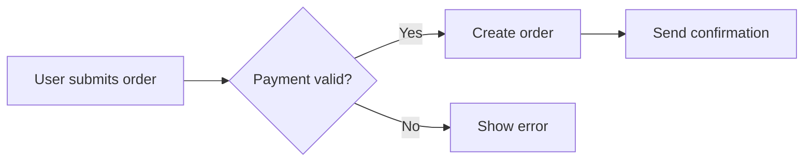

# Business Analysis

## Purpose
Elicit, analyze, and document requirements through user stories, acceptance criteria, process models, and stakeholder analysis.

## Agent Protocol

### Trigger
Exact user phrases: "business analysis", "requirements", "user story", "acceptance criteria", "Gherkin", "INVEST", "process flow", "use case", "stakeholder analysis", "BRD", "functional requirements", "specification", "write story", "refine story", "requirements gathering".

### Input Context
Before activating, verify:
- The feature or problem domain is known.
- The user role and goal are understood (who needs what and why).
- Existing documentation or context is available (brief, PRD, or conversation).

### Output Artifact
Writes user stories to `docs/stories/` or acceptance criteria to the appropriate spec document.

### Response Format
Answer exactly:

Story: {title}
As a: {user role}
I want: {goal}
So that: {benefit / value}

Acceptance Criteria:
Scenario: {title}
  Given {context}
  When {action}
  Then {expected outcome}

No preamble. No postamble. No explanations. No filler/hedging/transitions. Compress output — why use many token when few do trick. No explanations of agile or BDD concepts.

### Completion Criteria
This skill is complete when:
- [ ] User story follows INVEST criteria (Independent, Negotiable, Valuable, Estimable, Small, Testable).
- [ ] Acceptance criteria are written in Gherkin format.
- [ ] Stakeholder concerns are addressed or noted for follow-up.
- [ ] Non-functional requirements are documented where applicable.

### Max Response Length
One story: 15 lines. Acceptance criteria: 10 lines per scenario.

## Workflow

### Step 1: Requirements Elicitation
Ask and document:

| Question | Purpose |
|----------|---------|
| Who is the user? | Define role and persona |
| What do they need to achieve? | Define the goal |
| Why is this valuable? | Define the benefit |
| What could go wrong? | Edge cases and error paths |
| How will we know it's done? | Acceptance criteria |

### Step 2: Write User Stories

As a {role}
I want {feature / goal}
So that {benefit / value}

**INVEST checklist:**
- [ ] **I**ndependent — can be delivered separately
- [ ] **N**egotiable — details can be refined
- [ ] **V**aluable — delivers value to user or business
- [ ] **E**stimable — team can estimate effort
- [ ] **S**mall — fits within one sprint
- [ ] **T**estable — clear pass/fail criteria

### Step 3: Acceptance Criteria (Gherkin)

Scenario: {title}
  Given {precondition / context}
  When {action / trigger}
  Then {expected result}

Additional keywords:
- `And` — additional precondition, action, or result
- `But` — negative condition
- `Scenario Outline` + `Examples` — data-driven scenarios

Scenario Outline: Login with valid credentials
  Given the user is on the login page
  When they enter "<email>" and "<password>"
  And they click "Sign In"
  Then they are redirected to the dashboard

  Examples:
    | email              | password    |
    | user@example.com   | Pass123!    |
    | admin@example.com  | Admin@456   |

**Boundary scenarios to cover:**
- Happy path
- Invalid input (empty, malformed, out of range)
- Permission denied
- Resource not found
- Concurrent access
- Timeout / network failure
- Duplicate submission

### Step 4: Process Modeling
Document workflows as structured steps:



When Mermaid is not available, use step-by-step:

1. User submits order form
2. System validates payment
   - If valid: create order, send confirmation
   - If invalid: show error message, log attempt
3. Order appears in user's order history

### Step 5: Non-Functional Requirements

| Category | Examples |
|----------|----------|
| Performance | Response time < 2s, supports 1000 concurrent users |
| Security | TLS 1.3, OAuth2, input sanitization |
| Usability | WCAG 2.1 AA, mobile-responsive |
| Reliability | 99.9% uptime, automatic failover |
| Scalability | Horizontal scaling, stateless design |

### Step 6: Stakeholder Analysis and Management

Identify all stakeholders affected by the requirements. Categorize by influence and interest. Define engagement strategy per stakeholder. Document concerns and ensure they are addressed. Plan validation sessions with key stakeholders. Maintain a stakeholder matrix updated throughout the project.

### Step 7: Requirements Prioritization

Use a structured prioritization framework:

| Framework | Description | Best For |
|-----------|-------------|----------|
| MoSCoW | Must have, Should have, Could have, Won't have | Time-boxed delivery |
| Kano Model | Basic, Performance, Excitement factors | Customer satisfaction |
| Value vs Effort | Business value against implementation effort | Resource-constrained |
| Weighted Scoring | Multi-criteria scoring (value, risk, cost, dependency) | Portfolio decisions |
| RICE | Reach, Impact, Confidence, Effort | Growth and product features |

### Step 8: Requirements Validation

Conduct systematic validation with stakeholders:
- Walkthrough: Present requirements for review and feedback
- Prototyping: Demonstrate interactive mockups to validate understanding
- Acceptance criteria review: Ensure criteria are testable and complete
- Traceability check: Map requirements to business objectives
- Sign-off: Formal approval from authorized stakeholders

### Step 9: Requirements Management and Change Control

Establish a requirements baseline. Define a change control process for requirement changes. Assess impact of changes on scope, timeline, and cost. Maintain requirements traceability matrix. Communicate changes to all affected stakeholders.

### Step 10: Story Refinement and Splitting

Refine large stories into sprint-sized pieces. Use splitting heuristics:
- Split by workflow step (login → search → select → pay)
- Split by data type (handle different entity types separately)
- Split by operations (create, read, update, delete separately)
- Split by UI variant (web vs mobile, different user types)
- Split by acceptance criteria (one criterion per story)
- Split by non-functional boundary (basic functionality first, performance later)

## Framework / Methodologies

### Business Analysis Framework Comparison

| Framework | Focus | Artifacts | Best For | Process |
|-----------|-------|-----------|----------|---------|
| BABOK (IIBA) | Comprehensive BA practice | 30+ techniques across 6 knowledge areas | Enterprise BA, certification prep | Multi-phase, adaptive |
| Agile/Scrum BA | Iterative delivery | User stories, acceptance criteria, backlog | Scrum teams | Continuous refinement |
| Design Thinking | User-centric problem solving | Personas, journey maps, prototypes | Innovation and new products | Divergent → Convergent |
| Lean BA | Waste reduction, value focus | Value stream map, minimal spec | Process improvement | Value stream analysis |
| Use Case (UML) | System interaction modeling | Use case diagrams, scenarios, flows | Complex systems, formal specs | Actor-goal oriented |

### Decision Tree: Requirements Approach

```
What is the project type?
  ├── New product / major feature
  │   ├── User needs well understood?
  │   │   ├── Yes → Agile BA (user stories + backlog refinement)
  │   │   └── No → Design Thinking (research → prototype → test)
  ├── Process improvement / automation
  │   └── Lean BA (value stream mapping, waste identification)
  ├── Complex system with many integrations
  │   └── Use Case (UML) + BABOK techniques
  ├── Compliance / regulatory project
  │   └── BABOK (traceability matrix, formal sign-off)
  └── Small enhancement / bug fix
      └── Direct user story with minimal analysis
```

### Requirements Elicitation Technique Selection

| Technique | Best For | Participants | Time | Artifact |
|-----------|----------|--------------|------|----------|
| Interview | Deep understanding of individual perspectives | BA + single stakeholder | 30-60 min | Interview notes |
| Workshop | Collaborative requirement definition | BA + multiple stakeholders | 2-4 hours | Workshop output document |
| Observation | Understanding current process reality | BA + users in their environment | 2-8 hours | Process notes, pain points |
| Document analysis | Understanding existing system | BA only | 2-8 hours | Gap analysis |
| Survey/Questionnaire | Broad input from many stakeholders | BA + many respondents | Design: 1 day, Response: 1 week | Survey results |
| Prototyping | Validating understanding visually | BA + users | 1-5 days | Prototype, feedback log |
| Brainstorming | Generating ideas and possibilities | BA + creative team | 1-2 hours | Idea list |
| Focus group | Validating concepts with representative users | Facilitator + 6-10 users | 1-2 hours | Focus group report |
| Interface analysis | Understanding system boundaries | BA + technical team | 2-4 hours | Interface specification |
| Root cause analysis | Understanding underlying problems | BA + stakeholders | 1-3 hours | Root cause diagram |

## Common Pitfalls

### Pitfall 1: Solution-Jumping
Stakeholders (and analysts) often jump to solutions before understanding the problem. "We need a report" instead of "we need to understand customer churn patterns". Always start with the problem and let the solution emerge from analysis.

### Pitfall 2: Writing Stories Too Large
Epic-sized stories that take months to deliver cannot be estimated, tested, or completed in a sprint. Apply splitting techniques until each story can be done within 2-3 days. If a story takes longer, split it further.

### Pitfall 3: Implementation Details in Stories
Stories that say "Add a button on the left sidebar" prescribe solutions instead of describing needs. The team should decide implementation. Write "User can access order history from any page" — the implementation detail belongs in design discussions.

### Pitfall 4: Happy Path Only
Stories that only describe the sunshine scenario miss error handling, edge cases, and alternative flows. Every story must have at least one positive and one negative acceptance criterion. Cover authorization failures, data not found, concurrent access, and network issues.

### Pitfall 5: Gherkin as Test Script
Gherkin scenarios written with implementation details ("Click the blue button") rather than business language ("Submit the form") create brittle scenarios that break when UI changes. Gherkin should describe behavior, not UI interactions.

### Pitfall 6: No Non-Functional Requirements
Stories focused entirely on functionality while ignoring performance, security, usability, and scalability. Non-functional requirements are often discovered during testing, causing rework. Include relevant NFRs in every epic.

### Pitfall 7: Stakeholder Assumption
Assuming stakeholders know what they want without validation leads to rework. What stakeholders say and what they actually need are often different. Validate through prototypes, acceptance criteria reviews, and iterative feedback.

### Pitfall 8: Requirements Creep
Adding requirements without change control leads to scope creep. Every new requirement should go through the same prioritization and impact assessment process. Maintain a scope baseline and manage changes formally.

### Pitfall 9: Insufficient Edge Case Coverage
Teams cover the happy path and a few obvious error cases, then discover production issues from untested edge cases. Use boundary value analysis and equivalence partitioning systematically. Cover concurrent access, race conditions, and data inconsistency scenarios.

### Pitfall 10: Analysis Paralysis
Over-analyzing requirements before development starts delays delivery and doesn't prevent change (requirements will change anyway). Analyze enough to start development, then refine iteratively. The goal is shared understanding, not perfect documentation.

## Best Practices

- **Start with the problem, not the solution**: Requirements describe what, not how. The solution emerges from understanding the problem deeply.
- **Write stories for real users**: Use actual user roles and personas, not generic "users". Different roles have different goals and needs.
- **Make acceptance criteria testable**: "Fast response" is subjective. "Response time under 2 seconds for 95% of requests" is testable.
- **Validate early and often**: Share drafts, prototypes, and scenarios with stakeholders before development starts. The cost of change increases exponentially over time.
- **Use business language, not technical jargon**: Stakeholders need to understand and approve requirements. Gherkin scenarios use domain language.
- **Maintain a glossary**: Define domain terms in a shared glossary. Different stakeholders may use the same term differently.
- **Trace requirements to goals**: Every requirement should link back to a business objective. If you can't trace it, question whether it's needed.
- **Separate functional from non-functional**: Different stakeholders review them (product owners for functional, architects for NFRs). They have different prioritization criteria.
- **Manage scope formally**: Every change to the requirements baseline goes through assessment and approval. No scope change without impact analysis.
- **Keep stories small, not thin**: A story that says "User can view dashboard" is too thin. A story with detailed acceptance criteria that fits in 2-3 days is well-sized.

## Templates & Tools

### User Story Template

```yaml
story:
  id: US-{n}
  title: {concise description}
  description: |
    As a {role}
    I want {goal}
    So that {benefit}
  acceptance_criteria:
    - scenario: {title}
      given: {context}
      when: {action}
      then: {result}
    - scenario: {error case}
      given: {context}
      when: {action with invalid input}
      then: {error result}
  non_functional:
    - {performance requirement}
    - {security requirement}
  estimates:
    complexity: small / medium / large
    points: {story points}
  dependencies:
    - {related story or external dependency}
  status: backlog / refined / in_progress / done
```

### BRD (Business Requirements Document) Outline

```yaml
brd:
  document_control:
    title: {project name} Business Requirements
    version: 1.0
    author: {BA name}
    date: {date}
    status: draft / reviewed / approved
  sections:
    - section: executive_summary
      content: 1-2 paragraph overview of objectives and scope
    - section: business_context
      content: Current state, problem statement, opportunity
    - section: project_scope
      subsections:
        - in_scope: {list of what is included}
        - out_of_scope: {list of what is excluded}
        - assumptions: {list of assumptions made}
        - constraints: {list of constraints}
    - section: stakeholder_analysis
      content: Stakeholder matrix with influence, interest, engagement strategy
    - section: functional_requirements
      content: User stories organized by epic/feature
    - section: non_functional_requirements
      content: Performance, security, usability, reliability, scalability
    - section: process_models
      content: Current and future state process flows
    - section: data_requirements
      content: Data entities, relationships, volumes
    - section: interfaces
      content: Systems integrations, APIs, data exchange
    - section: acceptance_criteria
      content: High-level acceptance criteria for the project
    - section: assumptions_and_dependencies
      content: Key assumptions, dependencies, risks
    - section: approval
      content: Sign-off section
```

### Requirements Traceability Matrix

```yaml
rtm:
  entries:
    - id: REQ-001
      description: User can search orders by date range
      business_objective: BO-003 (Improve order management efficiency)
      source: Stakeholder workshop 2026-03-15
      owner: Product Manager
      priority: Must have
      status: Approved
      test_cases:
        - TC-001, TC-002, TC-003
      design_docs:
        - Design-Search-001
      release: v2.1
      change_history:
        - date: 2026-03-20
          change: Added date range filter
          reason: User feedback from beta
    - id: REQ-002
      description: Export search results to CSV
      business_objective: BO-003
      source: Stakeholder interview (Alice, Ops)
      owner: Product Manager
      priority: Should have
      status: Proposed
      test_cases: []
      design_docs: []
      release: TBD
```

## Case Studies

### Case Study 1: E-Commerce Checkout Redesign
An e-commerce company's checkout had 40% abandonment. BA analysis using process mapping revealed 7 required fields, 3 page loads, and no guest checkout. User stories with acceptance criteria covered: guest checkout, address autocomplete, progress indicator, saved payment methods. After implementation, abandonment dropped to 22%. Key factor: stakeholder workshops included customer support agents who knew the top abandonment reasons.

### Case Study 2: Healthcare Scheduling System
A hospital needed a new patient scheduling system. The BA team used stakeholder analysis to identify 12 distinct user roles (patients, receptionists, nurses, doctors, administrators...). Each role had unique needs. Gherkin scenarios captured complex business rules (scheduling conflicts, insurance validation, room availability). Using scenario outlines with examples, they covered 80+ variations with 15 scenario templates.

### Case Study 3: Fintech Regulatory Reporting
A fintech needed to implement new regulatory reporting requirements. The BA team created a requirements traceability matrix from regulation text through requirements to test cases. They used structured analysis to identify data lineage requirements (where data originates, transforms, and is reported). The traceability matrix proved invaluable during regulatory audit — demonstrating complete coverage of every regulatory requirement.

### Case Study 4: Internal Tool Rationalization
A company had 20+ internal tools for HR, IT, and Finance processes. BA analysis using Lean techniques discovered 60% of requirements were duplicated across tools. Lean BA workshops eliminated redundant features, standardized 40% of processes, and reduced the tool set from 20 to 8. Cost savings exceeded $500K annually.

## Rules

- Every story must have at least one positive and one negative acceptance criterion
- Stories must be small enough to complete within one sprint — split if larger
- Acceptance criteria must be testable (pass/fail, not subjective)
- Gherkin scenarios must use business language, not implementation details
- Do not include solution details in user stories (keep WHY not HOW)
- INVEST checklist mandatory before a story is ready for development
- Elicit requirements from at least two independent sources to validate
- Validate requirements with stakeholders before development starts
- Manage scope changes through a formal change control process
- Non-functional requirements must be documented alongside functional requirements
- Maintain a glossary of domain terms shared with all stakeholders
- Requirements must trace to business objectives — if it doesn't serve a goal, question it
- Stories must be estimated by the team, not assigned by the BA
- Every epic must have a clear definition of done

## References

- references/ba-advanced.md — BA advanced topics and techniques
- references/ba-fundamentals.md — BA fundamentals and core concepts
- references/gherkin-patterns.md — Gherkin patterns for acceptance criteria
- references/requirements-gathering.md — Requirements gathering techniques
- references/story-splitting.md — Story splitting techniques and patterns
- references/user-story-mapping.md — User story mapping methodology
- references/ba-elicitation-techniques.md — Comprehensive elicitation techniques guide
- references/ba-requirements-management.md — Requirements management lifecycle

## Handoff
After completing this skill:
- Next skill: **qa** — to plan testing for the defined requirements
- Pass context: user stories with acceptance criteria, NFRs, process models

## Architecture Decision Trees

### Requirements Elicitation Method
| Decision Point | Option A | Option B | Decision Criteria |
|---|---|---|---|
| Stakeholder access | Direct interviews (rich detail) | Document analysis (async) | Stakeholder availability, project timeline |
| Problem complexity | User story mapping (end-to-end view) | Use case specs (detailed flows) | Team familiarity with agile vs formal methods |
| Validation method | Prototyping (interactive feedback) | Written sign-off (formal approval) | Speed of iteration, regulatory requirements |

### Requirements Structuring
- Simple feature → Single user story with acceptance criteria
- Complex workflow → User story map with epics and tasks
- Compliance-heavy → Use case specifications with pre/post conditions
- Integration-heavy → BDD scenarios in Gherkin format

## Implementation Patterns

### User Story Template
`gherkin
Feature: User Authentication
  As a registered user
  I want to log in with email and password
  So that I can access my account

  Scenario: Successful login
    Given I am on the login page
    When I enter valid email and password
    And I click "Sign In"
    Then I should be redirected to my dashboard
    And I should see my profile name in the header

  Scenario: Failed login with invalid password
    Given I am on the login page
    When I enter an invalid password
    Then I should see an error message "Invalid email or password"
    And I should remain on the login page
`

### Requirements Traceability Matrix
| Req ID | Priority | Source | Test Case | Status |
|---|---|---|---|---|
| FR-001 | High | Stakeholder interview #3 | TC-AUTH-01 | Verified |
| FR-002 | Medium | Regulatory req §5.2 | TC-COMP-04 | Pending |
| NFR-001 | High | SLA requirement | TC-PERF-02 | In review |
| FR-003 | Low | Competitive analysis | TC-FEAT-07 | Deferred |

## Production Considerations

### Quality Assurance
- **Peer review**: All requirements documents need peer review. Use checklist-based review for completeness.
- **Traceability**: Link every requirement to a test case. Maintain forward/backward traceability in RTM.
- **Change impact**: When requirements change, assess impact on scope, timeline, and budget. Document changes in version-controlled register.

### Stakeholder Management
- **Regular validation**: Re-validate requirements with stakeholders at each phase. Avoid assumption-driven requirements.
- **Sign-off process**: Formal sign-off at requirement baseline and each change. Use approval tracking matrix.
- **Escalation path**: Define escalation for unresolved requirement conflicts. Include business sponsor as final arbiter.

## Anti-Patterns

| Anti-Pattern | Symptom | Solution |
|---|---|---|
| Analyzing to death | 200-page BRD, never implemented | Timebox analysis, release in increments, validate early |
| Assumed consensus | Stakeholders disagree at demo | Document decisions, use decision log, validate individually |
| Copy-paste requirements | Requirements don't match actual system | Contextualize each requirement, link to business goal |
| Gold-plating | Features nobody asked for | Scope must map to prioritized business outcomes |
| Silent stakeholder | Missing critical domain knowledge | Identify and interview all power users explicitly |

## Performance Optimization

### Elicitation Efficiency
- **Pre-work**: Send interview guides 48 hours in advance. Use async surveys for data gathering before sync sessions.
- **Workshop formats**: Use timeboxed workshops (max 2 hours). Apply Lean Coffee format for prioritization sessions.
- **Template reuse**: Maintain requirement pattern library. Reuse validated requirement templates across projects.

### Documentation Velocity
- **Tooling**: Use requirement management tools (Jira, Confluence, Notion) with templates. Automate RTM generation.
- **Collaborative editing**: Use real-time collaborative documents for requirements. Reduce iteration cycles on documents.
- **AI assistance**: Use AI for first-draft requirement generation from meeting transcripts. Always verify and refine output.

## Security Considerations

### Sensitive Information
- **Data classification**: Tag requirements containing PII, financial data, or trade secrets. Apply access controls to sensitive requirements.
- **Third-party disclosure**: Never include vendor API keys or credentials in requirement docs. Use placeholder values.
- **Security requirements**: Include security requirements (auth, encryption, audit) for every feature touching sensitive data.

### Compliance & Audit
- **Regulatory mapping**: Map requirements to regulatory controls (GDPR, SOC2, HIPAA). Maintain compliance traceability matrix.
- **Approval trail**: Document who approved each requirement and when. Maintain immutable audit log of changes.
- **Access control**: Restrict requirement document access on need-to-know basis. Review access quarterly.
