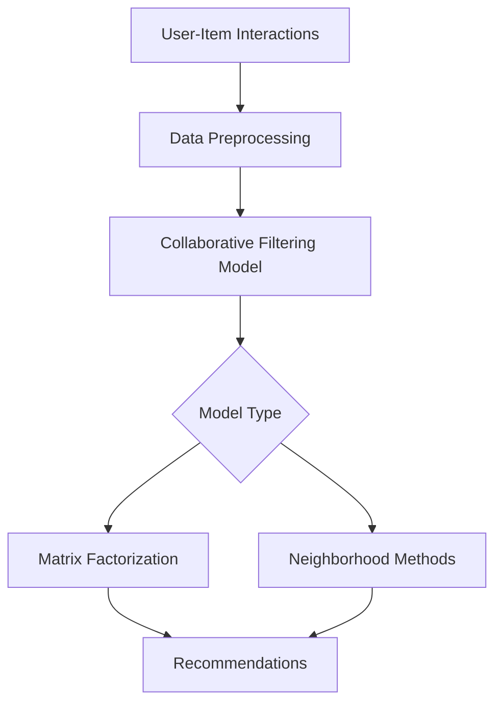

# Recommendation Systems (Collaborative Filtering)

## Architecture Overview



## Best Practices
- **Data Sparsity**: Handle cold-start problems with hybrid approaches or content-based fallbacks.
- **Evaluation**: Use metrics like NDCG, Precision@K, and Recall@K for ranking quality. Avoid relying solely on RMSE.

## Code Snippet: Matrix Factorization (Surprise Library)
```python
from surprise import Dataset, Reader, SVD
from surprise.model_selection import cross_validate

# Load data
data = Dataset.load_builtin('ml-100k')

# Use Singular Value Decomposition (Matrix Factorization)
algo = SVD()

# Cross-validation
results = cross_validate(algo, data, measures=['RMSE', 'MAE'], cv=5, verbose=True)
print(f"Mean RMSE: {results['test_rmse'].mean()}")
```
