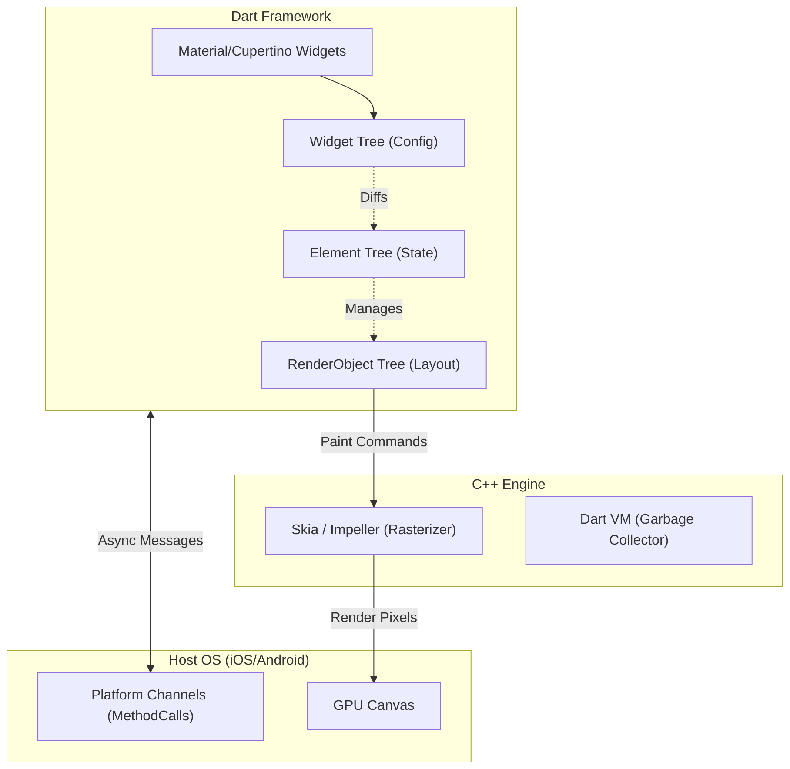

# Flutter Architecture Internals

## Core Concepts

Flutter bypasses OEM UI components entirely, drawing every pixel from scratch using its own graphics engine.

### 1. The Rendering Pipeline (Skia/Impeller)
Flutter communicates directly with the GPU. It builds a Layer Tree in Dart and passes it to the C++ Engine, which uses Skia (or the new Impeller engine) to rasterize the layers into pixels via OpenGL/Metal.

### 2. The 3 Trees
- **Widget Tree:** The developer's declarative configuration (immutable).
- **Element Tree:** The logical structure holding state and lifecycle (mutable).
- **RenderObject Tree:** Handles exact sizing, layout, and painting on screen.

### 3. Isolates (Threading)
Dart is single-threaded. To perform heavy computation without freezing the UI (Jank), you must spawn an "Isolate"—an independent worker with its own memory heap.

### Flutter Architecture Map

