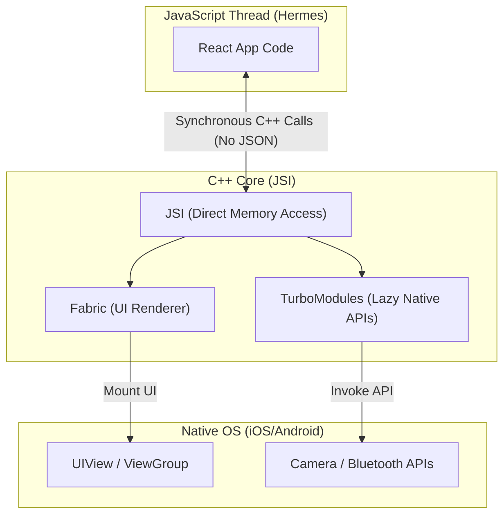

# React Native New Architecture

## Core Concepts

React Native is undergoing a massive architectural rewrite to eliminate the async JSON bridge bottleneck.

### 1. The Old Architecture (The Bridge)
In the past, the JS thread communicated with the Native thread by serializing data to JSON and sending it over an asynchronous "Bridge". This caused massive bottlenecks during heavy scrolling or complex animations.

### 2. JSI (JavaScript Interface)
The New Architecture replaces the Bridge with JSI. JSI allows the C++ core to expose direct references to native objects to the JS runtime. JS can now call native methods *synchronously*, without JSON serialization.

### 3. Fabric Renderer & TurboModules
- **Fabric:** The new UI manager. It allows React to render UI synchronously in C++, bridging the gap between React's virtual DOM and native UI instantly.
- **TurboModules:** Native modules (Camera, GPS) are now lazy-loaded on demand via JSI, drastically improving app startup time.

### React Native New Architecture Map

