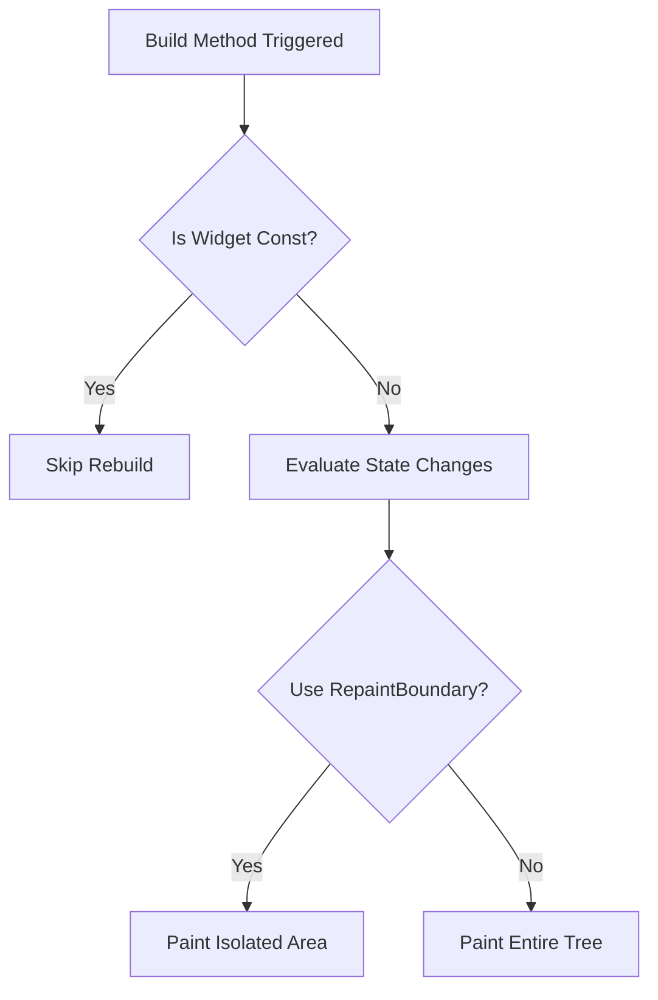

# Flutter Expertise

## State Management (Riverpod / BLoC)
- **Riverpod**: Use `ConsumerWidget` or `ref.watch` carefully to limit widget rebuilds. Keep providers small and focused.
- **BLoC**: Use `BlocBuilder` with `buildWhen` to prevent unnecessary rebuilds. Maintain distinct states (Loading, Success, Error).

```dart
// Riverpod Example
final counterProvider = StateProvider((ref) => 0);

class CounterText extends ConsumerWidget {
  @override
  Widget build(BuildContext context, WidgetRef ref) {
    // Only rebuilds when counterProvider changes
    final count = ref.watch(counterProvider);
    return Text('Count: $count');
  }
}
```

## Render Tree Optimization
- Avoid rebuilding the entire tree. Extract widgets into smaller `const` StatelessWidgets.
- Use `RepaintBoundary` to isolate widgets that paint frequently (e.g., animations).
- Minimize the use of heavy widgets like `Opacity` and `ClipRRect` when simpler alternatives exist.


