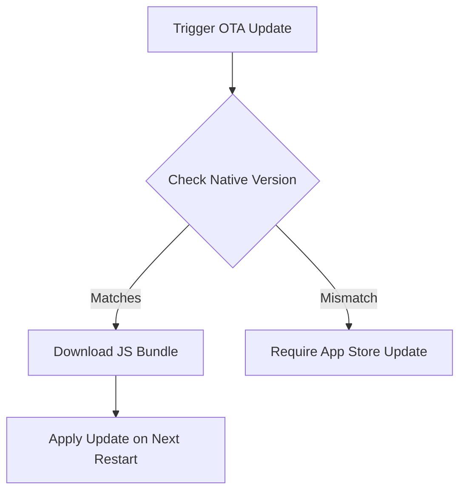

# React Native Expertise

## FlatList Optimization
To ensure smooth scrolling in `FlatList`:
- Use `removeClippedSubviews={true}`.
- Implement `getItemLayout` for fixed-height items.
- Memoize `renderItem` using `React.memo` or `useCallback`.
- Use `keyExtractor` with stable unique keys.

```jsx
import React, { useCallback } from 'react';
import { FlatList, View, Text } from 'react-native';

const Item = React.memo(({ title }) => (
  <View style={{ height: 50 }}><Text>{title}</Text></View>
));

export const OptimizedList = ({ data }) => {
  const renderItem = useCallback(({ item }) => <Item title={item.title} />, []);
  const getItemLayout = useCallback((data, index) => (
    { length: 50, offset: 50 * index, index }
  ), []);

  return (
    <FlatList
      data={data}
      renderItem={renderItem}
      keyExtractor={item => item.id}
      getItemLayout={getItemLayout}
      removeClippedSubviews={true}
      maxToRenderPerBatch={10}
      windowSize={5}
    />
  );
};
```

## OTA Updates
OTA updates allow you to ship bug fixes and small features instantly.
- Always verify compatibility between JS bundle and native layer before deploying.
- Ensure critical paths handle update download failures gracefully.


