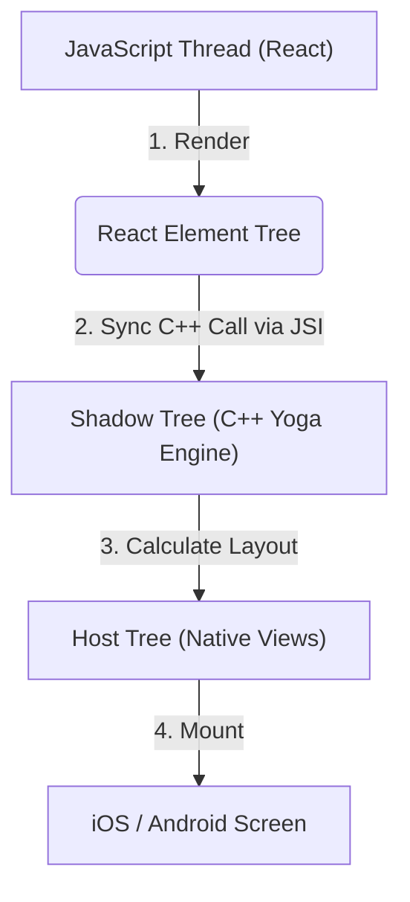

# React Native: The Fabric Renderer

## 1. The Legacy Architecture (The Bridge)
In the old React Native architecture, the JavaScript thread and the Native (UI) thread communicated via an asynchronous JSON bridge.
- When JS wanted to render a `<View>`, it serialized the command into a JSON string.
- The string was sent across the Bridge, placed in a queue.
- The Native thread deserialized the JSON and called the native UI APIs (UIKit/View).
- **The Problem**: Serialization is slow. Because it's asynchronous, complex gestures or rapid scrolling caused frame drops ("white flashes") because the UI thread rendered before the JS thread could calculate the next frame.

## 2. The New Architecture: Fabric & JSI
Fabric completely eliminates the asynchronous Bridge for UI rendering.

### JSI (JavaScript Interface)
JSI allows the JavaScript engine (Hermes) to hold direct references to C++ objects. JS can call C++ methods synchronously, bypassing JSON serialization entirely.

### The Fabric Pipeline

1. **Render Phase**: React executes JS code to create React Elements.
2. **Commit Phase**: Fabric uses JSI to synchronously create a "Shadow Node" in C++ for every React Element. The C++ Yoga engine calculates the exact X/Y layout.
3. **Mount Phase**: The C++ Shadow Tree is mapped to native Host Views (`UIView` or `android.view.View`) and drawn to the screen.

## 3. Benefits of Fabric
- **Synchronous Layout**: Measurements (like `onLayout`) can happen synchronously, allowing JS to measure elements before they are drawn, eliminating visual jumping.
- **Shared Codebase**: The core rendering and layout engine (Yoga) is written in C++, meaning iOS and Android share the exact same rendering logic, reducing platform-specific bugs.
