# React Native Performance: The Hermes Engine

## 1. The JIT vs AOT Dilemma
Historically, React Native used JavaScriptCore (JSC) or V8 engines. These engines were designed for web browsers and use **Just-In-Time (JIT)** compilation.
- **JIT Flow**: Download JS Source -> Parse -> Compile to Bytecode -> Execute -> Profile -> Compile hot paths to Machine Code.
- **The Issue for Mobile**: Parsing and compiling a massive JS bundle at app launch consumes massive CPU and delays the Time-To-Interactive (TTI). On mid-range Android devices, parsing 5MB of JS can take over 2 seconds before the app even renders the first screen.

## 2. Hermes: Ahead-of-Time (AOT) Bytecode
Hermes is a JavaScript engine built by Meta specifically for React Native.

Instead of shipping raw JavaScript text files to the device, Hermes uses an **Ahead-of-Time (AOT)** compiler during the build process on the developer's CI/CD server.
- **Build Time**: Compiles JS source code into highly optimized Hermes Bytecode (HBC).
- **Run Time**: The device simply memory-maps the `.hbc` file and executes the bytecode instantly. Zero parsing time required on the device.

## 3. Memory & Garbage Collection (GC)
Mobile devices have severe memory constraints compared to desktop browsers.
- JSC/V8 optimize for CPU speed at the expense of memory consumption.
- Hermes aggressively minimizes Memory Footprint (RAM).
- **Concurrent GC**: Hermes implements a concurrent garbage collector that runs on a background thread. It pauses the JS execution thread for mere microseconds, ensuring smooth 60fps animations without noticeable GC "hiccups" (jank).

## 4. Measuring TTI (Time to Interactive)

```mermaid
%%{init: {"theme": "default", "gantt": {"useMaxWidth": true}}}%%
gantt
    title App Launch Profile (V8 vs Hermes)
    dateFormat  s
    axisFormat %S
    
    section V8 (JIT)
    Parse JS Source     :a1, 00, 2s
    Compile to Bytecode :a2, after a1, 1.5s
    Execute & Render    :a3, after a2, 1s
    
    section Hermes (AOT)
    Memory-Map Bytecode :b1, 00, 0.2s
    Execute & Render    :b2, after b1, 1s
```

As shown, Hermes completely bypasses the parse and compile phases on the device, cutting app launch time by more than 50%.
