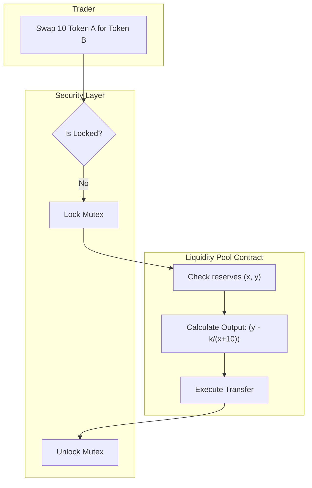

# DeFi: Automated Market Makers (AMM)

## Core Mechanics

Traditional finance uses Order Books (matching buyers and sellers). DeFi protocols like Uniswap use AMMs: algorithms that pool liquidity and price assets deterministically using math.

### 1. The Constant Product Formula
The core engine of an AMM is `x * y = k`.
- `x` and `y` are the quantities of two tokens in a liquidity pool.
- `k` must remain constant after a trade.
- If a user buys token X, they must add token Y, making X scarcer and thus more expensive. This curve automatically provides continuous liquidity.

### 2. Smart Contract Reentrancy Guard
A classic vector for stealing funds. If a contract calls an external untrusted contract before updating its own internal balances, the malicious contract can recursively call back (re-enter) the original function to drain funds. Always use a `ReentrancyGuard` mutex or follow the Checks-Effects-Interactions pattern.

### AMM Swap Flow Map

