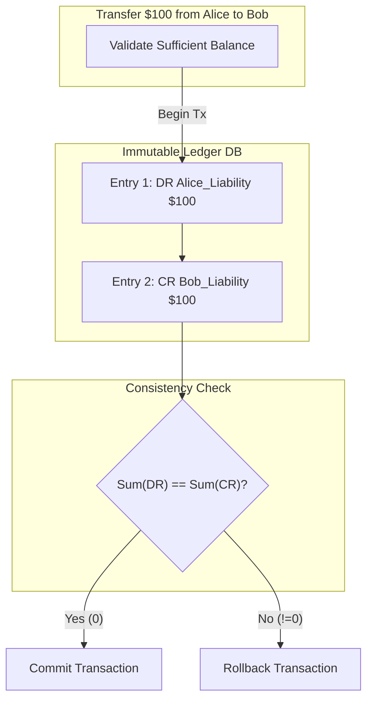

# Double-Entry Ledger Architecture

## Core Mechanics

At the heart of any core banking or FinTech system lies the Double-Entry Ledger. It ensures absolute mathematical consistency: every transaction requires at least two ledger entries (a Debit and a Credit) that must perfectly balance.

### 1. The Accounting Equation
`Assets = Liabilities + Equity`
- **Debit (DR):** Increases an Asset or Expense account. Decreases Liability or Equity.
- **Credit (CR):** Increases a Liability or Equity account. Decreases an Asset.
- **Rule of Zero:** Sum of all Debits - Sum of all Credits MUST equal 0 for every transaction.

### 2. Immutability & Event Sourcing
Ledger entries are Append-Only. You can NEVER update or delete a ledger row. If a mistake is made, a compensating transaction (reversal) must be appended. This guarantees an unforgeable audit trail.

### Double-Entry Flow Map

