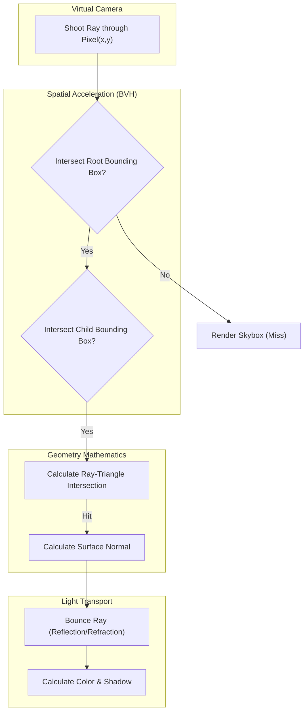

# Raytracing Mathematics

## Core Mechanics

Raytracing simulates the physical behavior of light to generate photorealistic images. It traces paths of light backwards from the camera into the 3D scene.

### 1. Ray-Sphere Intersection
A Ray is defined mathematically as `P(t) = O + tD` (Origin + time * Direction).
A Sphere is defined as `(P - C)·(P - C) = r^2`.
Substituting the Ray into the Sphere equation yields a quadratic equation (`at^2 + bt + c = 0`). Solving for `t` determines if, and exactly where, the ray hits the sphere.

### 2. Bounding Volume Hierarchies (BVH)
Checking every ray against millions of triangles is computationally impossible. A BVH wraps complex models in simple boxes. If a ray misses the big box, we immediately skip checking all the complex triangles inside it.

### Raytracing Flow Map

