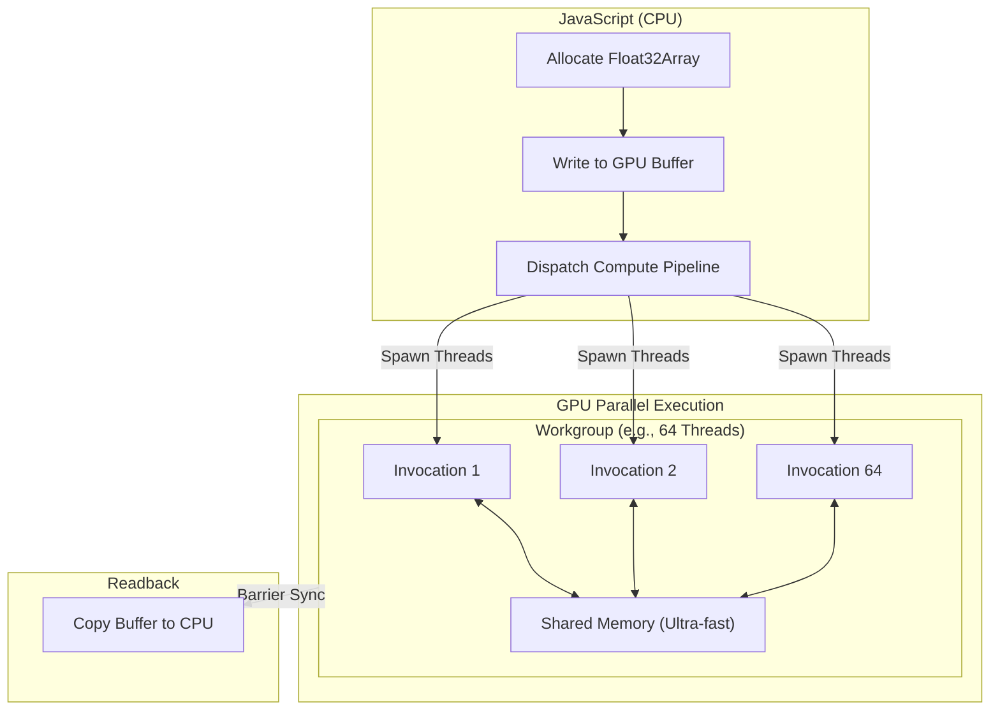

# WebGPU & Compute Shaders

## Core Mechanics

WebGPU is the modern successor to WebGL. It unlocks the massive parallel processing power of the GPU directly in the browser, not just for drawing triangles, but for general-purpose compute (GPGPU) like Physics simulations or Machine Learning.

### 1. Compute Shaders (WGSL)
Unlike Vertex or Fragment shaders which are tied to the rendering pipeline, a Compute Shader is just a program executed thousands of times simultaneously by the GPU. Written in WebGPU Shading Language (WGSL).

### 2. Workgroups & Shared Memory
GPU threads are organized into Workgroups. Threads within the same Workgroup can share a special, ultra-fast memory space (`var<workgroup>`) and synchronize with each other using barriers (`workgroupBarrier()`). This is critical for complex algorithms like Matrix Multiplication.

### Compute Shader Architecture Map

